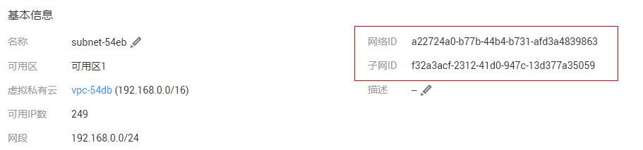

# VPC子网接口与OpenStack Neutron子网接口的区别是什么？<a name="vpc_api_0005"></a>

## 两者区别<a name="section1965810513426"></a>

子网接口分为[VPC子网](子网.md)接口、[OpenStack Neutron子网](子网-1.md)接口两种。两者均可以正常创建、查询、更新、删除子网。

两者的区别及容易混淆的地方在于网络ID、子网ID两个参数的含义。

登录管理控制台，查看子网的基本信息，可以看到网络ID、子网ID两个字段。

**图 1**  子网基本信息<a name="fig719561173917"></a>  


-   调用VPC子网接口时，使用的子网ID为[图1](#fig719561173917)所示的网络ID，例如：a22724a0-b77b-44b4-b731-afd3a4839863。
-   调用OpenStack neutron子网接口时，使用的子网ID为[图1](#fig719561173917)所示的子网ID，例如：f32a3acf-2312-41d0-947c-13d377a35059。

## 示例<a name="section465342914437"></a>

以查询子网详情为例，对比两者之间的区别。

**VPC子网接口**

```
GET /v1/049d06b7f20037e12f0dc0137381822f/subnets/a22724a0-b77b-44b4-b731-afd3a4839863
```

```
{
    "subnet": {
        "id": "a22724a0-b77b-44b4-b731-afd3a4839863",  //对应管理控制台上的网络ID
        "name": "subnet-54eb",
        "description": "",
        "cidr": "192.168.0.0/24",
        "dnsList": [
            "100.125.1.202",
            "100.125.1.230"
        ],
        "status": "ACTIVE",
        "tags": [],
        "vpc_id": "f4d0ebd4-2a62-4396-980b-96e73b3386de",
        "ipv6_enable": false,
        "gateway_ip": "192.168.0.1",
        "dhcp_enable": true,
        "primary_dns": "100.125.1.202",
        "secondary_dns": "100.125.1.230",
        "availability_zone": "az1.dc1",
        "neutron_network_id": "a22724a0-b77b-44b4-b731-afd3a4839863",  //对应管理控制台上的网络ID
        "neutron_subnet_id": "f32a3acf-2312-41d0-947c-13d377a35059",  //对应管理控制台上的子网ID
        "extra_dhcp_opts": []
    }
}
```

**OpenStack neutron子网接口**

```
GET /v2.0/subnets/f32a3acf-2312-41d0-947c-13d377a35059
```

```
{
    "subnet": {
        "name": "subnet-54eb",
        "cidr": "192.168.0.0/24",
        "id": "f32a3acf-2312-41d0-947c-13d377a35059",  //对应管理控制台上的子网ID
        "enable_dhcp": true,
        "network_id": "a22724a0-b77b-44b4-b731-afd3a4839863",  //对应管理控制台上的网络ID
        "tenant_id": "049d06b7f20037e12f0dc0137381822f",
        "project_id": "049d06b7f20037e12f0dc0137381822f",
        "dns_nameservers": [
            "100.125.1.202",
            "100.125.1.230"
        ],
        "allocation_pools": [
            {
                "start": "192.168.0.2",
                "end": "192.168.0.252"
            }
        ],
        "host_routes": [],
        "ip_version": 4,
        "gateway_ip": "192.168.0.1",
        "created_at": "2019-04-09T08:03:58",
        "updated_at": "2019-04-09T08:03:59"
    }
}
```

