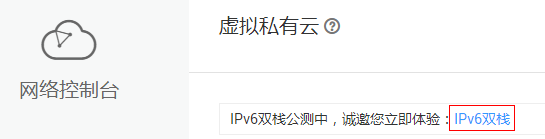
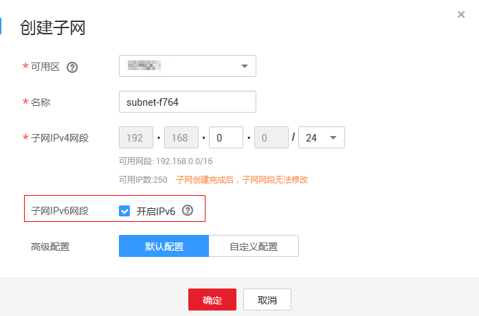
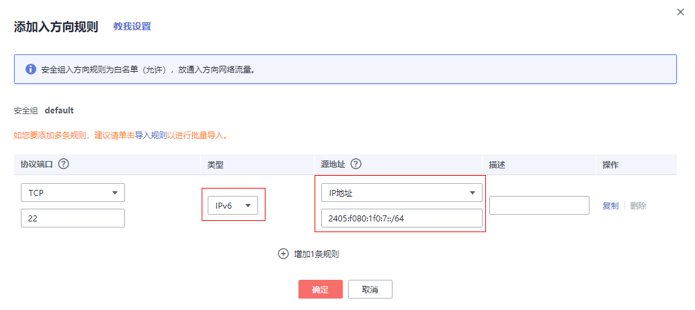
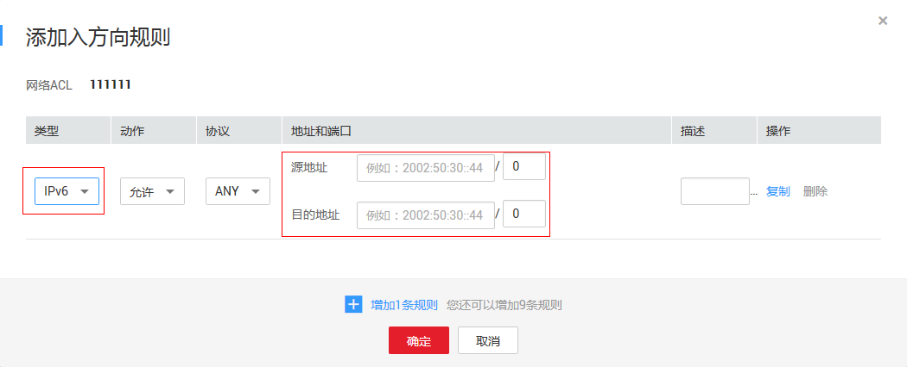
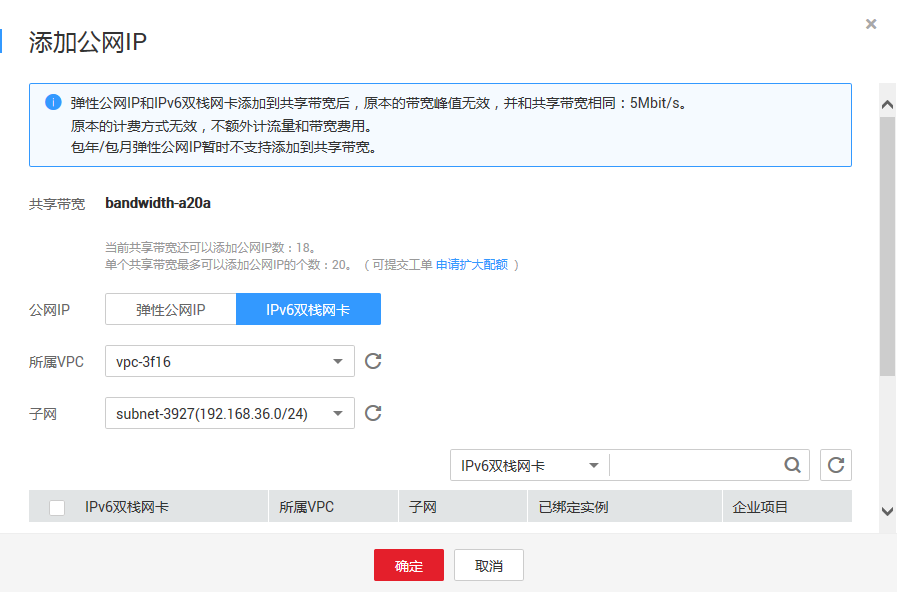
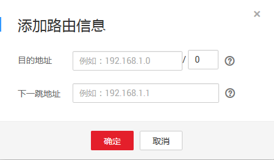
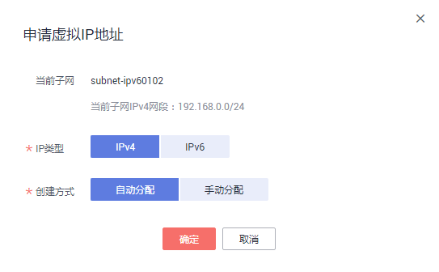

# IPv4/IPv6双栈网络（公测）

## 简介

IPv4/IPv6双栈可为您的实例（例如：ECS）提供两个不同版本的IP地址：IPv4地址和IPv6地址，这两个IP地址都可以进行内网/公网访问。

-   通过IPv4私网地址在ECS之间进行内网访问。
-   通过IPv4私网地址绑定弹性公网IP的方式访问互联网。
-   通过IPv6地址在双栈ECS之间进行内网访问（同VPC）。
-   通过IPv6地址与互联网上的IPv6网络进行访问。

## 应用场景

如果您的应用需要为使用IPv6终端的用户提供访问服务，则您可使用：IPv6弹性公网IP或IPv6双栈。

如果您的应用既需要为使用IPv6终端的用户提供访问服务，又需要对这些访问来源进行数据分析处理，则您必须使用IPv6双栈。

如果您的应用系统与其他系统（例如：数据库系统）、应用系统之间需要使用IPv6进行内网访问，则您必须使用IPv6双栈。

## 申请公测

该功能目前正在“华北-北京四”、“华东-上海一”区域”公测中，您可以在管理控制台选择“网络 \> 虚拟私有云”，单击“IPv6双栈”进入公测申请页面。了解更多关于IPv6知识或申请公测请参考：[IPv6解决方案](https://www.huaweicloud.com/solution/ipv6/)。申请通过后，就可以开始体验IPv4/IPv6双栈网络。

**图 1**  公测入口  

## 基本操作

> **说明：** 
>-   IPv4/IPv6双栈网络的基本操作与之前的IPv4网络相同。只有部分页面的配置参数会略有差异，具体请以管理控制台显示为准。
>-   公测期间，只有选择如下类型的ECS才能体验IPv6双栈，请务必选择支持的区域和规格。
>    -   “华北-北京四”区域，“可用区2”：sn3
>    -   “华东-上海一”区域，“可用区1”：c3，m3，“可用区2”：c3

**创建IPv6子网**

参考[为虚拟私有云创建新的子网](为虚拟私有云创建新的子网.md)创建子网，勾选“开启IPv6”，将自动为子网分配IPv6网段。该功能一旦开启，将不能关闭。暂不支持自定义设置IPv6网段。

**图 2**  创建IPv6子网  

**查看已使用IPv6地址**

在子网列表中单击子网名称，在“已用IP地址”页签可以查看已经使用的IPv4地址和IPv6地址。

**添加IPv6安全组规则**

参考[添加安全组规则](添加安全组规则.md)添加安全组规则，类型选择“IPv6”,源地址或目的地址填写IPv6地址。

**图 3**  添加IPv6安全组规则  

**添加IPv6网络ACL规则**

参考[添加网络ACL规则](添加网络ACL规则.md)添加网络ACL规则，类型选择“IPv6”，源地址或目的地址填写IPv6地址。

**图 4**  添加IPv6网络ACL规则  

**购买IPv6弹性公网IP**

您可以购买IPv6弹性公网IP，或者将已有IPv4弹性公网IP转换为IPv6弹性公网IP，详情请参见[IPv6弹性公网IP（公测）](IPv6弹性公网IP（公测）.md)。

**添加IPv6弹性公网IP/IPv6双栈网卡到共享带宽**

参考[添加弹性公网IP到共享带宽](添加弹性公网IP到共享带宽.md)将IPv6弹性公网IP、IPv6双栈网卡添加到共享带宽。

**图 5**  添加IPv6双栈网卡到共享带宽  

**添加IPv6自定义路由**

参考[添加自定义路由](添加自定义路由.md)添加自定义路由，其中目的地址和下一跳地址可以配置IPv4网段或IPv6网段。如果目的地址是IPv6网段，则下一跳地址暂时只能使用同一VPC内的地址。

**图 6**  添加路由  

**申请IPv6虚拟IP地址**

参考[申请虚拟IP地址](申请虚拟IP地址.md)申请虚拟IP地址，其中IP类型可以选择“IPv4”或“IPv6”。

当前该功能仅在“华东-上海一”支持。

**图 7**  申请虚拟IP地址  

