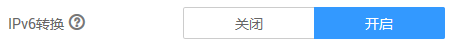

# IPv6弹性公网IP（公测）

## 简介

弹性公网IP支持IPv4地址和IPv6地址，您可以申请一个全新的IPv6弹性公网IP，也可以将已有的IPv4弹性公网IP转换为IPv6的。

开启IPv6转换后，将提供IPv4和IPv6弹性公网IP地址，原有IPv4业务可以快速为IPv6用户提供访问能力。

## 应用场景

如果您的应用需要为使用IPv6终端的用户提供访问服务，则您可使用：IPv6弹性公网IP。

如果您的应用既需要为使用IPv6终端的用户提供访问服务，又需要对这些访问来源进行数据分析处理，则您必须使用IPv6双栈。使用IPv6双栈请参考[IPv4/IPv6双栈网络（公测）](IPv4-IPv6双栈网络（公测）.md)。

如果您的应用系统与其他系统（例如：数据库系统）、应用系统之间需要使用IPv6进行内网访问，则您必须使用IPv6双栈。使用IPv6双栈请参考[IPv4/IPv6双栈网络（公测）](IPv4-IPv6双栈网络（公测）.md)。

## 申请公测

该功能目前正在公测中，目前只支持以下区域：华南-广州、华北-北京一、华北-北京四、华东-上海二、华东-上海一。您可以在管理控制台选择“网络 \> 弹性公网IP”，单击“IPv6 EIP”进入公测申请页面。了解更多关于IPv6知识或申请公测请参考：[IPv6解决方案](https://www.huaweicloud.com/solution/ipv6/)。申请通过后，就可以开始体验IPv6弹性公网IP。

> **说明：**   
>安全组和NAT网关暂时不支持IPv6地址的弹性公网IP。  

## 申请IPv6弹性公网IP

参考[为弹性云服务器申请和绑定弹性公网IP](为弹性云服务器申请和绑定弹性公网IP.md)申请弹性公网IP，在申请页面配置参数时，请开启“IPv6转换”，如[图1](#fig19943166121120)所示，就可以申请一个全新的IPv6弹性公网IP。

**图 1**  开启IPv6转换  

## 开启IPv6转换

当已有的IPv4地址的弹性公网IP需要增加IPv6地址时，可以在弹性公网IP列表页面，找到想转换的IPv4地址弹性公网IP ，单击“操作”列的“开启IPv6转换”，即可将已有的IPv4弹性公网IP转换为IPv6的。转换后，该弹性公网IP将同时拥有IPv4和IPv6地址。

## 配置安全组

开启弹性公网IP的IPv6转换后，请务必在安全组的出方向和入方向中放通198.19.0.0/16网段的IP地址，如[表1](#table854766319358)所示。因为IPv6 弹性公网IP采用NAT64技术，入方向的源IP地址经过NAT64转换后，会从IPv6地址转换为198.19.0.0/16之间的某个IPv4地址，源端口随机，目的IP为本机的内部私有IPv4地址，目的端口不变。

**表 1**  安全组规则

<table><thead align="left"><tr id="row2051403019358"><th class="cellrowborder" valign="top" width="19.681968196819682%" id="mcps1.2.4.1.1">
方向

</th>
<th class="cellrowborder" valign="top" width="20.782078207820785%" id="mcps1.2.4.1.2">
协议

</th>
<th class="cellrowborder" valign="top" width="59.53595359535954%" id="mcps1.2.4.1.3">
端口和地址

</th>
</tr>
</thead>
<tbody><tr id="row3779122419358"><td class="cellrowborder" valign="top" width="19.681968196819682%" headers="mcps1.2.4.1.1 ">
入方向

</td>
<td class="cellrowborder" valign="top" width="20.782078207820785%" headers="mcps1.2.4.1.2 ">
全部

</td>
<td class="cellrowborder" valign="top" width="59.53595359535954%" headers="mcps1.2.4.1.3 ">
源地址：198.19.0.0/16

</td>
</tr>
<tr id="row22818581398"><td class="cellrowborder" valign="top" width="19.681968196819682%" headers="mcps1.2.4.1.1 ">
出方向

</td>
<td class="cellrowborder" valign="top" width="20.782078207820785%" headers="mcps1.2.4.1.2 ">
全部

</td>
<td class="cellrowborder" valign="top" width="59.53595359535954%" headers="mcps1.2.4.1.3 ">
目的地址：198.19.0.0/16

</td>
</tr>
</tbody>
</table>

## 关闭IPv6转换

当弹性公网IP不需要IPv6地址时，可以在弹性公网IP列表页面，找到想关闭IPv6地址的弹性公网IP ，单击“操作”列的“关闭IPv6转换”，即可删除IPv6地址。删除后，该弹性公网IP仅保留IPv4地址。

