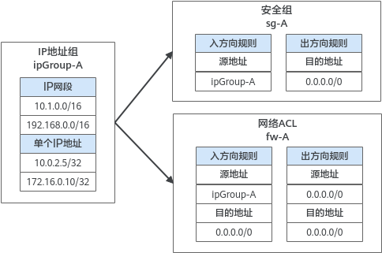

# IP地址组简介

## IP地址组简介

IP地址组是一个或者多个IP地址的集合，可关联至安全组、网络ACL，用于简化网络架构中IP地址的配置和管理。

对于需要统一管理的IP网段、单个IP地址，您可以将其添加到一个IP地址组内。IP地址组无法独立使用，需要将IP地址组关联至对应的资源，可关联IP地址组的资源说明如[表1](#table106971359413)所示。

**表 1**  IP地址组关联资源说明

<table><thead align="left"><tr id="row12697951849"><th class="cellrowborder" valign="top" width="17.001700170017003%" id="mcps1.2.4.1.1">
资源

</th>
<th class="cellrowborder" valign="top" width="37.12371237123712%" id="mcps1.2.4.1.2">
说明

</th>
<th class="cellrowborder" valign="top" width="45.87458745874587%" id="mcps1.2.4.1.3">
示例

</th>
</tr>
</thead>
<tbody><tr id="row36971959414"><td class="cellrowborder" valign="top" width="17.001700170017003%" headers="mcps1.2.4.1.1 ">
安全组

</td>
<td class="cellrowborder" valign="top" width="37.12371237123712%" headers="mcps1.2.4.1.2 ">
添加安全组规则的时候，源地址和目的地址可以选择IP地址组。

</td>
<td class="cellrowborder" valign="top" width="45.87458745874587%" headers="mcps1.2.4.1.3 ">
如<a href="#fig12881184316212">图1</a>所示，安全组sg-A的的入方向规则的源地址使用IP地址组ipGroup-A。

</td>
</tr>
<tr id="row66973512419"><td class="cellrowborder" valign="top" width="17.001700170017003%" headers="mcps1.2.4.1.1 ">
网络ACL

</td>
<td class="cellrowborder" valign="top" width="37.12371237123712%" headers="mcps1.2.4.1.2 ">
添加网络ACL规则的时候，源地址和目的地址可以选择IP地址组。

</td>
<td class="cellrowborder" valign="top" width="45.87458745874587%" headers="mcps1.2.4.1.3 ">
如<a href="#fig12881184316212">图1</a>所示，网络ACLfw-A的的入方向规则的源地址使用IP地址组ipGroup-A。

</td>
</tr>
</tbody>
</table>

**图 1**  IP地址组使用场景  

## 约束与限制

-   对于关联IP地址组的安全组，其中IP地址组相关的规则对某些类型的云服务器不生效，不支持的规则如下：
    -   通用计算型（S1型、C1型、C2型 ）
    -   内存优化型（M1型）
    -   高性能计算型（H1型）
    -   磁盘增强型（ D1型）
    -   GPU加速型（G1型、G2型）
    -   超大内存型（E1型、E2型、ET2型）

-   在网络ACL的规则中使用IP地址组时，有以下限制：

    -   对于入方向规则，源地址和目的地址只能有一方使用IP地址组。
    -   对于出方向规则，源地址和目的地址只能有一方使用IP地址组。

    比如网络ACL入方向规则中的源地址已使用IP地址组，则目的地址只能是IP地址，无法选择IP地址组。

