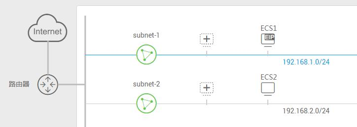
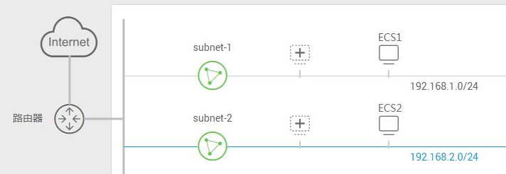

# VPC内自定义路由示例

VPC内自定义路由，用于将同一个VPC内弹性云服务器发起的流量，路由到该VPC内的指定的弹性云服务器。主要包含以下两个场景：

-   当VPC内的云服务器需要访问Internet，用户可以添加自定义路由，通过绑定弹性公网IP的服务器访问Internet网络。在通过自定义路由访问Internet网络时，目的地址配置为默认的0.0.0.0/0（不能配置为具体的公网网段），下一跳为本VPC内ECS绑定了EIP的私有IP或者绑定了EIP的虚拟IP。
-   当VPC内的云服务器需要访问容器网络时，用户可以添加自定义路由，通过配置了容器的服务器访问容器网络。在通过自定义路由访问ECS内部容器网络时，目的地址可以配置为默认的0.0.0.0/0，也可以配置为容器网络的网段，下一跳为本VPC下已经配置了容器网络的ECS的私有IP或者虚拟IP。

每条路由信息的目的地址不能重复。

## 通过自定义路由访问Internet网络

**场景举例**

一个VPC内创建了两个弹性云服务器ECS1和ECS2，ECS1绑定了弹性公网IP，ECS2没有绑定弹性公网IP，您可以添加VPC的自定义路由，使得ECS2可以通过ECS1访问Internet网络。

**图 1**  通过自定义路由访问Internet网络  

**配置方法**

1.  VPC的自定义路由配置如[表1](#table181163495219)，目的地址配置为默认0.0.0.0/0，下一跳地址为ECS1绑定了EIP的私有IP或者绑定了EIP的虚拟IP。

    **表 1**  自定义路由

    
    <table><thead align="left"><tr id="row81183485218"><th class="cellrowborder" valign="top" width="15%" id="mcps1.2.3.1.1">
目的地址

    </th>
    <th class="cellrowborder" valign="top" width="85%" id="mcps1.2.3.1.2">
下一跳地址

    </th>
    </tr>
    </thead>
    <tbody><tr id="row1011734205217"><td class="cellrowborder" valign="top" width="15%" headers="mcps1.2.3.1.1 ">
0.0.0.0/0

    </td>
    <td class="cellrowborder" valign="top" width="85%" headers="mcps1.2.3.1.2 ">
ECS1的私有IP地址/虚拟IP地址

    </td>
    </tr>
    </tbody>
    </table>

    > **说明：** 
    >-   通过自定义路由访问Internet网络时，目的地址配置为默认0.0.0.0/0，不能配置为具体的公网网段。
    >-   如果下一跳地址是虚拟IP，则虚拟IP必须绑定弹性公网IP，否则无法通过虚拟IP访问Internet网络。

2.  参考[配置SNAT服务器](配置SNAT服务器.md)为下一跳ECS配置SNAT服务器。

## 通过自定义路由访问ECS内部容器网络

**场景举例**

一个VPC内创建了两个弹性云服务器ECS1和ECS2，ECS1内部配置了容器网络，ECS2想要访问ECS1的容器网络，您可以添加VPC的自定义路由，使得ECS2可以通过ECS1访问容器网络。

**图 2**  通过自定义路由访问ECS内部容器网络  

**配置方法**

1.  VPC的自定义路由配置如[表2](#table16307251175210)，目的地址可以配置为默认0.0.0.0/0，也可以配置为容器网络所在的网段，下一跳为本VPC下已经配置了容器网络的ECS的私有IP或者虚拟IP。

    **表 2**  自定义路由

    
    <table><thead align="left"><tr id="row2306105114523"><th class="cellrowborder" valign="top" width="35.49%" id="mcps1.2.3.1.1">
目的地址

    </th>
    <th class="cellrowborder" valign="top" width="64.51%" id="mcps1.2.3.1.2">
下一跳地址

    </th>
    </tr>
    </thead>
    <tbody><tr id="row93071951195215"><td class="cellrowborder" valign="top" width="35.49%" headers="mcps1.2.3.1.1 ">
0.0.0.0/0

    </td>
    <td class="cellrowborder" valign="top" width="64.51%" headers="mcps1.2.3.1.2 ">
ECS1的私有IP/虚拟IP

    </td>
    </tr>
    </tbody>
    </table>

2.  参考[配置SNAT服务器](配置SNAT服务器.md)为下一跳ECS配置SNAT服务器。

