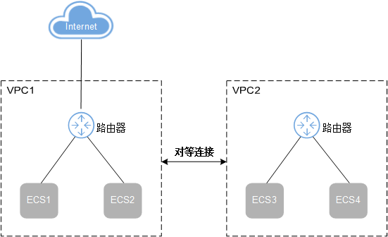
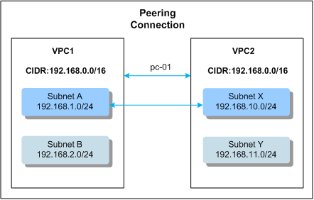
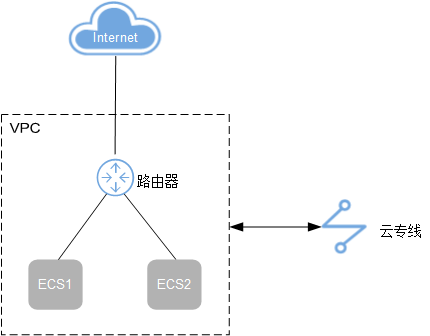

# VPC外自定义路由示例

VPC外自定义路由，用于将VPC外部发起的流量，路由到VPC内的指定弹性云服务器。在设置自定义路由时，目的地址可以配置为默认的0.0.0.0/0，也可以配置为其他网段（不能与本VPC下子网网段冲突），每条路由信息的目的地址不能配置重复。

## VPC间自定义路由

**场景举例**

两个VPC之间建立了对等连接，您可以添加VPC的自定义路由，使得VPC2下的弹性云服务器可以通过对端VPC1下绑定了EIP的弹性云服务器访问Internet。

**图 1**  VPC间自定义路由  

**配置方法**

1.  VPC1和VPC2建立对等连接，如[图2](#fig137910157244)所示。

    **图 2**  VPC1和VPC2建立对等连接  
    

    对等连接路由配置，如[表1](#table033831391920)和[表2](#table17641783201)所示。

    **表 1**  Subnet A关联的路由表中的对等连接路由

    
    <table><thead align="left"><tr id="row153677134190"><th class="cellrowborder" valign="top" width="57.07%" id="mcps1.2.3.1.1">
目的地址

    </th>
    <th class="cellrowborder" valign="top" width="42.93%" id="mcps1.2.3.1.2">
下一跳地址

    </th>
    </tr>
    </thead>
    <tbody><tr id="row163671613171920"><td class="cellrowborder" valign="top" width="57.07%" headers="mcps1.2.3.1.1 ">
192.168.10.0/24

    </td>
    <td class="cellrowborder" valign="top" width="42.93%" headers="mcps1.2.3.1.2 ">
pc-01

    </td>
    </tr>
    </tbody>
    </table>

    **表 2**  Subnet X关联的路由表中的对等连接路由

    
    <table><thead align="left"><tr id="row28915802015"><th class="cellrowborder" valign="top" width="57.07%" id="mcps1.2.3.1.1">
目的地址

    </th>
    <th class="cellrowborder" valign="top" width="42.93%" id="mcps1.2.3.1.2">
下一跳地址

    </th>
    </tr>
    </thead>
    <tbody><tr id="row7891289206"><td class="cellrowborder" valign="top" width="57.07%" headers="mcps1.2.3.1.1 ">
192.168.1.0/24

    </td>
    <td class="cellrowborder" valign="top" width="42.93%" headers="mcps1.2.3.1.2 ">
pc-01

    </td>
    </tr>
    <tr id="row198978152011"><td class="cellrowborder" valign="top" width="57.07%" headers="mcps1.2.3.1.1 ">
0.0.0.0/0

    </td>
    <td class="cellrowborder" valign="top" width="42.93%" headers="mcps1.2.3.1.2 ">
pc-01

    </td>
    </tr>
    </tbody>
    </table>

    > **说明：**   
    >其中pc-01为对等连接的ID，自动生成，不可配置。  

1.  自定义路由配置，如[表3](#table19161511762)所示。

    **表 3**  VPC1默认路由表中的自定义路由

    
    <table><thead align="left"><tr id="row10201411269"><th class="cellrowborder" valign="top" width="34.31%" id="mcps1.2.3.1.1">
目标网段

    </th>
    <th class="cellrowborder" valign="top" width="65.69%" id="mcps1.2.3.1.2">
下一跳地址

    </th>
    </tr>
    </thead>
    <tbody><tr id="row02029111369"><td class="cellrowborder" valign="top" width="34.31%" headers="mcps1.2.3.1.1 ">
0.0.0.0/0

    </td>
    <td class="cellrowborder" valign="top" width="65.69%" headers="mcps1.2.3.1.2 ">
ECS1的私有IP/虚拟IP

    </td>
    </tr>
    </tbody>
    </table>

    > **说明：**   
    >-   通过自定义路由访问Internet网络时，目的地址配置为默认0.0.0.0/0，不能配置为具体的公网网段。  
    >-   如果下一跳地址是虚拟IP，则虚拟IP必须绑定弹性公网IP，否则无法通过虚拟IP访问Internet网络。  

2.  参考[配置SNAT服务器](配置SNAT服务器.md)为下一跳ECS配置SNAT服务器。

## VPC与云专线间的路由

**场景举例**

您可以添加VPC的自定义路由，将云专线进来的所有报文路由到VPC内的指定主机。除了云专线的配置外，VPC需要按照[表4](#table92261116611)添加自定义路由。

**图 3**  VPC与云专线间的路由  

**配置方法**

1.  VPC的自定义路由配置如[表4](#table92261116611)，目的地址配置为默认0.0.0.0/0，下一跳为ECS的私有IP或者虚拟IP。

    **表 4**  VPC自定义路由表

    
    <table><thead align="left"><tr id="row62021112060"><th class="cellrowborder" valign="top" width="35.61%" id="mcps1.2.3.1.1">
目的地址

    </th>
    <th class="cellrowborder" valign="top" width="64.39%" id="mcps1.2.3.1.2">
下一跳地址

    </th>
    </tr>
    </thead>
    <tbody><tr id="row192025116610"><td class="cellrowborder" valign="top" width="35.61%" headers="mcps1.2.3.1.1 ">
0.0.0.0/0

    </td>
    <td class="cellrowborder" valign="top" width="64.39%" headers="mcps1.2.3.1.2 ">
ECS的私有IP/虚拟IP

    </td>
    </tr>
    </tbody>
    </table>

2.  参考[配置SNAT服务器](配置SNAT服务器.md)为下一跳ECS配置SNAT服务器。

