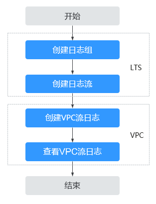

# VPC流日志简介

VPC流日志功能可以记录虚拟私有云中的流量信息，帮助您检查和优化安全组和网络ACL控制规则、监控网络流量、进行网络攻击分析等。

VPC流日志功能需要与云日志服务LTS结合使用，先在云日志服务中创建日志组和日志流，然后再创建VPC流日志。配置流程如[图1](#fig20742104751616)所示。

**图 1**  配置VPC流日志  

VPC流日志本身是免费的，您只需要为使用过程中用到的其他云资源付费。 例如，数据存储在云日志服务中，将按日志服务的标准收费。详情请参见[《云日志服务用户指南》](https://support.huaweicloud.com/lts/index.html)。

VPC流日志功能目前仅在“华东-上海一”、“亚太-新加坡”、“华南-广州”、“亚太-曼谷”开放，且还在公测期间，请申请公测权限后使用。

## 约束与限制

-   目前支持S2、M2、Hc2、H2、D2、P1、G3、Pi1、fp1、S3、C3、M3、H3、D3、Ir3、I3、Sn3、S6、E3、C3ne、M3ne、G5、P2v、Ai1、M6、D6类型的弹性云服务器。弹性云服务器类型具体信息请参见[实例类型](https://support.huaweicloud.com/productdesc-ecs/zh-cn_topic_0035470096.html)。
-   默认情况下，一个用户最多允许创建10个VPC流日志。
-   默认情况下，最大支持40万条流日志记录。

