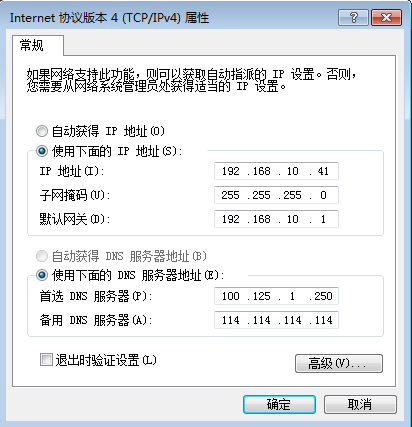
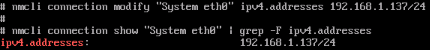

# 为虚拟IP地址绑定弹性公网IP或弹性云服务器

## 操作场景

用户可以为虚拟IP地址绑定一个弹性公网IP地址，从互联网可以访问后端绑定了同一个虚拟IP地址的多个主备部署的弹性云服务器，增强容灾性能。

## 操作步骤

1.  登录管理控制台。
2.  在管理控制台左上角单击，选择区域和项目。
3.  在系统首页，选择“网络\>虚拟私有云”。

    进入“我的VPC”页面。

4.  在左侧导航栏，选择“虚拟私有云 \> 子网”。
5.  在子网列表中，单击虚拟IP地址所属子网名称。
6.  选择“IP地址管理”页签，在需要绑定弹性公网IP或者弹性云服务器的虚拟IP地址所在行的操作列下，单击“绑定弹性公网IP”或者“绑定服务器”。
7.  选择需要绑定的弹性公网IP地址或弹性云服务器（及网卡）。

    > **说明：** 
    >-   弹性云服务器多网卡时，建议绑定主网卡。
    >-   一个弹性云服务器的网卡可以绑定多个虚拟IP。
    >-   IPv6的虚拟IP仅支持绑定一个网卡（双栈网卡），如需进行服务器的主备切换，请通过调用API方式。具体请参考[配置云服务器高可用的IPv6虚拟IP功能](https://support.huaweicloud.com/api-vpc/vpc_apieg_0006.html)。

8.  单击“确定”。

1.  为已绑定虚拟IP的弹性云服务器手工配置虚拟IP地址。

    弹性云服务器的网卡绑定虚拟IP地址后，需要在弹性云服务器上手工配置虚拟IP地址。

    **Linux系统**（本文以“CentOS 7.2 64bit”为例，其他规格请参考对应官网帮助文档）

    1.  执行以下命令，查看并记录需要绑定虚拟IP的网卡及对应连接。

        **nmcli connection**

        回显类似如下信息：

        

        本示例的回显信息说明如下：

        -   **DEVICE**列的**eth0**为需要绑定虚拟IP的网卡。
        -   **NAME**列的**Wired connection 1**为网卡对应的连接。

    2.  执行以下命令，在目标连接中添加虚拟IP。

        **nmcli connection modify "**_CONNECTION_**" ipv4.addresses** _VIP_

        参数说明如下：

        -   CONNECTION：为[9.a](#li528316578916)中查到的网卡对应的连接。
        -   VIP：待添加的虚拟IP地址。
            -   如果一次添加多个虚拟IP地址，多个虚拟IP地址之间用“,”隔开。
            -   如果已有虚拟IP地址，此时还需要新增虚拟IP地址，那么命令中除了包含新的虚拟IP地址，也需要包含原有虚拟IP地址。

        命令示例：

        -   添加单个虚拟IP：**nmcli connection modify "Wired connection 1" ipv4.addresses 172.16.0.125**
        -   添加多个虚拟IP：**nmcli connection modify "Wired connection 1" ipv4.addresses 172.16.0.125,172.16.0.126**

    3.  执行以下命令，使[9.b](#li20283257695)的配置生效。

        **nmcli connection up "**_CONNECTION_**"**

        命令示例：

        **nmcli connection up "Wired connection 1"**

        回显类似如下信息：

        

    4.  执行以下命令，检查虚拟IP配置是否成功。

        **ip a**

        回显类似如下信息，可以看到eth0网卡下存在虚拟IP地址，为**172.16.0.125**。

        

    **Windows系统**（本文以“Windows Server”为例）

    1.  在“控制面板 \> 网络和共享中心”路径下，单击对应的本地连接。
    2.  在打开的本地连接页面中，单击“属性”。
    3.  在“网络”页签中选择“Internet 协议版本 4 （TCP/IPv4）”。
    4.  单击“属性”。
    5.  选择“使用下面的IP地址”，IP地址配置为弹性云服务器的私有IP地址，例如：10.0.0.101。

        **图 1**  配置私有IP地址  
        

    6.  单击“高级”。
    7.  在“IP设置”页签内“IP地址”区域，单击“添加”。

        添加虚拟IP地址，例如：10.0.0.154。

        **图 2**  配置虚拟IP地址  
        

    8.  单击“确定”，保存更改。
    9.  在“开始”菜单中打开Windows命令行窗口，执行以下命令确认是否配置了虚拟IP地址。

        **ipconfig /all**

        回显样例中IPv4 Address包含虚拟IP地址10.0.0.154，表示弹性云服务器内部网卡的虚拟IP地址配置正常。

## 相关操作

-   [弹性云服务器的网卡绑定虚拟IP地址后，该虚拟IP地址无法ping通时，如何排查？](https://support.huaweicloud.com/vpc_faq/vpc_faq_0083.html)
-   [弹性公网IP、私有IP和虚拟IP之间有何区别？](https://support.huaweicloud.com/vpc_faq/faq_eip_0003.html)
-   [为虚拟IP解绑弹性公网IP](为虚拟IP解绑弹性公网IP.md)

