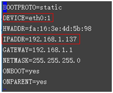
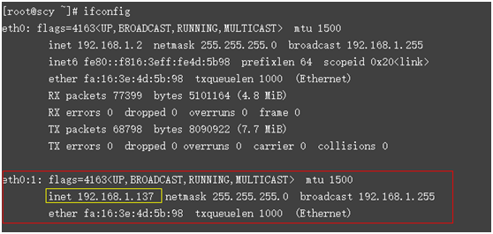

# 为虚拟IP地址绑定弹性公网IP或弹性云服务器

## 操作场景

用户可以为虚拟IP地址绑定一个弹性公网IP地址，从互联网可以访问后端绑定了同一个虚拟IP地址的多个主备部署的弹性云服务器，增强容灾性能。

## 操作步骤

1.  登录管理控制台。
2.  在管理控制台左上角单击，选择区域和项目。
3.  在系统首页，选择“网络 \> 虚拟私有云”。
4.  在左侧导航栏选择“虚拟私有云”。
5.  在虚拟私有云列表中，单击虚拟IP地址所属的虚拟私有云名称。
6.  在“子网”页签中，单击虚拟IP地址所属子网名称。
7.  选择“虚拟IP”页签，在需要绑定弹性公网IP或者弹性云服务器的虚拟IP地址所在行的操作列下，单击“绑定弹性公网IP”或者“绑定云服务器”。
8.  选择需要绑定的弹性公网IP地址或者弹性云服务器（及网卡）。

    > **说明：**   
    >-   弹性云服务器多网卡时，建议绑定主网卡。  
    >-   一个弹性云服务器的网卡可以绑定多个虚拟IP。  

9.  单击“确定”。

1.  为已绑定虚拟IP的弹性云服务器手工配置虚拟IP地址。

    弹性云服务器的网卡绑定虚拟IP地址后，需要在弹性云服务器上手工配置虚拟IP地址。

    **Linux系统**（本文以“CentOS 7.2 64bit”为例）

    1.  在弹性云服务器上执行以下命令进入“/etc/sysconfig/network-scripts”目录。

        **cd /etc/sysconfig/network-scripts**

    2.  执行以下命令新建并修改“ifcfg-eth0:1”文件。

        **vi ifcfg-eth0:1**

        在文件中增加以下网卡信息。

        **图 1**  增加网卡信息  
        

    3.  按“**Esc**”输入“**:wq!**”，保存后退出文件。
    4.  重启弹性云服务器，使用**ifconfig**命令查看是否已经完成虚拟IP地址的配置。

        **图 2**  查看是否存在ethX:X类型的网卡  
        

        上图回显样例中包含ethX:X类型的网卡，样例中192.168.1.137为虚拟IP地址。

    **Windows系统**（本文以“Windows 7”为例）

    1.  在“控制面板 \> 网络和Internet \> 网络连接”路径下，右键单击对应的本地连接，选择“属性”。
    2.  在“网络”页签内选择“Internet 协议版本 4 （TCP/IPv4）”。
    3.  单击“属性”。
    4.  选择“使用下面的IP地址”，IP地址配置为弹性云服务器的私有IP地址，例如：192.168.10.41。

        **图 3**  配置私有IP地址  
        

    5.  单击“高级”。
    6.  在“IP设置”页签内“IP地址”区域，单击“添加”。

        添加虚拟IP地址，例如：192.168.10.137。

        **图 4**  配置虚拟IP地址  
        

    7.  单击“确认”，保存更改。
    8.  在“开始”菜单中打开Windows命令行窗口，执行以下命令确认是否配置了虚拟IP地址。

        **ipconfig /all**

        **图 5**  查看是否配置虚拟IP地址  
        

        上图回显样例中IPv4 Address包含虚拟IP地址192.168.10.137，表示弹性云服务器内部网卡的虚拟IP地址配置正常。

## 相关操作

-   [云主机弹性云服务器的网卡绑定虚拟IP地址后，该虚拟IP地址无法ping通时，如何排查？](https://support.huaweicloud.com/vpc_faq/vpc_faq_0083.html)
-   [弹性公网IP、私有IP、浮动IP、虚拟IP之间有何区别？](https://support.huaweicloud.com/vpc_faq/faq_eip_0003.html)

