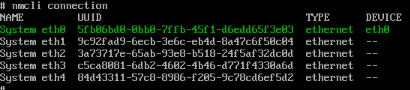
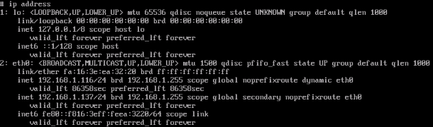
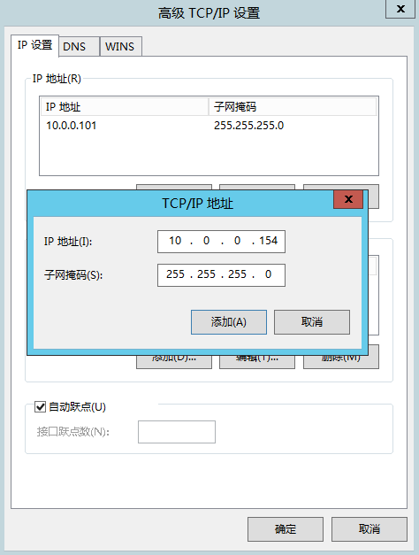
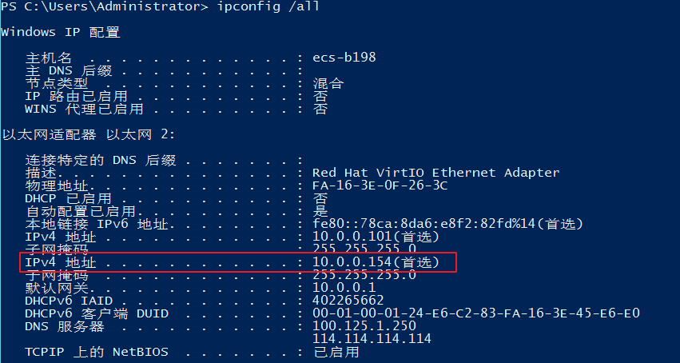

# 为虚拟IP地址绑定弹性公网IP或弹性云服务器

## 操作场景

用户可以为虚拟IP地址绑定一个弹性公网IP地址，从互联网可以访问后端绑定了同一个虚拟IP地址的多个主备部署的弹性云服务器，增强容灾性能。

> **说明：** 
>当前在部分区域中，子网已从虚拟私有云中解耦，解耦后子网拥有独立入口，虚拟IP的相关操作入口也随之迁移。目前存在以下两种入口。
>-   未解耦：在虚拟私有云详情页的“子网”页签，可对子网进行操作。
>-   已解耦：在进入“网络 \> 虚拟私有云”后，在左侧导航栏直接选择“子网”，对子网进行操作。

## 操作步骤

1.  登录管理控制台。

1.  在管理控制台左上角单击，选择区域和项目。
2.  在系统首页，选择“网络 \> 虚拟私有云”。

**在子网未解耦区域，虚拟IP入口请参考[4](申请虚拟IP地址.md#li51522361618)\~[7](申请虚拟IP地址.md#li18152143611112)；在子网已解耦区域，虚拟IP入口请参考[8](申请虚拟IP地址.md#li715211361516)\~[10](申请虚拟IP地址.md#li19153536815)。**

**图 1**  入口图示  

1.  在左侧导航栏选择“虚拟私有云”。
2.  在虚拟私有云列表中，单击虚拟IP地址所属的虚拟私有云名称。
3.  在“子网”页签中，单击虚拟IP地址所属子网名称。
4.  选择“虚拟IP”页签，在需要绑定弹性公网IP或者弹性云服务器的虚拟IP地址所在行的操作列下，单击“绑定弹性公网IP”或者“绑定云服务器”。
5.  在左侧导航栏选择“子网”。
6.  在子网列表中，单击虚拟IP地址所属子网名称。
7.  选择“IP地址管理”页签，在需要绑定弹性公网IP或者弹性云服务器的虚拟IP地址所在行的操作列下，单击“绑定弹性公网IP”或者“绑定服务器”。
8.  选择需要绑定的弹性公网IP地址或弹性云服务器（及网卡）。

    > **说明：** 
    >-   弹性云服务器多网卡时，建议绑定主网卡。
    >-   一个弹性云服务器的网卡可以绑定多个虚拟IP。
    >-   IPv6的虚拟IP仅支持绑定一个网卡（双栈网卡），如需进行服务器的主备切换，请通过调用API方式。具体请参考[配置云服务器高可用的IPv6虚拟IP功能](https://support.huaweicloud.com/api-vpc/vpc_apieg_0006.html)。

9.  单击“确定”。

1.  为已绑定虚拟IP的弹性云服务器手工配置虚拟IP地址。

    弹性云服务器的网卡绑定虚拟IP地址后，需要在弹性云服务器上手工配置虚拟IP地址。

    **Linux系统**（本文以“CentOS 7.2 64bit”为例，其他规格请参考对应官网帮助文档）

    1.  执行以下命令查看需要绑定虚拟IP的网卡及其连接。

        **nmcli connection**

        **图 2**  查看网卡及其连接  
        

        上图回显样例中“DEVICE”列的“eth0”为需要绑定虚拟IP的网卡，“NAME”列的“System eth0”为对应的连接。

    2.  执行以下命令修改对应的连接添加虚拟IP。

        **nmcli connection modify "**_CONNECTION_**" ipv4.addresses** _VIP_

        **图 3**  配置虚拟IP地址  
        

    3.  重启弹性云服务器，使用**ip address**命令查看是否已经完成虚拟IP地址的配置。

        **图 4**  查看是否配置虚拟IP地址  
        

        上图回显样例中192.168.1.137为虚拟IP地址。

    **Windows系统**（本文以“Windows Server”为例）

    1.  在“控制面板 \> 网络和共享中心”路径下，单击对应的本地连接。
    2.  在打开的本地连接页面中，单击“属性”。
    3.  在“网络”页签中选择“Internet 协议版本 4 （TCP/IPv4）”。
    4.  单击“属性”。
    5.  选择“使用下面的IP地址”，IP地址配置为弹性云服务器的私有IP地址，例如：10.0.0.101。

        **图 5**  配置私有IP地址  
        

    6.  单击“高级”。
    7.  在“IP设置”页签内“IP地址”区域，单击“添加”。

        添加虚拟IP地址，例如：10.0.0.154。

        **图 6**  配置虚拟IP地址  
        

    8.  单击“确定”，保存更改。
    9.  在“开始”菜单中打开Windows命令行窗口，执行以下命令确认是否配置了虚拟IP地址。

        **ipconfig /all**

        **图 7**  查看是否配置虚拟IP地址  
        

        上图回显样例中IPv4 Address包含虚拟IP地址10.0.0.154，表示弹性云服务器内部网卡的虚拟IP地址配置正常。

## 相关操作

-   [弹性云服务器的网卡绑定虚拟IP地址后，该虚拟IP地址无法ping通时，如何排查？](https://support.huaweicloud.com/vpc_faq/vpc_faq_0083.html)
-   [弹性公网IP、私有IP、浮动IP、虚拟IP之间有何区别？](https://support.huaweicloud.com/vpc_faq/faq_eip_0003.html)

