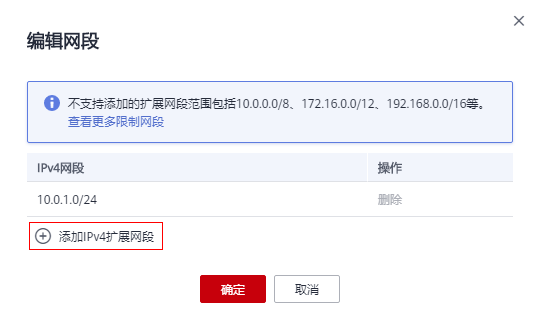

# 为虚拟私有云添加扩展网段

## 操作场景

VPC创建后，若主网段不够分配时，您可以通过添加扩展网段来扩充VPC的网段。

创建VPC时配置的IPv4网段是VPC的主网段。VPC创建后，主网段不能进行修改，但您可以添加IPv4扩展网段来扩充VPC的网段。

添加扩展网段后，您可以选择使用主网段或扩展网段来创建子网，但每个子网只能属于一个VPC网段。同主网段一样，使用扩展网段创建子网时，系统也会在VPC路由表中自动添加一条子网路由。

目前添加IPv4扩展网段功能仅在“华东-上海一”开放。

## 前提条件

已创建VPC。

## 使用限制

-   一个VPC默认只支持添加1个IPv4扩展网段。
-   扩展网段的子网路由的目的地址是该子网网段，该网段范围不得与所属VPC路由表中的其它路由的目标网段范围相同或大于该范围。
-   不支持添加的扩展网段范围包括：
    -   主网段或帐户下已存在网段：10.0.0.0/8 、172.16.0.0/12、192.168.0.0/16
    -   系统内部已占用：100.64.0.0/10、214.0.0.0/7、198.18.0.0/15、69.254.0.0/16、21.0.0.0.0/8
    -   公网保留地址：0.0.0.0/8、127.0.0.0/8、192.0.0.0/24、192.0.0.0/29、192.0.2.0/24、192.88.99.0/24、 240.0.0.0/4、198.51.100.0/24、203.0.113.0/24、255.255.255.255/32

## 操作步骤

1.  登录管理控制台。

1.  在管理控制台左上角单击，选择区域和项目。
2.  在系统首页，选择“网络 \> 虚拟私有云”。
3.  在虚拟私有云列表中待添加扩展网段的虚拟私有云所在行的“操作”列下单击“编辑网段”。
4.  在“编辑网段”页面，单击“添加IPv4扩展网段”。

    **图 1**  添加IPv4扩展网段  
    

5.  输入扩展网段，单击“确定”。

