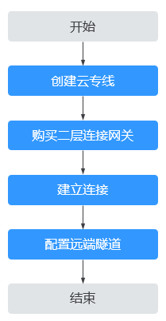

# 二层连接网关简介

## 二层连接网关

二层连接网关（Layer 2 Connection Gateway，以下简称L2CG）是一种虚拟隧道网关，可基于云专线/VPN网络建立云上与云下之间的二层网络，解决云上和云下网络二层互通问题，允许您在不改变子网、IP规划的前提下将数据中心或私有云主机业务部分迁移上云。

通过云专线/VPN，建立的是云上与云下的三层网络通道，要求云上与云下子网网段不重叠。而当数据中心与云上子网网段相同，且需要云上与云下服务器在该相同子网网段互通时，您就可以通过二层连接网关来解决云上与云下二层网络通信问题。

二层连接网关组网图如[图1 L2CG组网图](#fig1449182883911)所示。

**图 1**  二层连接网关组网图  

二层连接网关作为虚拟私有云的隧道网关，与用户本地数据中心侧的隧道网关对应，可基于云专线/VPN网络使虚拟私有云与用户数据中心之间建立二层网络。

二层连接可将虚拟私有云的子网接入到二层连接网关中，并指定二层连接网关与企业数据中心侧的隧道网关建立连接，使虚拟私有云的子网与企业数据中心侧的子网建立二层通信。

二层连接网关功能目前仅在“华东-上海一”开放，且还在公测期间，请申请公测权限后使用。

## 二层连接网关配置流程

**图 2**  二层连接网关配置流程  

1.  创建云专线/VPN

    创建一个云上和云下的三层网络通道，可以选择云专线或VPN。具体操作请参见[云专线](https://support.huaweicloud.com/dc/index.html)或[虚拟专用网络](https://support.huaweicloud.com/vpn/index.html)。

2.  购买二层连接网关

    在云上指定VPC和云专线/VPN的本端子网创建一个二层连接网关，生成本端隧道IP。

3.  建立连接

    在云上指定接入子网和远端隧道IP创建二层连接。

4.  配置远端隧道

    在云下数据中心的网关设备上配置VXLAN隧道。

## 应用场景

通过L2CG在线下传统数据中心与线上VPC之间建立二层网络，帮助企业客户业务快速平滑上云。

-   支持客户业务IP不修改迁移上云，减少业务对环境感知，加快上云进度。
-   支持线上线下二层互通，可通过虚拟IP提供线上线下互备的高可用系统，应对线上或线下单点故障问题，完善客户混合云组网解决方案。
-   支持业务系统灰度上云，应对核心业务分批平滑上云，可按VM粒度进行业务迁移，避免业务在迁移过程中受损，减少上云风险。

## 使用限制

-   每个帐号默认可以创建5个L2CG。（公测期间默认只能创建1个L2CG）。

    如需提升配额请提交工单，请参见[提交工单](https://support.huaweicloud.com/usermanual-ticket/zh-cn_topic_0127038618.html)。

-   一个VPC可绑定多个L2CG，一个L2CG只能绑定一个VPC。
-   一个L2CG支持多个二层连接，二层连接数量受L2CG规格限制。
-   一个L2CG只能绑定一个子网和一个对端隧道网关。
-   已被二层连接绑定过的子网不能再被其它二层连接或L2CG使用。
-   在创建中、删除中、规格变更中的资源不允许做修改或删除操作。

