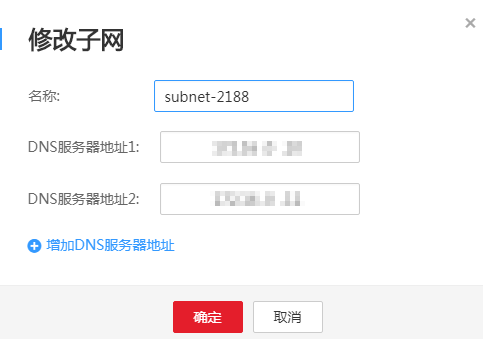

# 修改子网网络信息

## 操作场景

当最初创建子网时设置的DHCP策略或DNS服务器地址需要修改，可通过修改子网网络信息的方式进行调整。

## 操作步骤

1.  登录管理控制台。
2.  在管理控制台左上角单击图标，选择区域和项目。
3.  在系统首页，单击“网络 \> 虚拟私有云”。
4.  在左侧导航栏选择“虚拟私有云”。
5.  在虚拟私有云列表中，单击需要修改子网的虚拟私有云名称。
6.  在“子网”列表待修改子网所在行，单击“修改”。根据界面提示修改参数。如[图1](#f4999b2ead30645ff8f3767504992bfba)所示。

    **图 1**  修改子网  
    

    **表 1**  参数说明

    
    <table><thead align="left"><tr id="r9fa5b742a4a3411f8c03962647a54613"><th class="cellrowborder" valign="top" width="32.22%" id="mcps1.2.4.1.1">
参数

    </th>
    <th class="cellrowborder" valign="top" width="43.1%" id="mcps1.2.4.1.2">
说明

    </th>
    <th class="cellrowborder" valign="top" width="24.68%" id="mcps1.2.4.1.3">
取值样例

    </th>
    </tr>
    </thead>
    <tbody><tr id="r4b7733c08f1b44efa71c70084ae18ba2"><td class="cellrowborder" valign="top" width="32.22%" headers="mcps1.2.4.1.1 ">
名称

    </td>
    <td class="cellrowborder" valign="top" width="43.1%" headers="mcps1.2.4.1.2 ">
子网的名称。

    </td>
    <td class="cellrowborder" valign="top" width="24.68%" headers="mcps1.2.4.1.3 ">
Subnet

    </td>
    </tr>
    <tr id="r353cdea3d7b84db98fdcb684650a65bf"><td class="cellrowborder" valign="top" width="32.22%" headers="mcps1.2.4.1.1 ">
DNS服务器地址1

    </td>
    <td class="cellrowborder" valign="top" width="43.1%" headers="mcps1.2.4.1.2 ">
DNS地址1，可以设置为空，默认情况下使用网络外部的DNS。

    </td>
    <td class="cellrowborder" valign="top" width="24.68%" headers="mcps1.2.4.1.3 ">
-

    </td>
    </tr>
    <tr id="r166e710a7f784ded8c04e6feb2e8b142"><td class="cellrowborder" valign="top" width="32.22%" headers="mcps1.2.4.1.1 ">
DNS服务器地址2

    </td>
    <td class="cellrowborder" valign="top" width="43.1%" headers="mcps1.2.4.1.2 ">
DNS地址2，可以设置为空，默认情况下使用网络外部的DNS。

    </td>
    <td class="cellrowborder" valign="top" width="24.68%" headers="mcps1.2.4.1.3 ">
-

    </td>
    </tr>
    </tbody>
    </table>

7.  单击“确定”。

