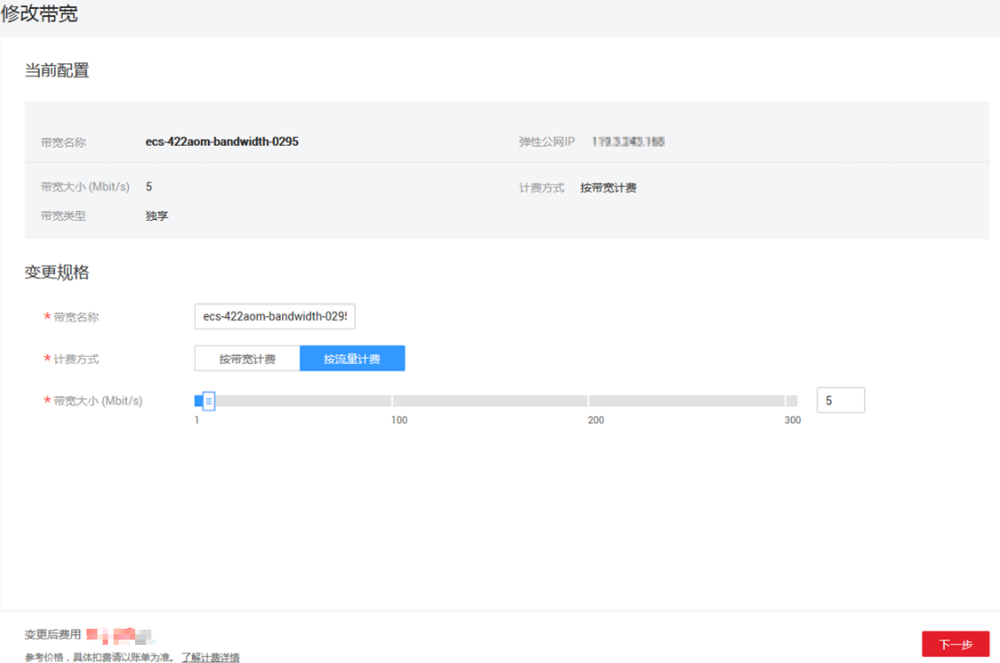

# 修改弹性公网IP的带宽

## 操作场景

对于按需计费的弹性公网IP，支持修改带宽名称、大小、计费方式（按带宽计费、按流量计费）。

对于包年包月的弹性公网IP，支持修改带宽名称和大小。

## 费用影响

**表 1**  费用影响

<table><thead align="left"><tr id="row2070710212517"><th class="cellrowborder" valign="top" width="14.04%" id="mcps1.2.4.1.1">
当前计费模式

</th>
<th class="cellrowborder" valign="top" width="18.91%" id="mcps1.2.4.1.2">
变更场景

</th>
<th class="cellrowborder" valign="top" width="67.05%" id="mcps1.2.4.1.3">
对费用的影响

</th>
</tr>
</thead>
<tbody><tr id="row137079211510"><td class="cellrowborder" valign="top" width="14.04%" headers="mcps1.2.4.1.1 ">
按需

</td>
<td class="cellrowborder" valign="top" width="18.91%" headers="mcps1.2.4.1.2 ">
变更计费方式为按带宽计费、按流量计费

</td>
<td class="cellrowborder" valign="top" width="67.05%" headers="mcps1.2.4.1.3 ">
变更成功后，新的计费方式将立即生效。

</td>
</tr>
<tr id="row6707727518"><td class="cellrowborder" rowspan="2" valign="top" width="14.04%" headers="mcps1.2.4.1.1 ">
包年包月

</td>
<td class="cellrowborder" valign="top" width="18.91%" headers="mcps1.2.4.1.2 ">
增加带宽大小（升配）

</td>
<td class="cellrowborder" valign="top" width="67.05%" headers="mcps1.2.4.1.3 ">
升配后新带宽大小将在原来已有的时间周期内立即生效。需按照与原规格的价格差异，结合已使用的时间周期，补上差价。

</td>
</tr>
<tr id="row1616328121117"><td class="cellrowborder" valign="top" headers="mcps1.2.4.1.1 ">
降低带宽大小（续费降配）

</td>
<td class="cellrowborder" valign="top" headers="mcps1.2.4.1.2 ">
续费成功后新的带宽大小将在新的计费周期生效。

<ul id="ul178551434171416"><li>续费降配订单支付成功后不可取消。</li><li>续费降配后，当前计费周期的剩余时间内不能再对带宽进行任何修改，请谨慎操作。</li></ul>
</td>
</tr>
<tr id="row1211891016159"><td class="cellrowborder" valign="top" width="14.04%" headers="mcps1.2.4.1.1 ">
按需

</td>
<td class="cellrowborder" valign="top" width="18.91%" headers="mcps1.2.4.1.2 ">
转包年包月

</td>
<td class="cellrowborder" valign="top" width="67.05%" headers="mcps1.2.4.1.3 ">
您可以在弹性公网IP页面或费用中心转包年包月，变更成功后，新的计费模式将立即生效。具体操作请参见<a href="https://support.huaweicloud.com/vpc_faq/vpc_faq_0078.html" target="_blank" rel="noopener noreferrer">如何切换计费模式中的“按需”和“包年包月”？</a>。

</td>
</tr>
<tr id="row128237518151"><td class="cellrowborder" valign="top" width="14.04%" headers="mcps1.2.4.1.1 ">
包年包月

</td>
<td class="cellrowborder" valign="top" width="18.91%" headers="mcps1.2.4.1.2 ">
转按需

</td>
<td class="cellrowborder" valign="top" width="67.05%" headers="mcps1.2.4.1.3 ">
您可以在费用中心转按需，包年包月资费到期后，新的按需资费才会生效。具体操作请参见<a href="https://support.huaweicloud.com/vpc_faq/vpc_faq_0078.html" target="_blank" rel="noopener noreferrer">如何切换计费模式中的“按需”和“包年包月”？</a>。

</td>
</tr>
</tbody>
</table>

## 操作步骤

1.  登录管理控制台。
2.  在管理控制台左上角单击，选择区域和项目。
3.  在系统首页，选择“网络 \> 弹性公网IP”。
4.  在“操作”列，选择“更多 \> 修改带宽”。
5.  根据界面提示修改带宽参数。

    **图 1**  修改按需带宽  
    

    **图 2**  修改包年包月带宽  
    

6.  单击“下一步”。
7.  单击“提交”，完成修改。

## 相关操作

-   [如何切换计费方式中的“按带宽计费”和“按流量计费”？](https://support.huaweicloud.com/vpc_faq/vpc_common_0001.html)
-   [什么是入云带宽和出云带宽？](https://support.huaweicloud.com/vpc_faq/faq_bandwidth_0004.html)
-   [包年包月模式的带宽支持升配后再降配吗？](https://support.huaweicloud.com/vpc_faq/faq_bandwidth_0005.html)

