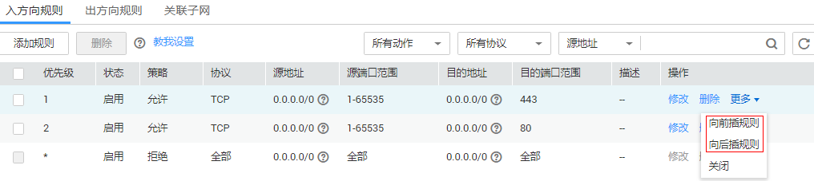

# 修改网络ACL规则生效顺序

## 操作场景

若某个规则需要优先或落后生效，可在对应规则（需要优先或落后于某个规则生效的规则）前面或后面插入此规则。

多个网络ACL规则冲突，更靠前的规则生效，优先级低的不生效。

## 操作步骤

1.  登录管理控制台。

1.  在管理控制台左上角单击，选择区域和项目。
2.  在系统首页，选择“网络 \> 虚拟私有云”。
3.  在左侧导航栏选择“访问控制 \> 网络ACL”。
4.  在“网络ACL”列表区域，选择网络ACL的名称列，单击您需要修改的“网络ACL名称”进入网络ACL详情页面。
5.  在入方向规则或出方向规则页签，选择需要优先或落后生效规则的“操作”列，单击“更多 \> 向前插规则”或“更多 \> 向后插规则”。

    **图 1**  插入规则  
    

6.  根据弹出框提示，填写需要插入规则的参数，单击“确定”插入规则。

