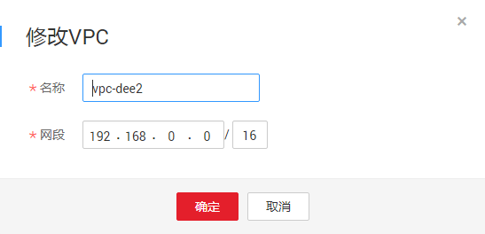

# 修改虚拟私有云基本信息

## 操作场景

修改虚拟私有云的名称、网段。

例如：当虚拟私有云的CIDR和VPN地址有冲突时，可以通过修改虚拟私有云基本信息来调整VPC的地址范围。

## 约束与限制

修改VPC网段时需注意以下两点：

-   修改的VPC网段须在支持的网段内。当前VPC支持的网段有：10.0.0.0/8\~24、172.16.0.0/12\~24、192.168.0.0/16\~24。
-   若该VPC下已有子网，修改网段必须包含所有子网网段。

## 操作步骤

1.  登录管理控制台。
2.  在管理控制台左上角单击，选择区域和项目。
3.  在系统首页，选择“网络 \> 虚拟私有云”。
4.  在左侧导航栏选择“虚拟私有云”。
5.  在虚拟私有云列表中待修改的虚拟私有云所在行的“操作”列下单击“修改”或“编辑网段”。
6.  在“修改VPC”或“编辑网段”页面，根据界面提示修改参数。可以修改虚拟私有云的名称、VPC网段。如[图1](#fig6227525253)所示。

    **图 1**  修改虚拟私有云  
    

7.  单击“确定”。

