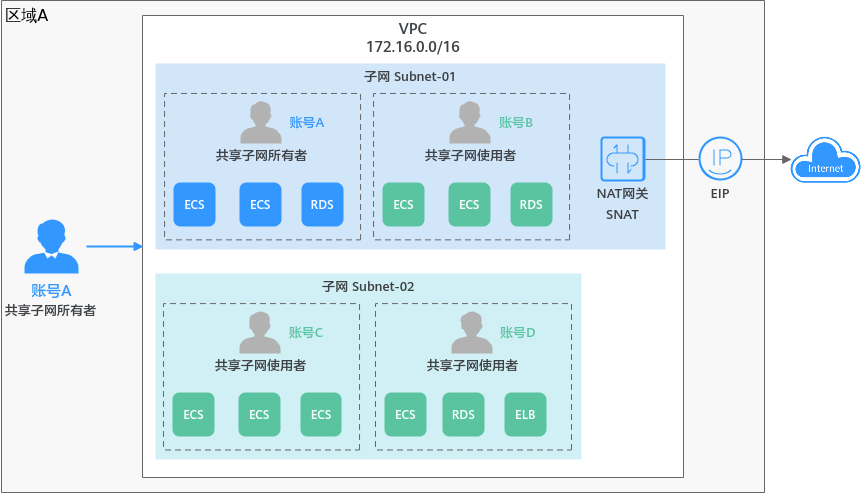

# 共享VPC使用示例

某企业的云上业务主要分为两类，一类业务需要连接公网，一类业务不需要连接公网。为了规范管理各类资源，该企业使用账号A作为IT管理账号，用来管理基础公共资源，主要包括VPC、子网、路由表等。同时，账号A需要将子网共享给其他账号共同使用（账号B，账号C以及账号D），其他账号可以在子网内创建各自的资源，例如ECS、RDS以及ELB等。企业的账号和资源规划详情如[表1](#table534341514119)所示。

**图 1**  共享VPC业务规划示例  

**表 1**  账号及资源规划说明

<table><thead align="left"><tr id="row1334311513119"><th class="cellrowborder" valign="top" width="12.541254125412543%" id="mcps1.2.4.1.1">
账号

</th>
<th class="cellrowborder" valign="top" width="24.512451245124513%" id="mcps1.2.4.1.2">
账号角色

</th>
<th class="cellrowborder" valign="top" width="62.94629462946294%" id="mcps1.2.4.1.3">
资源说明

</th>
</tr>
</thead>
<tbody><tr id="row173435151718"><td class="cellrowborder" valign="top" width="12.541254125412543%" headers="mcps1.2.4.1.1 ">
账号A

</td>
<td class="cellrowborder" valign="top" width="24.512451245124513%" headers="mcps1.2.4.1.2 ">
共享VPC和子网的所有者

</td>
<td class="cellrowborder" valign="top" width="62.94629462946294%" headers="mcps1.2.4.1.3 "><ul id="ul12568316835"><li>账号A创建VPC和子网，并将子网共享给其他账号。</li><li>账号A创建NAT网关以及EIP资源，通过配置SNAT使子网Subnet-01连通公网。</li></ul>
</td>
</tr>
<tr id="row18344415815"><td class="cellrowborder" valign="top" width="12.541254125412543%" headers="mcps1.2.4.1.1 ">
账号B

</td>
<td class="cellrowborder" valign="top" width="24.512451245124513%" headers="mcps1.2.4.1.2 ">
共享子网的使用者

</td>
<td class="cellrowborder" valign="top" width="62.94629462946294%" headers="mcps1.2.4.1.3 ">
账号B在子网Subnet-01创建ECS和RDS资源，用来部署面向公网的应用程序。

</td>
</tr>
<tr id="row1845116400317"><td class="cellrowborder" valign="top" width="12.541254125412543%" headers="mcps1.2.4.1.1 ">
账号C和账号D

</td>
<td class="cellrowborder" valign="top" width="24.512451245124513%" headers="mcps1.2.4.1.2 ">
共享子网的使用者

</td>
<td class="cellrowborder" valign="top" width="62.94629462946294%" headers="mcps1.2.4.1.3 ">
账号C和账号D共同使用子网Subnet-02，在子网内创建各自业务所需的ECS、RDS以及ELB等资源，不需要连通公网。

</td>
</tr>
</tbody>
</table>

同一个VPC内的不同子网网络默认互通，但是由于不同账号下的资源需要关联各自的安全组，不同安全组之间网络隔离，因此如果有网络互通需求，需要放通资源对应安全组之间的网络。

-   账号A内的资源属于安全组Sg-A。
-   账号B内的资源属于安全组Sg-B。
-   账号C内的资源属于安全组Sg-C。
-   账号D内的资源属于安全组Sg-D。

如果需要账号C和账号D内的资源网络互通，则需要在Sg-C和Sg-D的入方向分别添加以下规则：

**表 2**  放通Sg-C和Sg-D的网络

<table><thead align="left"><tr id="row13741154103116"><th class="cellrowborder" valign="top" width="8.73912608739126%" id="mcps1.2.8.1.1">
安全组

</th>
<th class="cellrowborder" valign="top" width="12.668733126687329%" id="mcps1.2.8.1.2">
方向

</th>
<th class="cellrowborder" valign="top" width="13.148685131486848%" id="mcps1.2.8.1.3">
优先级

</th>
<th class="cellrowborder" valign="top" width="13.148685131486848%" id="mcps1.2.8.1.4">
策略

</th>
<th class="cellrowborder" valign="top" width="11.62883711628837%" id="mcps1.2.8.1.5">
类型

</th>
<th class="cellrowborder" valign="top" width="16.788321167883208%" id="mcps1.2.8.1.6">
协议端口

</th>
<th class="cellrowborder" valign="top" width="23.87761223877612%" id="mcps1.2.8.1.7">
源地址

</th>
</tr>
</thead>
<tbody><tr id="row15751154173117"><td class="cellrowborder" valign="top" width="8.73912608739126%" headers="mcps1.2.8.1.1 ">
Sg-C

</td>
<td class="cellrowborder" valign="top" width="12.668733126687329%" headers="mcps1.2.8.1.2 ">
入方向

</td>
<td class="cellrowborder" valign="top" width="13.148685131486848%" headers="mcps1.2.8.1.3 ">
1

</td>
<td class="cellrowborder" valign="top" width="13.148685131486848%" headers="mcps1.2.8.1.4 ">
允许

</td>
<td class="cellrowborder" valign="top" width="11.62883711628837%" headers="mcps1.2.8.1.5 ">
IPv4

</td>
<td class="cellrowborder" valign="top" width="16.788321167883208%" headers="mcps1.2.8.1.6 ">
根据业务需求选择该项。

示例：全部协议

</td>
<td class="cellrowborder" valign="top" width="23.87761223877612%" headers="mcps1.2.8.1.7 ">
安全组：Sg-D

</td>
</tr>
<tr id="row667242155711"><td class="cellrowborder" valign="top" width="8.73912608739126%" headers="mcps1.2.8.1.1 ">
Sg-D

</td>
<td class="cellrowborder" valign="top" width="12.668733126687329%" headers="mcps1.2.8.1.2 ">
入方向

</td>
<td class="cellrowborder" valign="top" width="13.148685131486848%" headers="mcps1.2.8.1.3 ">
1

</td>
<td class="cellrowborder" valign="top" width="13.148685131486848%" headers="mcps1.2.8.1.4 ">
允许

</td>
<td class="cellrowborder" valign="top" width="11.62883711628837%" headers="mcps1.2.8.1.5 ">
IPv4

</td>
<td class="cellrowborder" valign="top" width="16.788321167883208%" headers="mcps1.2.8.1.6 ">
根据业务需求选择该项。

示例：全部协议

</td>
<td class="cellrowborder" valign="top" width="23.87761223877612%" headers="mcps1.2.8.1.7 ">
安全组：Sg-C

</td>
</tr>
</tbody>
</table>

