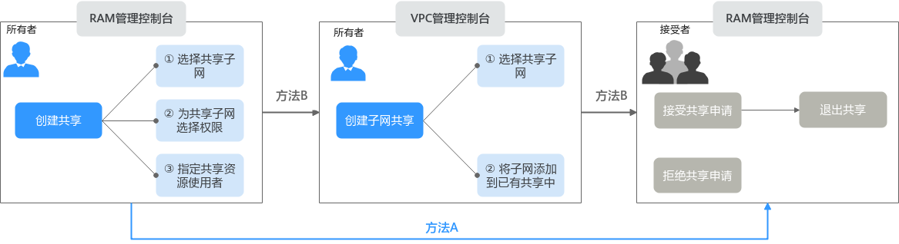

# 共享VPC简介

## 共享VPC功能介绍

共享VPC功能支持多个账号在一个集中管理，共享的VPC内创建云资源，比如ECS、ELB、RDS等。共享VPC基于资源访问管理（Resource Access Manager，简称RAM）服务的机制，VPC的所有者可以将VPC内的子网共享给一个或者多个账号使用。通过共享VPC功能，可以简化网络配置，帮助您统一配置和运维多个账号下的资源，有助于提升资源的管控效率，降低运维成本。

以下为您详细介绍共享VPC的使用场景，如[图1](#fig16662957112716)所示。

-   账号A：企业的IT管理账号，共享VPC和子网的所有者。

    账号A创建VPC和子网，并将子网共享给其他账号，同时也在子网Subnet-01下创建资源。

-   账号B：企业的业务账号，共享子网的使用者。使用子网Subnet-02创建资源。
-   账号C：企业的业务账号，共享子网的使用者。使用子网Subnet-03创建资源。
-   账号D：企业的业务账号，共享子网的使用者。使用子网Subnet-04创建资源。

**图 1**  共享VPC场景  

> **须知：** 
>所有者和使用者的子网在同一个VPC内，子网默认网络互通。但是由于使用者和所有者位于共享子网内的资源关联不同的安全组内，因此资源之间网络隔离，如果需要资源之间互通，需要添加安全组规则放通不同安全组之间的网络，具体方法请参见[添加安全组规则](添加安全组规则.md)。
>比如，放通账号A和账号B内两个ECS的安全组，则需要分别在两个安全组内添加入方向规则，源地址选择对方安全组。

## 共享VPC的优势

对于金融企业以及其他大企业的基础IT系统，资源在多个账号下分权管理，通常面临以下问题：

-   同时存在网络账号、安全账号、业务账号等多个账号，跨账号的资源管理，提升运维难度。
-   现有的跨账号网络配置导致组网结构复杂，用户操作体验下降并且效率较低。

为了更好的解决以上问题，我们推荐您使用共享VPC功能。企业可以按照组织结构或业务形态，将不同账号有序组织，并集中进行管理。

-   在一个账号内统一创建资源，并将资源共享给其他账号，其他账号无需创建重复资源，可以精简资源数量以及网络架构，提升管理效率并节约成本。

    比如不同账号下的VPC网络互通需要建立对等连接，使用共享VPC后，则不同账号用户可以在同一个VPC创建资源，免去了对等连接配置，有效的简化组网结构。

-   在一个账号内统一管理运维资源，便于企业集中配置业务安全策略，并且利于对资源使用情况的监控和审计，支撑业务的安全诉求。

## 共享VPC子网创建流程

使用共享VPC功能之前，您需要启用账号内的资源访问管理RAM服务，详情请参见  [资源访问管理 RAM 帮助文档](https://support.huaweicloud.com/productdesc-ram/ram_01_0001.html)。

作为虚拟私有云子网的所有者，您可以将VPC内的子网共享给其他账号的使用者，使用者接受该共享请求后，子网共享才会成功。共享子网创建流程如[图2](#fig1955972516512)所示。

**图 2**  共享子网创建流程  

您可以使用RAM管理控制台或者VPC管理控制台，创建子网共享，[表3](#table168733271489)中详细为您介绍方法A和方法B。

**表 1**  共享子网创建流程说明

<table><thead align="left"><tr id="row2043142882317"><th class="cellrowborder" valign="top" width="10.74%" id="mcps1.2.4.1.1">
方法

</th>
<th class="cellrowborder" valign="top" width="57.24%" id="mcps1.2.4.1.2">
说明

</th>
<th class="cellrowborder" valign="top" width="32.019999999999996%" id="mcps1.2.4.1.3">
操作指导

</th>
</tr>
</thead>
<tbody><tr id="row1431928122311"><td class="cellrowborder" valign="top" width="10.74%" headers="mcps1.2.4.1.1 ">
方法A

</td>
<td class="cellrowborder" valign="top" width="57.24%" headers="mcps1.2.4.1.2 "><ol id="ol55221829133011"><li>通过RAM管理控制台，所有者创建共享，将子网共享给使用者。配置如下：<ol type="a" id="ol1939218356268"><li>选择共享子网。</li><li>为共享子网选择权限，即指定使用者对该共享子网具备的权限。</li><li>指定共享子网的使用者，可以指定多个。</li></ol>
</li><li>共享创建完成后，通过RAM管理控制台，使用者可以选择接受或者拒绝共享申请。<ul id="ul1064401613317"><li>使用者接受共享申请，子网共享成功。
如果后续使用者不再需要使用该共享子网，可以退出该共享。

</li><li>使用者拒绝共享申请，子网共享失败。</li></ul>
</li></ol>
</td>
<td class="cellrowborder" valign="top" width="32.019999999999996%" headers="mcps1.2.4.1.3 "><ol id="ol15691950153919"><li><a href="https://support.huaweicloud.com/usermanual-ram/ram_03_0003.html" target="_blank" rel="noopener noreferrer">创建共享</a></li><li><a href="https://support.huaweicloud.com/usermanual-ram/ram_03_0011.html" target="_blank" rel="noopener noreferrer">接受/拒绝共享邀请</a>
<a href="https://support.huaweicloud.com/usermanual-ram/ram_03_0012.html" target="_blank" rel="noopener noreferrer">退出共享</a>

</li></ol>
</td>
</tr>
<tr id="row14431328122318"><td class="cellrowborder" valign="top" width="10.74%" headers="mcps1.2.4.1.1 ">
方法B

</td>
<td class="cellrowborder" valign="top" width="57.24%" headers="mcps1.2.4.1.2 "><ol id="ol1639815304"><li id="li3798164994814">通过RAM管理控制台，所有者创建共享，将子网共享给使用者。配置如下：<ol type="a" id="vpc_share_0001_ol1939218356268"><li>选择共享子网。</li><li>为共享子网选择权限，即指定使用者对该共享子网具备的权限。</li><li>指定共享子网的使用者，可以指定多个。</li></ol>
</li><li>通过VPC管理控制台，所有者创建子网共享，将子网添加至<a href="#li3798164994814">1</a>中已创建的共享中即可。</li><li>共享创建完成后，通过RAM管理控制台，使用者可以选择接受或者拒绝共享申请。<ul id="vpc_share_0001_ul1064401613317"><li>使用者接受共享申请，子网共享成功。
如果后续使用者不再需要使用该共享子网，可以退出该共享。

</li><li>使用者拒绝共享申请，子网共享失败。</li></ul>
</li></ol>
</td>
<td class="cellrowborder" valign="top" width="32.019999999999996%" headers="mcps1.2.4.1.3 "><ol id="ol81511034135115"><li><a href="https://support.huaweicloud.com/usermanual-ram/ram_03_0003.html" target="_blank" rel="noopener noreferrer">创建共享</a></li><li><a href="将VPC子网共享给其他账号.md">将VPC子网共享给其他账号</a></li><li><a href="https://support.huaweicloud.com/usermanual-ram/ram_03_0011.html" target="_blank" rel="noopener noreferrer">接受/拒绝共享邀请</a>
<a href="https://support.huaweicloud.com/usermanual-ram/ram_03_0012.html" target="_blank" rel="noopener noreferrer">退出共享</a>

</li></ol>
</td>
</tr>
</tbody>
</table>

## 共享VPC内所有者和使用者的权限

所有者将VPC子网共享给使用者后，所有者和使用者对共享子网、以及子网内关联云资源的操作权限如[表2](#table12766714194417)所示。

**表 2**  共享VPC内所有者和使用者的权限

<table><thead align="left"><tr id="row9766714134413"><th class="cellrowborder" valign="top" width="6.77%" id="mcps1.2.5.1.1">
角色

</th>
<th class="cellrowborder" valign="top" width="34.23%" id="mcps1.2.5.1.2">
所有者将子网共享给使用者时

</th>
<th class="cellrowborder" valign="top" width="28.99%" id="mcps1.2.5.1.3">
所有者停止子网共享后

</th>
<th class="cellrowborder" valign="top" width="30.009999999999998%" id="mcps1.2.5.1.4">
使用者退出子网共享后

</th>
</tr>
</thead>
<tbody><tr id="row18766191418440"><td class="cellrowborder" valign="top" width="6.77%" headers="mcps1.2.5.1.1 ">
所有者

</td>
<td class="cellrowborder" valign="top" width="34.23%" headers="mcps1.2.5.1.2 "><ul id="ul97305541977"><li>所有者可以对VPC内的资源执行的操作详细如<a href="#table168733271489">表3</a>所示。</li><li>所有者不可以修改、删除使用者创建的资源，比如ECS、ELB、RDS实例等。</li><li>在子网的“IP地址管理”页面中，所有者可以查看使用者创建资源的IP地址和资源ID等信息。</li></ul>
</td>
<td class="cellrowborder" valign="top" width="28.99%" headers="mcps1.2.5.1.3 "><ul id="ul173663199537"><li>所有者可以正常使用、删除、管理VPC下的所有所有资源。</li><li>如果使用者在已停止共享的子网中仍拥有资源，则所有者无法删除共享子网或共享子网所在的VPC。</li></ul>
</td>
<td class="cellrowborder" valign="top" width="30.009999999999998%" headers="mcps1.2.5.1.4 "><ul id="ul101481516145920"><li>所有者可以正常使用、删除、管理VPC下的所有所有资源。</li><li>如果使用者退出子网共享后，在共享的子网中仍拥有资源，则所有者无法删除共享子网或共享子网所在的VPC。</li></ul>
</td>
</tr>
<tr id="row1676615143442"><td class="cellrowborder" valign="top" width="6.77%" headers="mcps1.2.5.1.1 ">
使用者

</td>
<td class="cellrowborder" valign="top" width="34.23%" headers="mcps1.2.5.1.2 "><ul id="ul129699010251"><li>使用者可以对VPC内的资源执行的操作详细如<a href="#table168733271489">表3</a>所示。</li><li>使用者可以在共享VPC子网内新建资源，比如ECS、ELB、RDS实例等。</li><li>在子网的“IP地址管理”页面中，使用者可以查看自己创建资源的IP地址和资源ID等信息，无法查看所有者和其他使用者创建的资源信息。</li></ul>
</td>
<td class="cellrowborder" valign="top" width="28.99%" headers="mcps1.2.5.1.3 ">
使用者可以继续使用自己创建的资源，无法在该共享子网内新创建资源。

</td>
<td class="cellrowborder" valign="top" width="30.009999999999998%" headers="mcps1.2.5.1.4 ">
使用者可以继续使用自己创建的资源，无法在该共享子网内新创建资源。

</td>
</tr>
</tbody>
</table>

所有者和使用者对共享子网及其关联资源的使用操作权限不同，具体如[表3](#table168733271489)所示。

**表 3**  共享VPC内所有者和使用者的权限（共享时）

<table><thead align="left"><tr id="row2087211271186"><th class="cellrowborder" valign="top" width="17.91%" id="mcps1.2.4.1.1">
资源

</th>
<th class="cellrowborder" valign="top" width="37.66%" id="mcps1.2.4.1.2">
资源所有者的操作权限

</th>
<th class="cellrowborder" valign="top" width="44.43%" id="mcps1.2.4.1.3">
资源使用者的操作权限

</th>
</tr>
</thead>
<tbody><tr id="row1687318275813"><td class="cellrowborder" valign="top" width="17.91%" headers="mcps1.2.4.1.1 ">
虚拟私有云

</td>
<td class="cellrowborder" valign="top" width="37.66%" headers="mcps1.2.4.1.2 ">
所有者拥有虚拟私有云的全部操作权限。

</td>
<td class="cellrowborder" valign="top" width="44.43%" headers="mcps1.2.4.1.3 ">
使用者可以查看共享子网所在的虚拟私有云，无法对虚拟私有云执行任何操作。

</td>
</tr>
<tr id="row1287310271812"><td class="cellrowborder" valign="top" width="17.91%" headers="mcps1.2.4.1.1 ">
子网

</td>
<td class="cellrowborder" valign="top" width="37.66%" headers="mcps1.2.4.1.2 ">
所有者拥有子网的全部操作权限。同时，所有者可以查看共享者位于共享子网内的虚拟IP和弹性网卡。

</td>
<td class="cellrowborder" valign="top" width="44.43%" headers="mcps1.2.4.1.3 ">
使用者可以查看共享子网，无法对共享子网执行以下操作：<ul id="ul186840695920"><li>修改子网信息</li><li>删除子网</li><li>添加、修改以及删除子网标签</li></ul>

使用者可以在共享子网内，创建虚拟IP和弹性网卡。

</td>
</tr>
<tr id="row198736271584"><td class="cellrowborder" valign="top" width="17.91%" headers="mcps1.2.4.1.1 ">
路由表

</td>
<td class="cellrowborder" valign="top" width="37.66%" headers="mcps1.2.4.1.2 ">
所有者拥有路由表的全部操作权限。

</td>
<td class="cellrowborder" valign="top" width="44.43%" headers="mcps1.2.4.1.3 "><ul id="ul19990153817519"><li>使用者无法在共享子网所在虚拟私有云内新建路由表。</li><li>使用者可以在查看共享子网关联的路由表及路由表内路由，无法对该路由表及表内路由执行任何操作。</li></ul>
</td>
</tr>
<tr id="row5562036115012"><td class="cellrowborder" valign="top" width="17.91%" headers="mcps1.2.4.1.1 ">
网络ACL

</td>
<td class="cellrowborder" valign="top" width="37.66%" headers="mcps1.2.4.1.2 ">
所有者拥有网络ACL的全部操作权限。

</td>
<td class="cellrowborder" valign="top" width="44.43%" headers="mcps1.2.4.1.3 "><ul id="ul1557134165116"><li>使用者可以在查看共享子网关联的网络ACL，无法对该网络ACL执行任何操作。</li><li>使用者无法将所有者的网络ACL关联至自己名下的子网。</li></ul>
</td>
</tr>
<tr id="row3873112715812"><td class="cellrowborder" valign="top" width="17.91%" headers="mcps1.2.4.1.1 ">
安全组

</td>
<td class="cellrowborder" valign="top" width="37.66%" headers="mcps1.2.4.1.2 "><ul id="ul17335040459"><li>安全组资源是独立的，所有者可以创建自己的安全组。</li><li>所有者只拥有自己安全组的操作权限，无法操作使用者的安全组。</li><li>对于同一个共享子网下的资源所关联的安全组，所有者在自己的安全组内添加安全组规则时，“源地址”可以选择使用者创建的安全组。
例如，在共享子网Subnet-X内，存在以下资源：<ul id="ul16369192215141"><li>所有者创建了云服务器ECS-X，关联安全组Sys-X。</li><li>使用者A创建了云服务器ECS-A，关联安全组Sys-A。</li><li>使用者B创建了数据库RDS-B，关联安全组Sys-B。</li></ul>

所有者为Sys-X添加安全组规则时，“源地址”可以选择安全组Sys-A或者安全组Sys-B。

</li></ul>
</td>
<td class="cellrowborder" valign="top" width="44.43%" headers="mcps1.2.4.1.3 "><ul id="ul18200154513502"><li>安全组资源是独立的，使用者可以创建自己的安全组。</li><li>使用者只拥有自己安全组的操作权限，无法操作所有者和其他使用者的安全组。</li><li>对于同一个共享子网下的资源所关联的安全组，使用者在自己的安全组内添加安全组规则时，“源地址”可以选择所有者和其他使用者创建的安全组。
例如，在共享子网Subnet-X内，存在以下资源：<ul id="vpc_share_0001_ul16369192215141"><li>所有者创建了云服务器ECS-X，关联安全组Sys-X。</li><li>使用者A创建了云服务器ECS-A，关联安全组Sys-A。</li><li>使用者B创建了数据库RDS-B，关联安全组Sys-B。</li></ul>

使用者A为Sys-A添加安全组规则时，“源地址”可以选择所有者的安全组Sys-X或者使用者B的安全组Sys-B。

</li></ul>
</td>
</tr>
<tr id="row1981833314319"><td class="cellrowborder" valign="top" width="17.91%" headers="mcps1.2.4.1.1 ">
IP地址组

</td>
<td class="cellrowborder" valign="top" width="37.66%" headers="mcps1.2.4.1.2 ">
IP地址组资源是独立的，所有者可以创建IP地址组，并将IP地址组关联至自己的安全组。

</td>
<td class="cellrowborder" valign="top" width="44.43%" headers="mcps1.2.4.1.3 ">
IP地址组资源是独立的，使用者可以创建IP地址组，并将IP地址组关联至自己的安全组。

</td>
</tr>
<tr id="row12688134844412"><td class="cellrowborder" valign="top" width="17.91%" headers="mcps1.2.4.1.1 ">
流日志

</td>
<td class="cellrowborder" valign="top" width="37.66%" headers="mcps1.2.4.1.2 "><ul id="ul1072515189495"><li>所有者可以创建“资源类型”为“虚拟私有云”或者“子网”的流日志，该流日志可以对使用者位于该共享子网下的弹性网卡生效。</li><li>所有者可以创建“资源类型”为“网卡”的流日志，该流日志仅对所有者自己的弹性网卡生效。</li></ul>
</td>
<td class="cellrowborder" valign="top" width="44.43%" headers="mcps1.2.4.1.3 ">
使用者只可以创建“资源类型”为“网卡”的流日志，该流日志对使用者自己的弹性网卡生效。

</td>
</tr>
<tr id="row19937153110532"><td class="cellrowborder" valign="top" width="17.91%" headers="mcps1.2.4.1.1 ">
对等连接

</td>
<td class="cellrowborder" valign="top" width="37.66%" headers="mcps1.2.4.1.2 ">
所有者创建VPC之间的对等连接时，可以选择共享VPC。

</td>
<td class="cellrowborder" valign="top" width="44.43%" headers="mcps1.2.4.1.3 ">
使用者创建VPC之间的对等连接时，无法选择共享VPC。

</td>
</tr>
<tr id="row14381018162515"><td class="cellrowborder" valign="top" width="17.91%" headers="mcps1.2.4.1.1 ">
NAT网关

</td>
<td class="cellrowborder" valign="top" width="37.66%" headers="mcps1.2.4.1.2 ">
所有者可以在共享子网内创建并管理NAT网关。

</td>
<td class="cellrowborder" valign="top" width="44.43%" headers="mcps1.2.4.1.3 ">
使用者无法在共享子网中创建NAT网关。

</td>
</tr>
<tr id="row5444121474318"><td class="cellrowborder" valign="top" width="17.91%" headers="mcps1.2.4.1.1 ">
虚拟专用网络 VPN

</td>
<td class="cellrowborder" valign="top" width="37.66%" headers="mcps1.2.4.1.2 ">
所有者可以在共享子网内创建并管理VPN网关。

</td>
<td class="cellrowborder" valign="top" width="44.43%" headers="mcps1.2.4.1.3 ">
使用者无法在共享子网内创建VPN网关。

</td>
</tr>
<tr id="row13844044164210"><td class="cellrowborder" valign="top" width="17.91%" headers="mcps1.2.4.1.1 ">
企业路由器 ER

</td>
<td class="cellrowborder" valign="top" width="37.66%" headers="mcps1.2.4.1.2 ">
在企业路由器中添加“虚拟私有云”连接时，所有者可以选择共享子网所在的VPC，将VPC接入企业路由器中。

</td>
<td class="cellrowborder" valign="top" width="44.43%" headers="mcps1.2.4.1.3 ">
在企业路由器中添加“虚拟私有云”连接时，使用者无法选择共享子网所在的VPC。

</td>
</tr>
<tr id="row9844344194212"><td class="cellrowborder" valign="top" width="17.91%" headers="mcps1.2.4.1.1 ">
企业交换机 ESW

</td>
<td class="cellrowborder" valign="top" width="37.66%" headers="mcps1.2.4.1.2 ">
所有者可以在共享子网内创建并管理企业交换机。

</td>
<td class="cellrowborder" valign="top" width="44.43%" headers="mcps1.2.4.1.3 ">
使用者无法在共享子网内创建企业交换机。

</td>
</tr>
<tr id="row1661731704316"><td class="cellrowborder" valign="top" width="17.91%" headers="mcps1.2.4.1.1 ">
云专线 DC

</td>
<td class="cellrowborder" valign="top" width="37.66%" headers="mcps1.2.4.1.2 ">
所有者可以在共享子网内创建并管理云专线。

</td>
<td class="cellrowborder" valign="top" width="44.43%" headers="mcps1.2.4.1.3 ">
使用者无法在共享子网内创建云专线。

</td>
</tr>
<tr id="row1461861710432"><td class="cellrowborder" valign="top" width="17.91%" headers="mcps1.2.4.1.1 ">
云连接 CC

</td>
<td class="cellrowborder" valign="top" width="37.66%" headers="mcps1.2.4.1.2 ">
在云连接中添加VPC时，所有者可以选择共享子网。

</td>
<td class="cellrowborder" valign="top" width="44.43%" headers="mcps1.2.4.1.3 ">
在云连接中添加VPC时，使用者无法选择共享子网。

</td>
</tr>
<tr id="row17618141794315"><td class="cellrowborder" valign="top" width="17.91%" headers="mcps1.2.4.1.1 ">
终端节点服务 VPCEP

</td>
<td class="cellrowborder" valign="top" width="37.66%" headers="mcps1.2.4.1.2 ">
所有者可以在共享子网内创建并管理终端节点。

</td>
<td class="cellrowborder" valign="top" width="44.43%" headers="mcps1.2.4.1.3 ">
使用者无法在共享子网内创建终端节点。

</td>
</tr>
<tr id="row18596113144611"><td class="cellrowborder" valign="top" width="17.91%" headers="mcps1.2.4.1.1 ">
标签

</td>
<td class="cellrowborder" valign="top" width="37.66%" headers="mcps1.2.4.1.2 ">
所有者可以在共享子网内创建并管理标签。

</td>
<td class="cellrowborder" valign="top" width="44.43%" headers="mcps1.2.4.1.3 ">
使用者无法在共享子网内创建标签。

</td>
</tr>
</tbody>
</table>

## 共享VPC计费说明

在共享VPC中，使用者只需要为自己所创建的资源付费，比如ECS、ELB以及RDS实例等。各种资源的计费详情，请参见对应云资源的计费说明。

## 共享VPC配额说明

共享VPC的各项配额说明如[表4](#table14258125544512)所示，当前配额项均不支持提升，请合理规划您的资源。

**表 4**  共享VPC的配额说明

<table><thead align="left"><tr id="row20258115594513"><th class="cellrowborder" valign="top" width="41.21%" id="mcps1.2.3.1.1">
配额项目

</th>
<th class="cellrowborder" valign="top" width="58.79%" id="mcps1.2.3.1.2">
默认配额

</th>
</tr>
</thead>
<tbody><tr id="row11208719131015"><td class="cellrowborder" valign="top" width="41.21%" headers="mcps1.2.3.1.1 ">
单个资源使用者支持接收的共享子网数量

</td>
<td class="cellrowborder" valign="top" width="58.79%" headers="mcps1.2.3.1.2 ">
100个

</td>
</tr>
<tr id="row1567285717103"><td class="cellrowborder" valign="top" width="41.21%" headers="mcps1.2.3.1.1 ">
单个子网支持共享至资源使用者的最大数量

</td>
<td class="cellrowborder" valign="top" width="58.79%" headers="mcps1.2.3.1.2 ">
100个

</td>
</tr>
</tbody>
</table>

## 共享VPC的约束与限制

-   单个使用者最多可同时接收100个共享子网，当共享子网数量超过100个时，使用者将无法接收到超出数量的共享子网。
-   单个子网最多可同时共享给100个使用者，当使用者数量超过100个时，超出数量的使用者将无法接收到共享子网。
-   支持在共享VPC子网下创建的资源如下，此处仅列举了常用资源，更多资源情况请以控制台实际使用为准。
    -   弹性云服务器 ECS
    -   裸金属服务器 BMS
    -   弹性负载均衡 ELB：使用者可以在共享子网内创建独享型ELB实例，无法创建共享型ELB实例。
    -   云容器实例 CCI
    -   云容器引擎 CCE：使用者可以在共享子网内创建CCE Turbo集群。
    -   API网关 APIG
    -   应用管理与运维平台 ServiceStage
    -   微服务引擎 CSE
    -   函数工作流 FunctionGraph
    -   云数据库 GaussDB
    -   云数据库 RDS
    -   数据加密服务 DEW
    -   数据安全中心 DSC
    -   数据库安全服务 DBSS
    -   云堡垒机 CBH
    -   专属分布式存储服务 DSS
    -   数据仓库服务 GaussDB\(DWS\)
    -   数据治理中心 DataArts Studio
    -   云数据迁移 CDM

