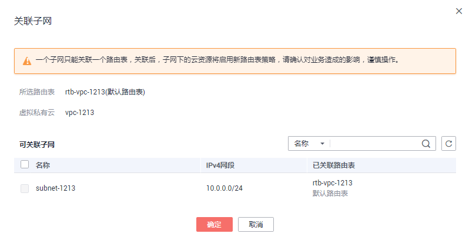

# 关联子网与路由表

## 操作场景

为路由表关联子网。关联后，该路由表的路由规则将对该子网生效，该子网下的云资源将启用这个新的路由策略，请确认对业务造成的影响，谨慎操作。

一个子网只能关联一个路由表。

## 操作步骤

1.  登录管理控制台。
2.  在管理控制台左上角单击，选择区域和项目。
3.  在系统首页，选择“网络 \> 虚拟私有云”。
4.  在左侧导航栏选择“路由表”。
5.  在路由表列表中，单击操作列的“关联子网”。
6.  选择需要关联的子网。

    **图 1**  关联子网  
    

7.  单击“确定”，完成关联。

