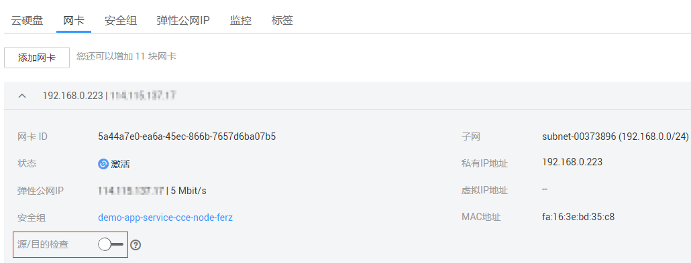

# 关闭源/目的检查（适用于高可用负载均衡集群场景）

1.  登录管理控制台。
2.  在管理控制台左上角单击，选择区域和项目。
3.  选择“计算 \> 弹性云服务器”。
4.  在弹性云服务器列表中单击该弹性云服务器名称。
5.  进入弹性云服务器详情页面，单击“网卡”页签。
6.  确认网卡详情中“源/目的检查”状态已设置“关闭”。

    **图 1**  关闭源/目的检查  
    

