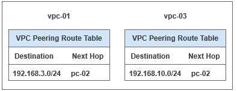
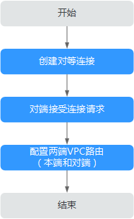
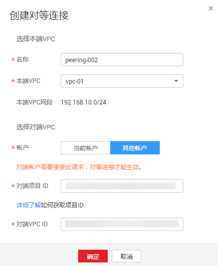

# 创建不同帐户下的对等连接

## 操作场景

VPC支持本帐户与其他帐户内相同区域的VPC创建对等连接。与其他帐户内相同区域的VPC创建对等连接时，需要对端帐户接受对等连接请求，才能建立有效对等连接。

本小节以分别属于不同账户下的vpc-01和vpc-03为例，创建不同账户下的对等连接。

假设vpc-01的CIDR为192.168.10.0/24，vpc-03的CIDR为192.168.3.0/24。

对等连接路由信息如所示。

**图 1**  vpc-01和vpc-03对等连接路由表  

## 操作流程

**图 2**  跨帐户的VPC创建对等连接流程  

跨帐户创建VPC对等连接时，一端VPC发起创建对等连接请求，对等连接状态为待接受。待对方接受该创建请求后，对等连接状态变为已接受，请求方和接受方须分别配置对等连接路由信息，才能使两个VPC互通。

## 创建VPC对等连接

1.  登录管理控制台。
2.  在管理控制台左上角单击，选择区域和项目。
3.  在系统首页，选择“网络 \> 虚拟私有云”。
4.  在左侧导航栏选择“对等连接”。
5.  在界面右侧详情区域单击“创建对等连接”。
6.  根据界面提示配置参数，其中“帐户”选择“其他帐户”。

    **图 3**  创建对等连接  
    

    **表 1**  参数说明

    
    <table><thead align="left"><tr id="row154231823162613"><th class="cellrowborder" valign="top" width="21.482148214821482%" id="mcps1.2.4.1.1">
参数

    </th>
    <th class="cellrowborder" valign="top" width="45.18451845184518%" id="mcps1.2.4.1.2">
说明

    </th>
    <th class="cellrowborder" valign="top" width="33.33333333333333%" id="mcps1.2.4.1.3">
取值样例

    </th>
    </tr>
    </thead>
    <tbody><tr id="row64247230268"><td class="cellrowborder" valign="top" width="21.482148214821482%" headers="mcps1.2.4.1.1 ">
名称

    </td>
    <td class="cellrowborder" valign="top" width="45.18451845184518%" headers="mcps1.2.4.1.2 ">
对等连接名称。

    
由中文字符、英文字母、数字、中划线、下划线等构成，一般不超过64个字符。

    </td>
    <td class="cellrowborder" valign="top" width="33.33333333333333%" headers="mcps1.2.4.1.3 ">
peering-002

    </td>
    </tr>
    <tr id="row84241823122615"><td class="cellrowborder" valign="top" width="21.482148214821482%" headers="mcps1.2.4.1.1 ">
本端VPC

    </td>
    <td class="cellrowborder" valign="top" width="45.18451845184518%" headers="mcps1.2.4.1.2 ">
本端VPC。可在下拉框中选择。

    </td>
    <td class="cellrowborder" valign="top" width="33.33333333333333%" headers="mcps1.2.4.1.3 ">
vpc_01

    </td>
    </tr>
    <tr id="row1942432332613"><td class="cellrowborder" valign="top" width="21.482148214821482%" headers="mcps1.2.4.1.1 ">
帐户

    </td>
    <td class="cellrowborder" valign="top" width="45.18451845184518%" headers="mcps1.2.4.1.2 ">
建立对等连接的帐号：

    <ul id="ul1542462322614"><li>当前帐户：表示在同一个帐户内、同一个区域下的不同VPC间建立对等连接。</li><li>其他帐户：表示在同一个区域下的不同帐户的VPC间建立对等连接。</li></ul>
    </td>
    <td class="cellrowborder" valign="top" width="33.33333333333333%" headers="mcps1.2.4.1.3 ">
其他帐户

    </td>
    </tr>
    <tr id="row3424202312612"><td class="cellrowborder" valign="top" width="21.482148214821482%" headers="mcps1.2.4.1.1 ">
对端项目ID

    </td>
    <td class="cellrowborder" valign="top" width="45.18451845184518%" headers="mcps1.2.4.1.2 ">
选择“其他帐户”时，有此参数。

    
对端项目ID获取参考<a href="#section41291933224121">如何获取对端项目ID</a>。

    </td>
    <td class="cellrowborder" valign="top" width="33.33333333333333%" headers="mcps1.2.4.1.3 ">
-

    </td>
    </tr>
    <tr id="row10425192313261"><td class="cellrowborder" valign="top" width="21.482148214821482%" headers="mcps1.2.4.1.1 ">
对端VPC ID

    </td>
    <td class="cellrowborder" valign="top" width="45.18451845184518%" headers="mcps1.2.4.1.2 ">
选择“其他帐户”时，有此参数。

    
对端VPC ID获取请参考<a href="#section19734314164713">如何获取对端VPC ID</a>。

    </td>
    <td class="cellrowborder" valign="top" width="33.33333333333333%" headers="mcps1.2.4.1.3 ">
65d062b3-40fa-4204-8181-3538f527d2ab

    </td>
    </tr>
    </tbody>
    </table>

7.  单击“确定”。

## 接受对等连接

不同帐户创建对等连接，由于本端帐户没有对端账号权限，要使对等连接生效，需对端帐户接受对等连接。

1.  对端帐户登录管理控制台。
2.  在系统首页，选择“网络 \> 虚拟私有云”。
3.  在左侧导航栏选择“对等连接”。
4.  在对等连接列表中，找到需要接受请求的对等连接，单击操作列的“接受请求”。

    **图 4**  对等连接列表  
    

5.  单击“是”，接受对等连接。

## 拒绝对等连接

不同帐户创建对等连接，由于本端帐户没有对端帐户权限，对端帐户如果不同意创建对等连接，可以选择拒绝对等连接请求，拒绝后本次创建对等连接结束。拒绝的对等连接，需要删除后，才能再次发起请求。

1.  对端帐户登录管理控制台。
2.  在系统首页，选择“网络 \> 虚拟私有云”。
3.  在左侧导航栏选择“对等连接”。
4.  在对等连接列表中，找到需要拒绝请求的对等连接，单击操作列的“拒绝请求”。
5.  单击“是”。拒绝对等连接。

## 添加VPC对等连接路由

不同帐户创建VPC对等连接，接受请求后，要使对等连接的VPC可以相互通信，还需要添加VPC对等连接路由信息。由于本端帐户没有对端帐户权限，本端帐户只可以添加本端路由信息，对端路由信息需要对端帐户添加相应路由信息。本端帐户添加路由信息和对端帐户添加路由信息操作相同，具体操作如下。

1.  登录管理控制台。
2.  在系统首页，选择“网络 \> 虚拟私有云”。
3.  在左侧导航栏选择“对等连接”。

1.  在已创建对等连接列表，查找需要添加路由信息对等连接名。
2.  单击对等连接名称链接，进入对等连接详情页面。
3.  单击“添加本端路由”添加本端路由信息，参数说明参考[表2](#table18940648191410)。

    **图 5**  添加本端路由  
    

    **表 2**  路由参数说明

    
    <table><thead align="left"><tr id="row114668654517"><th class="cellrowborder" valign="top" width="33.33333333333333%" id="mcps1.2.4.1.1">
参数

    </th>
    <th class="cellrowborder" valign="top" width="33.33333333333333%" id="mcps1.2.4.1.2">
说明

    </th>
    <th class="cellrowborder" valign="top" width="33.33333333333333%" id="mcps1.2.4.1.3">
取值样例

    </th>
    </tr>
    </thead>
    <tbody><tr id="row114807617451"><td class="cellrowborder" valign="top" width="33.33333333333333%" headers="mcps1.2.4.1.1 ">
目的地址

    </td>
    <td class="cellrowborder" valign="top" width="33.33333333333333%" headers="mcps1.2.4.1.2 ">
目的地址，对端VPC或子网的网段。

    </td>
    <td class="cellrowborder" valign="top" width="33.33333333333333%" headers="mcps1.2.4.1.3 ">
192.168.3.0/24

    </td>
    </tr>
    <tr id="row1148076134511"><td class="cellrowborder" valign="top" width="33.33333333333333%" headers="mcps1.2.4.1.1 ">
下一跳地址

    </td>
    <td class="cellrowborder" valign="top" width="33.33333333333333%" headers="mcps1.2.4.1.2 ">
下一跳地址，即对等连接ID，默认不用配置。

    </td>
    <td class="cellrowborder" valign="top" width="33.33333333333333%" headers="mcps1.2.4.1.3 ">
ba5db563-8673-488b-addf-854cabb7fc56

    </td>
    </tr>
    </tbody>
    </table>

4.  单击“确定”，完成添加VPC对等连接路由信息。

对等连接建立后，您可以使用私有IP地址在两个VPC之间进行通信。您可以使用“ping”命令检查网络两端是否连通。使用“ping”命令时，需检查是否已在安全组中放通ICMP入站规则，添加规则操作请参见[添加安全组规则](添加安全组规则.md)。

## 如何获取对端项目ID

1.  使用对端帐户登录管理控制台。
2.  在用户名的下拉列表中，单击“我的凭证”。
3.  在“项目列表”页签中查看项目ID。

## 如何获取对端VPC ID

1.  使用对端帐户登录管理控制台。
2.  在系统首页，选择“网络 \> 虚拟私有云”。
3.  在左侧导航栏，选择“虚拟私有云”。
4.  单击VPC名称，在VPC详情页查看VPC ID。

## 相关操作

[VPC对等连接出现问题时，如何排查？](https://support.huaweicloud.com/vpc_faq/vpc_faq_0087.html)

