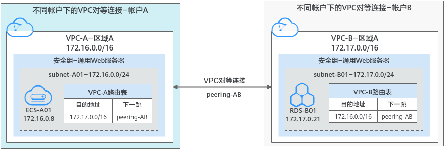
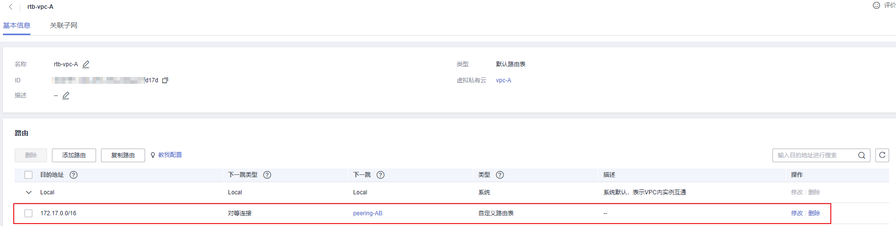
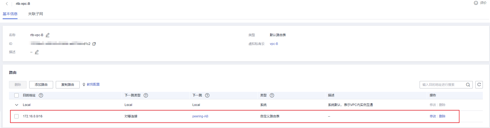

# 创建不同帐户下的对等连接<a name="zh-cn_topic_0046655038"></a>

## 操作场景<a name="s15a6c19babf0488eba98096754d78b91"></a>

不同VPC之间网络不通，您可以通过对等连接连通同一个区域下的VPC。本章节指导用户创建不同帐户下的VPC对等连接，即连通的两个VPC位于不同帐户下。

本文档以在帐户A下的VPC-A和帐户B的VPC-B之间创建对等连接为例，实现业务服务器ECS-A01和数据库服务器RDS-B01之间的通信。

创建步骤如下：

1.  [步骤一：创建VPC对等连接](#section14616192294815)
2.  [步骤二：对端帐户接受VPC对等连接](#section497322311429)
3.  [步骤三：添加VPC对等连接路由](#section519111175712)
4.  [步骤四：验证网络互通情况](#section920942154519)

**图 1**  不同帐户下的对等连接组网示例<a name="fig4721642193711"></a>  


> **须知：** 
>当前VPC对等连接暂不收取您的任何费用。

## 约束与限制<a name="section2324532142210"></a>

-   对等连接是建立在两个VPC之间的网络连接，两个VPC之间只能建立一个对等连接。
-   对等连接仅可以连通同区域的VPC，不同区域的VPC之间不能创建对等连接。
    -   若要实现不同区域VPC之间互通，您可以使用云连接，详细内容请参见[跨区域VPC互通](https://support.huaweicloud.com/qs-cc/cc_02_0201.html)。
    -   若您仅需要不同区域的几台ECS之间需要互通，您可以[为ECS申请和绑定弹性公网IP](https://support.huaweicloud.com/qs-eip/eip_qs_0001.html)，通过EIP实现ECS外网互通。此场景适用于ECS数量较少的情况。


-   配置对等连接时，当您的本端VPC和对端VPC存在网段重叠的情况时，那么您的对等连接可能会不生效。

    针对该情况，我们为您提供不同情况下的组网配置示例，请您参考[对等连接使用示例](对等连接使用示例.md)。


-   创建不同帐户下的对等连接时：
    -   创建不同帐户下的VPC对等连接时，如果在账号A下发起创建对等连接请求，需要账号B下接受该请求才可以，如果帐号B拒绝，则该对等连接创建失败。
    -   为了确保网络安全，请您不要接受来自未知帐号的对等连接申请。
    -   对等连接双方帐号都有权限删除对等连接，一方删除对等连接后，对等连接的所有信息会被立刻删除，包括对等连接关联的路由信息。


## 前提条件<a name="section2622867121261"></a>

已创建两个VPC，并且VPC位于同一个区域，具体方法请参见[创建虚拟私有云和子网](创建虚拟私有云和子网.md)。

## 步骤一：创建VPC对等连接<a name="section14616192294815"></a>

1.  登录管理控制台。


1.  在管理控制台左上角单击，选择区域和项目。
2.  在系统首页，选择“网络 \> 虚拟私有云”。

    进入虚拟有云列表页面。

3.  在左侧导航栏，选择“虚拟私有云 \> 对等连接”。

    进入对等连接列表页面。

4.  在页面右上角区域，单击“创建对等连接”。

    弹出“创建对等连接”对话框。

5.  根据界面提示设置对等连接参数。

    参数详细说明请参见[表1](#table13425162318260)。

    **图 2**  创建对等连接<a name="fig6632132284813"></a>  
    

    **表 1**  创建对等连接-参数说明

    <a name="table13425162318260"></a>
    <table><thead align="left"><tr id="row154231823162613"><th class="cellrowborder" valign="top" width="21.482148214821482%" id="mcps1.2.4.1.1"><p id="p1423182315268"><a name="p1423182315268"></a><a name="p1423182315268"></a>参数</p>
    </th>
    <th class="cellrowborder" valign="top" width="45.18451845184518%" id="mcps1.2.4.1.2"><p id="p17423162317261"><a name="p17423162317261"></a><a name="p17423162317261"></a>说明</p>
    </th>
    <th class="cellrowborder" valign="top" width="33.33333333333333%" id="mcps1.2.4.1.3"><p id="p16423162320263"><a name="p16423162320263"></a><a name="p16423162320263"></a>取值样例</p>
    </th>
    </tr>
    </thead>
    <tbody><tr id="row64247230268"><td class="cellrowborder" valign="top" width="21.482148214821482%" headers="mcps1.2.4.1.1 "><p id="p17483724103516"><a name="p17483724103516"></a><a name="p17483724103516"></a>名称</p>
    </td>
    <td class="cellrowborder" valign="top" width="45.18451845184518%" headers="mcps1.2.4.1.2 "><p id="p12511455184513"><a name="p12511455184513"></a><a name="p12511455184513"></a>必选参数。</p>
    <p id="p6483124203515"><a name="p6483124203515"></a><a name="p6483124203515"></a>此处填写对等连接的名称。</p>
    <p id="p04831624133516"><a name="p04831624133516"></a><a name="p04831624133516"></a>由中文字符、英文字母、数字、中划线、下划线等构成，一般不超过64个字符。</p>
    </td>
    <td class="cellrowborder" valign="top" width="33.33333333333333%" headers="mcps1.2.4.1.3 "><p id="p1948362414352"><a name="p1948362414352"></a><a name="p1948362414352"></a>peering-AB</p>
    </td>
    </tr>
    <tr id="row84241823122615"><td class="cellrowborder" valign="top" width="21.482148214821482%" headers="mcps1.2.4.1.1 "><p id="p164837248356"><a name="p164837248356"></a><a name="p164837248356"></a>本端VPC</p>
    </td>
    <td class="cellrowborder" valign="top" width="45.18451845184518%" headers="mcps1.2.4.1.2 "><p id="p2483102418354"><a name="p2483102418354"></a><a name="p2483102418354"></a>必选参数。</p>
    <p id="p172442324466"><a name="p172442324466"></a><a name="p172442324466"></a>此处为对等连接一端的VPC，可以在下拉框中选择已有VPC作为本端VPC。</p>
    </td>
    <td class="cellrowborder" valign="top" width="33.33333333333333%" headers="mcps1.2.4.1.3 "><p id="p312572911478"><a name="p312572911478"></a><a name="p312572911478"></a>VPC-A</p>
    </td>
    </tr>
    <tr id="row15392115214572"><td class="cellrowborder" valign="top" width="21.482148214821482%" headers="mcps1.2.4.1.1 "><p id="p1048302413519"><a name="p1048302413519"></a><a name="p1048302413519"></a>本端VPC网段</p>
    </td>
    <td class="cellrowborder" valign="top" width="45.18451845184518%" headers="mcps1.2.4.1.2 "><p id="p1948311241357"><a name="p1948311241357"></a><a name="p1948311241357"></a>此处显示已选择的本端VPC的网段。</p>
    </td>
    <td class="cellrowborder" valign="top" width="33.33333333333333%" headers="mcps1.2.4.1.3 "><p id="p04838244352"><a name="p04838244352"></a><a name="p04838244352"></a>172.16.0.0/16</p>
    </td>
    </tr>
    <tr id="row1942432332613"><td class="cellrowborder" valign="top" width="21.482148214821482%" headers="mcps1.2.4.1.1 "><p id="p144831124163511"><a name="p144831124163511"></a><a name="p144831124163511"></a>帐户</p>
    </td>
    <td class="cellrowborder" valign="top" width="45.18451845184518%" headers="mcps1.2.4.1.2 "><p id="p195762383507"><a name="p195762383507"></a><a name="p195762383507"></a>必选参数。</p>
    <a name="ul14830246351"></a><a name="ul14830246351"></a><ul id="ul14830246351"><li>当前帐户：当对等连接中的对端VPC和本端VPC位于同一个帐户下时，选择该项。</li><li>其他帐户：当对等连接中的对端VPC和本端VPC位于不同帐户下时，选择该项。</li></ul>
    </td>
    <td class="cellrowborder" valign="top" width="33.33333333333333%" headers="mcps1.2.4.1.3 "><p id="p124835244358"><a name="p124835244358"></a><a name="p124835244358"></a>其他帐户</p>
    </td>
    </tr>
    <tr id="row3424202312612"><td class="cellrowborder" valign="top" width="21.482148214821482%" headers="mcps1.2.4.1.1 "><p id="p16424112342616"><a name="p16424112342616"></a><a name="p16424112342616"></a>对端项目ID</p>
    </td>
    <td class="cellrowborder" valign="top" width="45.18451845184518%" headers="mcps1.2.4.1.2 "><p id="p144241323122613"><a name="p144241323122613"></a><a name="p144241323122613"></a>当帐户选择“其他帐户”时，该项为必选参数。</p>
    <p id="p1842422342610"><a name="p1842422342610"></a><a name="p1842422342610"></a>对端项目ID是另一个帐户下，对端VPC所在区域对应的项目ID，获取方法请参见<a href="获取对等连接的对端项目ID.md">获取对等连接的对端项目ID</a>。</p>
    </td>
    <td class="cellrowborder" valign="top" width="33.33333333333333%" headers="mcps1.2.4.1.3 "><p id="p33672451703"><a name="p33672451703"></a><a name="p33672451703"></a>VPC-B在区域A对应的项目ID：</p>
    <p id="p17424182362613"><a name="p17424182362613"></a><a name="p17424182362613"></a>067cf8aecf3XXX08322f13b</p>
    </td>
    </tr>
    <tr id="row10425192313261"><td class="cellrowborder" valign="top" width="21.482148214821482%" headers="mcps1.2.4.1.1 "><p id="p16424423102613"><a name="p16424423102613"></a><a name="p16424423102613"></a>对端VPC ID</p>
    </td>
    <td class="cellrowborder" valign="top" width="45.18451845184518%" headers="mcps1.2.4.1.2 "><p id="p144254233264"><a name="p144254233264"></a><a name="p144254233264"></a>当帐户选择“其他帐户”时，该项为必选参数</p>
    <p id="p4425102372618"><a name="p4425102372618"></a><a name="p4425102372618"></a>对端VPC ID是对等连接另一端的VPC ID，获取方法请参见<a href="获取虚拟私有云的ID信息.md">获取虚拟私有云的ID信息</a>。</p>
    </td>
    <td class="cellrowborder" valign="top" width="33.33333333333333%" headers="mcps1.2.4.1.3 "><p id="p132249141055"><a name="p132249141055"></a><a name="p132249141055"></a>VPC-B的ID:</p>
    <p id="p18425123162615"><a name="p18425123162615"></a><a name="p18425123162615"></a>17cd7278-XXX-530c952dcf35</p>
    </td>
    </tr>
    <tr id="row1342513235267"><td class="cellrowborder" valign="top" width="21.482148214821482%" headers="mcps1.2.4.1.1 "><p id="p1042572312263"><a name="p1042572312263"></a><a name="p1042572312263"></a>描述</p>
    </td>
    <td class="cellrowborder" valign="top" width="45.18451845184518%" headers="mcps1.2.4.1.2 "><p id="p1663904918593"><a name="p1663904918593"></a><a name="p1663904918593"></a>可选参数。</p>
    <p id="p2048418241358"><a name="p2048418241358"></a><a name="p2048418241358"></a>您可以根据需要在文本框中输入对该连接的描述信息。描述信息内容不能超过255个字符，且不能包含“&lt;”和“&gt;”。</p>
    </td>
    <td class="cellrowborder" valign="top" width="33.33333333333333%" headers="mcps1.2.4.1.3 "><p id="p134841624183519"><a name="p134841624183519"></a><a name="p134841624183519"></a>peering-AB连通VPC-A和VPC-B</p>
    </td>
    </tr>
    </tbody>
    </table>

6.  参数填写完成后，单击“确定”。
    -   如果提示“请输入正确的VPC ID以及项目ID”，请您检查项目ID和VPC ID的正确性。
        -   项目ID：必须为对端VPC所在区域对应的项目ID。
        -   本端VPC必须和对端VPC位于同一个区域。

    -   如果返回对等连接列表，且新创建的对等连接状态为“待接受”，请继续执行[步骤二：对端帐户接受VPC对等连接](#section497322311429)，联系帐户B处理。

        **图 3**  待接受对等连接<a name="fig13915546181"></a>  
        


## 步骤二：对端帐户接受VPC对等连接<a name="section497322311429"></a>

不同帐户创建对等连接，本端帐户创建完成后，需要联系对端帐户接受对等连接，该对等连接才算创建完成。本示例中，帐户A通知帐户B接受对等连接。

1.  对端帐户登录管理控制台。
2.  在系统首页，选择“网络 \> 虚拟私有云”。

    进入虚拟有云列表页面。

3.  在左侧导航栏，选择“虚拟私有云 \> 对等连接”。

    进入对等连接列表页面。

4.  在对等连接列表上方，找到待接受的对等连接请求。

    **图 4**  接受对等连接<a name="fig146311242152917"></a>  
    

5.  确认无误后，单击目标对等连接所在行的操作列下的“接受请求”。

    待对等连接状态变为“已接受”，表示对等连接创建完成，继续执行[步骤三：添加VPC对等连接路由](#section519111175712)，为对等连接添加路由。

    > **须知：** 
    >对等连接创建完成后，必须在本端VPC和对端VPC路由表中添加路由，否则对等连接不会生效。


## 步骤三：添加VPC对等连接路由<a name="section519111175712"></a>

本端帐户在本端VPC的路由表中添加路由，对端帐户在对端VPC的路由表中添加路由。本示例中，帐户A在VPC-A的路由表中添加路由，帐户B在VPC-B的路由表中添加路由。

1.  执行以下操作，在本端VPC路由表中添加对等连接路由。
    1.  在本端帐户的对等连接列表中，单击目标对等连接的名称。

        进入对等连接的基本信息页面。

    2.  在对等连接的“本端路由”页签，根据左上方界面提示，单击路由表超链接。

        进入本端VPC的默认路由表基本信息页面。

        **图 5**  跳转VPC对等连接路由表-本端<a name="fig188841213181714"></a>  
        

    3.  单击“添加路由”，在默认路由表中添加路由。

        参数说明如[表2](#zh-cn_topic_0046655037_table97163496270)所示。

        **表 2**  参数说明

        <a name="zh-cn_topic_0046655037_table97163496270"></a>
        <table><thead align="left"><tr id="zh-cn_topic_0046655037_row671512499273"><th class="cellrowborder" valign="top" width="19.24%" id="mcps1.2.4.1.1"><p id="zh-cn_topic_0046655037_p147151949172714"><a name="zh-cn_topic_0046655037_p147151949172714"></a><a name="zh-cn_topic_0046655037_p147151949172714"></a>参数</p>
        </th>
        <th class="cellrowborder" valign="top" width="55.7%" id="mcps1.2.4.1.2"><p id="zh-cn_topic_0046655037_p971594962711"><a name="zh-cn_topic_0046655037_p971594962711"></a><a name="zh-cn_topic_0046655037_p971594962711"></a>说明</p>
        </th>
        <th class="cellrowborder" valign="top" width="25.06%" id="mcps1.2.4.1.3"><p id="zh-cn_topic_0046655037_p1771514952712"><a name="zh-cn_topic_0046655037_p1771514952712"></a><a name="zh-cn_topic_0046655037_p1771514952712"></a>取值样例</p>
        </th>
        </tr>
        </thead>
        <tbody><tr id="zh-cn_topic_0046655037_row127151049182714"><td class="cellrowborder" valign="top" width="19.24%" headers="mcps1.2.4.1.1 "><p id="zh-cn_topic_0046655037_p5715174912716"><a name="zh-cn_topic_0046655037_p5715174912716"></a><a name="zh-cn_topic_0046655037_p5715174912716"></a>目的地址</p>
        </td>
        <td class="cellrowborder" valign="top" width="55.7%" headers="mcps1.2.4.1.2 "><p id="zh-cn_topic_0046655037_p20715134922718"><a name="zh-cn_topic_0046655037_p20715134922718"></a><a name="zh-cn_topic_0046655037_p20715134922718"></a>对端VPC的地址，可以为VPC网段、子网网段、ECS IP地址等，具体请参见<a href="对等连接使用示例.md">对等连接使用示例</a>。</p>
        </td>
        <td class="cellrowborder" valign="top" width="25.06%" headers="mcps1.2.4.1.3 "><p id="zh-cn_topic_0046655037_p18759194352410"><a name="zh-cn_topic_0046655037_p18759194352410"></a><a name="zh-cn_topic_0046655037_p18759194352410"></a>此处为VPC-B的网段：172.17.0.0/16</p>
        </td>
        </tr>
        <tr id="zh-cn_topic_0046655037_row1716164972718"><td class="cellrowborder" valign="top" width="19.24%" headers="mcps1.2.4.1.1 "><p id="zh-cn_topic_0046655037_p10716949152714"><a name="zh-cn_topic_0046655037_p10716949152714"></a><a name="zh-cn_topic_0046655037_p10716949152714"></a>下一跳类型</p>
        </td>
        <td class="cellrowborder" valign="top" width="55.7%" headers="mcps1.2.4.1.2 "><p id="zh-cn_topic_0046655037_p27169498279"><a name="zh-cn_topic_0046655037_p27169498279"></a><a name="zh-cn_topic_0046655037_p27169498279"></a>选择“对等连接”。</p>
        </td>
        <td class="cellrowborder" valign="top" width="25.06%" headers="mcps1.2.4.1.3 "><p id="zh-cn_topic_0046655037_p27161349142717"><a name="zh-cn_topic_0046655037_p27161349142717"></a><a name="zh-cn_topic_0046655037_p27161349142717"></a>对等连接</p>
        </td>
        </tr>
        <tr id="zh-cn_topic_0046655037_row187164494273"><td class="cellrowborder" valign="top" width="19.24%" headers="mcps1.2.4.1.1 "><p id="zh-cn_topic_0046655037_p12716249192710"><a name="zh-cn_topic_0046655037_p12716249192710"></a><a name="zh-cn_topic_0046655037_p12716249192710"></a>下一跳</p>
        </td>
        <td class="cellrowborder" valign="top" width="55.7%" headers="mcps1.2.4.1.2 "><p id="zh-cn_topic_0046655037_p171614497279"><a name="zh-cn_topic_0046655037_p171614497279"></a><a name="zh-cn_topic_0046655037_p171614497279"></a>选择当前对等连接的名称。</p>
        </td>
        <td class="cellrowborder" valign="top" width="25.06%" headers="mcps1.2.4.1.3 "><p id="zh-cn_topic_0046655037_p1871694912275"><a name="zh-cn_topic_0046655037_p1871694912275"></a><a name="zh-cn_topic_0046655037_p1871694912275"></a>peering-AB</p>
        </td>
        </tr>
        <tr id="zh-cn_topic_0046655037_row11716164911279"><td class="cellrowborder" valign="top" width="19.24%" headers="mcps1.2.4.1.1 "><p id="zh-cn_topic_0046655037_p167161493278"><a name="zh-cn_topic_0046655037_p167161493278"></a><a name="zh-cn_topic_0046655037_p167161493278"></a>描述</p>
        </td>
        <td class="cellrowborder" valign="top" width="55.7%" headers="mcps1.2.4.1.2 "><p id="zh-cn_topic_0046655037_p1871604962713"><a name="zh-cn_topic_0046655037_p1871604962713"></a><a name="zh-cn_topic_0046655037_p1871604962713"></a>路由的描述信息，非必填项。</p>
        <p id="zh-cn_topic_0046655037_p97161949142719"><a name="zh-cn_topic_0046655037_p97161949142719"></a><a name="zh-cn_topic_0046655037_p97161949142719"></a>描述信息内容不能超过255个字符，且不能包含“&lt;”和“&gt;”。</p>
        </td>
        <td class="cellrowborder" valign="top" width="25.06%" headers="mcps1.2.4.1.3 "><p id="zh-cn_topic_0046655037_p137167494278"><a name="zh-cn_topic_0046655037_p137167494278"></a><a name="zh-cn_topic_0046655037_p137167494278"></a>-</p>
        </td>
        </tr>
        </tbody>
        </table>

    4.  路由信息设置完成后，单击“确定”。

        返回路由列表，可以看到刚添加的路由。

        **图 6**  添加VPC对等连接路由-本端<a name="zh-cn_topic_0046655037_fig169203092913"></a>  
        

2.  执行以下操作，在对端VPC路由表中添加对等连接路由。
    1.  在对端帐户的对等连接列表中，单击目标对等连接的名称。

        进入对等连接的基本信息页面。

    2.  在对等连接的“本端路由”页签，根据左上方界面提示，单击路由表超链接。

        进入对端VPC的默认路由表基本信息页面。

        **图 7**  跳转VPC对等连接路由表-对端<a name="fig2308174583912"></a>  
        

    3.  单击“添加路由”，在默认路由表中添加路由。

        参数说明如[表3](#zh-cn_topic_0046655037_table13697163914393)所示。

        **表 3**  参数说明

        <a name="zh-cn_topic_0046655037_table13697163914393"></a>
        <table><thead align="left"><tr id="zh-cn_topic_0046655037_row2069718398393"><th class="cellrowborder" valign="top" width="19.24%" id="mcps1.2.4.1.1"><p id="zh-cn_topic_0046655037_p1569716399397"><a name="zh-cn_topic_0046655037_p1569716399397"></a><a name="zh-cn_topic_0046655037_p1569716399397"></a>参数</p>
        </th>
        <th class="cellrowborder" valign="top" width="55.7%" id="mcps1.2.4.1.2"><p id="zh-cn_topic_0046655037_p1169783914396"><a name="zh-cn_topic_0046655037_p1169783914396"></a><a name="zh-cn_topic_0046655037_p1169783914396"></a>说明</p>
        </th>
        <th class="cellrowborder" valign="top" width="25.06%" id="mcps1.2.4.1.3"><p id="zh-cn_topic_0046655037_p9697153918398"><a name="zh-cn_topic_0046655037_p9697153918398"></a><a name="zh-cn_topic_0046655037_p9697153918398"></a>取值样例</p>
        </th>
        </tr>
        </thead>
        <tbody><tr id="zh-cn_topic_0046655037_row15697139183912"><td class="cellrowborder" valign="top" width="19.24%" headers="mcps1.2.4.1.1 "><p id="zh-cn_topic_0046655037_p16697193913916"><a name="zh-cn_topic_0046655037_p16697193913916"></a><a name="zh-cn_topic_0046655037_p16697193913916"></a>目的地址</p>
        </td>
        <td class="cellrowborder" valign="top" width="55.7%" headers="mcps1.2.4.1.2 "><p id="zh-cn_topic_0046655037_p9809147434"><a name="zh-cn_topic_0046655037_p9809147434"></a><a name="zh-cn_topic_0046655037_p9809147434"></a>本端VPC的地址，可以为VPC网段、子网网段、ECS IP地址等，具体请参见<a href="对等连接使用示例.md">对等连接使用示例</a>。</p>
        </td>
        <td class="cellrowborder" valign="top" width="25.06%" headers="mcps1.2.4.1.3 "><p id="zh-cn_topic_0046655037_p8899143719370"><a name="zh-cn_topic_0046655037_p8899143719370"></a><a name="zh-cn_topic_0046655037_p8899143719370"></a>此处为VPC-A的网段：172.16.0.0/16</p>
        </td>
        </tr>
        <tr id="zh-cn_topic_0046655037_row7697173915399"><td class="cellrowborder" valign="top" width="19.24%" headers="mcps1.2.4.1.1 "><p id="zh-cn_topic_0046655037_p13697193918396"><a name="zh-cn_topic_0046655037_p13697193918396"></a><a name="zh-cn_topic_0046655037_p13697193918396"></a>下一跳类型</p>
        </td>
        <td class="cellrowborder" valign="top" width="55.7%" headers="mcps1.2.4.1.2 "><p id="zh-cn_topic_0046655037_p4697103910393"><a name="zh-cn_topic_0046655037_p4697103910393"></a><a name="zh-cn_topic_0046655037_p4697103910393"></a>选择“对等连接”。</p>
        </td>
        <td class="cellrowborder" valign="top" width="25.06%" headers="mcps1.2.4.1.3 "><p id="zh-cn_topic_0046655037_p0697739173916"><a name="zh-cn_topic_0046655037_p0697739173916"></a><a name="zh-cn_topic_0046655037_p0697739173916"></a>对等连接</p>
        </td>
        </tr>
        <tr id="zh-cn_topic_0046655037_row2697163963916"><td class="cellrowborder" valign="top" width="19.24%" headers="mcps1.2.4.1.1 "><p id="zh-cn_topic_0046655037_p769718397393"><a name="zh-cn_topic_0046655037_p769718397393"></a><a name="zh-cn_topic_0046655037_p769718397393"></a>下一跳</p>
        </td>
        <td class="cellrowborder" valign="top" width="55.7%" headers="mcps1.2.4.1.2 "><p id="zh-cn_topic_0046655037_p669773913393"><a name="zh-cn_topic_0046655037_p669773913393"></a><a name="zh-cn_topic_0046655037_p669773913393"></a>选择当前对等连接的名称。</p>
        </td>
        <td class="cellrowborder" valign="top" width="25.06%" headers="mcps1.2.4.1.3 "><p id="zh-cn_topic_0046655037_p16697739153910"><a name="zh-cn_topic_0046655037_p16697739153910"></a><a name="zh-cn_topic_0046655037_p16697739153910"></a>peering-AB</p>
        </td>
        </tr>
        <tr id="zh-cn_topic_0046655037_row669733963913"><td class="cellrowborder" valign="top" width="19.24%" headers="mcps1.2.4.1.1 "><p id="zh-cn_topic_0046655037_p9697123933915"><a name="zh-cn_topic_0046655037_p9697123933915"></a><a name="zh-cn_topic_0046655037_p9697123933915"></a>描述</p>
        </td>
        <td class="cellrowborder" valign="top" width="55.7%" headers="mcps1.2.4.1.2 "><p id="zh-cn_topic_0046655037_p10697939183913"><a name="zh-cn_topic_0046655037_p10697939183913"></a><a name="zh-cn_topic_0046655037_p10697939183913"></a>路由的描述信息，非必填项。</p>
        <p id="zh-cn_topic_0046655037_p1697143953919"><a name="zh-cn_topic_0046655037_p1697143953919"></a><a name="zh-cn_topic_0046655037_p1697143953919"></a>描述信息内容不能超过255个字符，且不能包含“&lt;”和“&gt;”。</p>
        </td>
        <td class="cellrowborder" valign="top" width="25.06%" headers="mcps1.2.4.1.3 "><p id="zh-cn_topic_0046655037_p86971139153912"><a name="zh-cn_topic_0046655037_p86971139153912"></a><a name="zh-cn_topic_0046655037_p86971139153912"></a>-</p>
        </td>
        </tr>
        </tbody>
        </table>

    4.  路由信息设置完成后，单击“确定”。

        返回路由列表，可以看到刚添加的路由。

        **图 8**  添加VPC对等连接路由-对端<a name="zh-cn_topic_0046655037_fig1797195563717"></a>  
        


## 步骤四：验证网络互通情况<a name="section920942154519"></a>

对等连接路由添加完成后，执行以下操作，验证本端VPC和对端VPC的通信情况。

1.  登录本端VPC内的弹性云服务器，本示例中为ECS-A01。

    弹性云服务器有多种登录方法，具体请参见[登录弹性云服务器](https://support.huaweicloud.com/qs-ecs/zh-cn_topic_0092494193.html)。

2.  执行以下命令，验证ECS-A01和的RDS-B01是否可以通信。

    **ping** _对端服务器的IP地址_

    命令示例：

    **ping 172.17.0.21**

    回显类似如下信息，表示ECS-A01与RDS-B01可以通过通信，VPC-A和VPC-B之间的对等连接创建成功。

    ```
    [root@ecs-A02 ~]# ping 172.17.0.21
    PING 172.17.0.21 (172.17.0.21) 56(84) bytes of data.
    64 bytes from 172.17.0.21: icmp_seq=1 ttl=64 time=0.849 ms
    64 bytes from 172.17.0.21: icmp_seq=2 ttl=64 time=0.455 ms
    64 bytes from 172.17.0.21: icmp_seq=3 ttl=64 time=0.385 ms
    64 bytes from 172.17.0.21: icmp_seq=4 ttl=64 time=0.372 ms
    ...
    --- 172.17.0.21 ping statistics ---
    ```

    > **须知：** 
    >-   本示例中ECS-A01和RDS-B01位于同一个安全组内，因此只要VPC-A和VPC-B之间的对等连接创建成功后，就可以实现网络互通。如果您需要连通的实例位于不同的安全组内，那么您需要在安全组的入方向规则中，添加放通对端安全组的规则，具体方法请参见[不同安全组内的弹性云服务器内网互通](安全组配置示例.md#section14197522283)。
    >-   对于更多对等连接网络不通的问题，处理方法请参见[为什么对等连接创建完成后不能互通？](https://support.huaweicloud.com/vpc_faq/vpc_faq_0069.html)。


