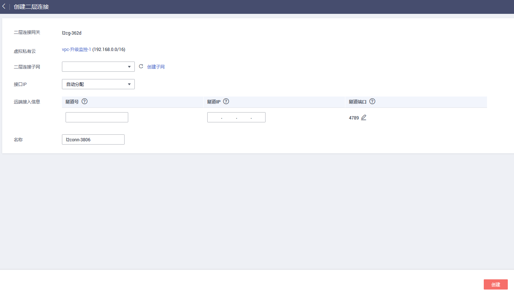

# 创建二层连接

## 操作场景

如果您需要将VPC中的弹性云服务器和您的数据中心子网做二层互通，在购买二层连接网关后需要创建二层连接。

> **说明：** 
>二层连接网关功能目前仅在“华东-上海一”、“ 华南-广州”开放，且还在公测期间，请申请公测权限后使用。

## 前提条件

二层连接网关创建成功。

## 操作步骤

1.  登录管理控制台。
2.  在管理控制台左上角单击，选择区域和项目。
3.  在系统首页，选择“网络 \> 虚拟私有云”。
4.  在左侧导航栏选择“二层连接网关”。
5.  在右侧详情区域单击二层连接网关名称。
6.  在二层连接网关页面右侧，单击“创建连接”，进入二层连接创建页面。

    **图 1**  创建连接  
    

7.  根据界面提示，配置二层连接的基本信息，配置参数请参见[表1](#zh-cn_topic_0228866532_table37675406)。

    **表 1**  参数说明

    
    <table><thead align="left"><tr id="zh-cn_topic_0228866532_row19509166"><th class="cellrowborder" colspan="2" valign="top" id="mcps1.2.5.1.1">
<strong id="zh-cn_topic_0228866532_b62212303">参数</strong>

    </th>
    <th class="cellrowborder" valign="top" id="mcps1.2.5.1.2">
<strong id="zh-cn_topic_0228866532_b54286223">参数说明</strong>

    </th>
    <th class="cellrowborder" valign="top" id="mcps1.2.5.1.3">
取值样例

    </th>
    </tr>
    </thead>
    <tbody><tr id="zh-cn_topic_0228866532_row35107966"><td class="cellrowborder" colspan="2" valign="top" headers="mcps1.2.5.1.1 ">
二层连接网关

    </td>
    <td class="cellrowborder" valign="top" headers="mcps1.2.5.1.2 ">
L2CG名称。

    </td>
    <td class="cellrowborder" valign="top" headers="mcps1.2.5.1.3 ">
l2cg-01

    </td>
    </tr>
    <tr id="zh-cn_topic_0228866532_row10177686"><td class="cellrowborder" colspan="2" valign="top" headers="mcps1.2.5.1.1 ">
虚拟私有云

    </td>
    <td class="cellrowborder" valign="top" headers="mcps1.2.5.1.2 ">
L2CG绑定的VPC名称。

    </td>
    <td class="cellrowborder" valign="top" headers="mcps1.2.5.1.3 ">
vpc-01

    </td>
    </tr>
    <tr id="zh-cn_topic_0228866532_row10968764"><td class="cellrowborder" colspan="2" valign="top" headers="mcps1.2.5.1.1 ">
二层连接子网

    </td>
    <td class="cellrowborder" valign="top" headers="mcps1.2.5.1.2 ">
VPC与线下数据中心做二层互通的子网。

    </td>
    <td class="cellrowborder" valign="top" headers="mcps1.2.5.1.3 ">
subnet-01

    </td>
    </tr>
    <tr id="zh-cn_topic_0228866532_row49967046"><td class="cellrowborder" colspan="2" valign="top" headers="mcps1.2.5.1.1 ">
接口IP

    </td>
    <td class="cellrowborder" valign="top" headers="mcps1.2.5.1.2 ">
VPC子网接入到L2CG接口的IP。可以自动分配或手工指定IP地址。

    </td>
    <td class="cellrowborder" valign="top" headers="mcps1.2.5.1.3 ">
自动分配

    </td>
    </tr>
    <tr id="zh-cn_topic_0228866532_row4482025"><td class="cellrowborder" rowspan="3" valign="top" width="12.088791120887912%" headers="mcps1.2.5.1.1 ">
远端接入信息

    </td>
    <td class="cellrowborder" valign="top" width="12.70872912708729%" headers="mcps1.2.5.1.1 ">
隧道号

    </td>
    <td class="cellrowborder" valign="top" width="56.214378562143786%" headers="mcps1.2.5.1.2 ">
远端数据中心连接L2CG所需的VXLAN隧道号，即VXLAN网络标识VNI，类似VLAN ID，用于区分VXLAN段。

    </td>
    <td class="cellrowborder" valign="top" width="18.988101189881014%" headers="mcps1.2.5.1.3 ">
-

    </td>
    </tr>
    <tr id="zh-cn_topic_0228866532_row36980629"><td class="cellrowborder" valign="top" headers="mcps1.2.5.1.1 ">
隧道IP

    </td>
    <td class="cellrowborder" valign="top" headers="mcps1.2.5.1.1 ">
远端数据中心连接L2CG所需的VXLAN隧道IP。

    </td>
    <td class="cellrowborder" valign="top" headers="mcps1.2.5.1.2 ">
-

    </td>
    </tr>
    <tr id="zh-cn_topic_0228866532_row50805071"><td class="cellrowborder" valign="top" headers="mcps1.2.5.1.1 ">
隧道端口

    </td>
    <td class="cellrowborder" valign="top" headers="mcps1.2.5.1.1 ">
远端数据中心连接L2CG所需的VXLAN隧道端口号。默认为4789。

    </td>
    <td class="cellrowborder" valign="top" headers="mcps1.2.5.1.2 ">
4789

    </td>
    </tr>
    <tr id="zh-cn_topic_0228866532_row55677130"><td class="cellrowborder" colspan="2" valign="top" headers="mcps1.2.5.1.1 ">
名称

    </td>
    <td class="cellrowborder" valign="top" headers="mcps1.2.5.1.2 ">
二层连接名称。

    </td>
    <td class="cellrowborder" valign="top" headers="mcps1.2.5.1.3 ">
l2conn-01

    </td>
    </tr>
    </tbody>
    </table>

8.  确认参数无误后，单击“创建”，开始创建二层连接。

    二层连接的创建过程一般需要20\~60秒。

9.  在二层连接网关页面查询连接状态。

    若状态为“未连接”或“已连接”，表示二层连接已创建成功。

