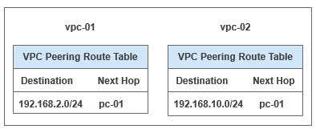

# 创建同一帐户下的对等连接

## 操作场景

创建对等连接首先要向需要建立对等连接的VPC发送请求，您可以和自己帐户内相同区域的其他VPC申请对等连接，同帐户内同区域的VPC创建对等连接，默认自动接受。

本小节以账户内vpc-01和vpc-02为例，创建同一账户下的对等连接。

假设vpc-01的CIDR为192.168.10.0/24，vpc-02的CIDR为192.168.2.0/24。

对等连接路由信息如所示。

**图 1**  vpc-01和vpc-02对等连接路由表  

## 操作流程

**图 2**  同帐户的VPC创建对等连接流程  

在同一个帐户下，创建对等连接后，状态是已接受。您需要在两端VPC内添加对等连接路由信息，才能使两个VPC互通。

> **说明：**   
>当前在部分区域中，由于路由表与虚拟私有云已解耦，配置VPC对等连接路由时，需要前往路由表界面进行操作。具体配置时请根据界面提示为准。  
>若您所在区域，路由表未解耦，请参考[添加VPC对等连接路由（路由表未解耦）](#section22722059952)。  
>若您所在区域，路由表已解耦，请参考[添加VPC对等连接路由（路由表已解耦）](#section19655123018712)。  

## 前提条件

已创建相同区域内的两个VPC。

## 创建VPC对等连接

1.  登录管理控制台。
2.  在管理控制台左上角单击，选择区域和项目。
3.  在系统首页，选择“网络 \> 虚拟私有云”。
4.  在左侧导航栏选择“对等连接”。
5.  在界面右侧详情区域单击“创建对等连接”。
6.  根据界面提示配置参数，其中“帐户”选择“当前帐户”,相关参数如[表1](#table1215761020244)所示。

    **图 3**  创建对等连接  
    

    **表 1**  参数说明

    
    <table><thead align="left"><tr id="row0156161072415"><th class="cellrowborder" valign="top" width="22.38223822382238%" id="mcps1.2.4.1.1">
参数

    </th>
    <th class="cellrowborder" valign="top" width="43.884388438843885%" id="mcps1.2.4.1.2">
说明

    </th>
    <th class="cellrowborder" valign="top" width="33.73337333733373%" id="mcps1.2.4.1.3">
取值样例

    </th>
    </tr>
    </thead>
    <tbody><tr id="row1115691072416"><td class="cellrowborder" valign="top" width="22.38223822382238%" headers="mcps1.2.4.1.1 ">
名称

    </td>
    <td class="cellrowborder" valign="top" width="43.884388438843885%" headers="mcps1.2.4.1.2 ">
对等连接名称。

    
由中文字符、英文字母、数字、中划线、下划线等构成，一般不超过64个字符。

    </td>
    <td class="cellrowborder" valign="top" width="33.73337333733373%" headers="mcps1.2.4.1.3 ">
peering-001

    </td>
    </tr>
    <tr id="row141561910182419"><td class="cellrowborder" valign="top" width="22.38223822382238%" headers="mcps1.2.4.1.1 ">
本端VPC

    </td>
    <td class="cellrowborder" valign="top" width="43.884388438843885%" headers="mcps1.2.4.1.2 ">
本端VPC。可在下拉框中选择。

    </td>
    <td class="cellrowborder" valign="top" width="33.73337333733373%" headers="mcps1.2.4.1.3 ">
vpc_01

    </td>
    </tr>
    <tr id="row10156141092419"><td class="cellrowborder" valign="top" width="22.38223822382238%" headers="mcps1.2.4.1.1 ">
本端VPC网段

    </td>
    <td class="cellrowborder" valign="top" width="43.884388438843885%" headers="mcps1.2.4.1.2 ">
本端VPC网段。

    </td>
    <td class="cellrowborder" valign="top" width="33.73337333733373%" headers="mcps1.2.4.1.3 ">
192.168.10.0/24

    </td>
    </tr>
    <tr id="row1015616108249"><td class="cellrowborder" valign="top" width="22.38223822382238%" headers="mcps1.2.4.1.1 ">
帐户

    </td>
    <td class="cellrowborder" valign="top" width="43.884388438843885%" headers="mcps1.2.4.1.2 ">
建立对等连接的帐号：

    <ul id="ul1815617101249"><li>当前帐户：表示在同一个帐户内、同一个区域下的不同VPC间建立对等连接。</li><li>其他帐户：表示在同一个区域下的不同帐户的VPC间建立对等连接。</li></ul>
    </td>
    <td class="cellrowborder" valign="top" width="33.73337333733373%" headers="mcps1.2.4.1.3 ">
当前帐户

    </td>
    </tr>
    <tr id="row4157151017243"><td class="cellrowborder" valign="top" width="22.38223822382238%" headers="mcps1.2.4.1.1 ">
对端项目

    </td>
    <td class="cellrowborder" valign="top" width="43.884388438843885%" headers="mcps1.2.4.1.2 ">
对端项目名称，默认为当前项目的项目名称。

    </td>
    <td class="cellrowborder" valign="top" width="33.73337333733373%" headers="mcps1.2.4.1.3 ">
aaa

    </td>
    </tr>
    <tr id="row101571310132410"><td class="cellrowborder" valign="top" width="22.38223822382238%" headers="mcps1.2.4.1.1 ">
对端VPC

    </td>
    <td class="cellrowborder" valign="top" width="43.884388438843885%" headers="mcps1.2.4.1.2 ">
对端VPC。同帐户Peer VPC可在下拉框中选择。

    </td>
    <td class="cellrowborder" valign="top" width="33.73337333733373%" headers="mcps1.2.4.1.3 ">
vpc_02

    </td>
    </tr>
    <tr id="row161571610102416"><td class="cellrowborder" valign="top" width="22.38223822382238%" headers="mcps1.2.4.1.1 ">
对端VPC网段

    </td>
    <td class="cellrowborder" valign="top" width="43.884388438843885%" headers="mcps1.2.4.1.2 ">
对端VPC网段。

    
对端VPC网段不能和本端VPC网段相同或有重叠网段，否则对等连接路由可能会失效。

    </td>
    <td class="cellrowborder" valign="top" width="33.73337333733373%" headers="mcps1.2.4.1.3 ">
192.168.2.0/24

    </td>
    </tr>
    </tbody>
    </table>

7.  单击“确定”。

## 添加VPC对等连接路由（路由表未解耦）

相同帐户创建VPC对等连接，默认自动接受请求，要使对等连接的VPC可以路由数据，还需要添加VPC对等连接本端、对端路由信息。

1.  在系统首页，选择“网络 \> 虚拟私有云”。
2.  在左侧导航栏选择“对等连接”。
3.  在对等连接列表中，查找需要添加路由信息的对等连接。
4.  单击对等连接名称，进入对等连接详情页面。
5.  在“本端路由”页签区域，单击“添加本端路由”添加本端路由信息，参数说明参考[表2](#table1626072032518)。

    **图 4**  添加本端路由  
    

    **表 2**  路由参数说明

    
    <table><thead align="left"><tr id="row1260520192515"><th class="cellrowborder" valign="top" width="33.33333333333333%" id="mcps1.2.4.1.1">
参数

    </th>
    <th class="cellrowborder" valign="top" width="33.33333333333333%" id="mcps1.2.4.1.2">
说明

    </th>
    <th class="cellrowborder" valign="top" width="33.33333333333333%" id="mcps1.2.4.1.3">
取值样例

    </th>
    </tr>
    </thead>
    <tbody><tr id="row92601620142520"><td class="cellrowborder" valign="top" width="33.33333333333333%" headers="mcps1.2.4.1.1 ">
目的地址

    </td>
    <td class="cellrowborder" valign="top" width="33.33333333333333%" headers="mcps1.2.4.1.2 ">
目的地址，对端VPC或子网的网段。

    </td>
    <td class="cellrowborder" valign="top" width="33.33333333333333%" headers="mcps1.2.4.1.3 ">
192.168.2.0/24

    </td>
    </tr>
    <tr id="row19260102012518"><td class="cellrowborder" valign="top" width="33.33333333333333%" headers="mcps1.2.4.1.1 ">
下一跳地址

    </td>
    <td class="cellrowborder" valign="top" width="33.33333333333333%" headers="mcps1.2.4.1.2 ">
下一跳地址，即对等连接ID，默认不用配置。

    </td>
    <td class="cellrowborder" valign="top" width="33.33333333333333%" headers="mcps1.2.4.1.3 ">
d1a7863b-9d5e-4d27-8eaf-ab14d2a9148b

    </td>
    </tr>
    </tbody>
    </table>

6.  单击“确定”，回到对等连接详情界面。
7.  在对等连接详情界面，单击“对端路由”。
8.  在“对端路由”页签区域，单击“添加对端路由”添加对端路由信息。
9.  单击“确定”，完成添加VPC对等连接路由信息。

对等连接建立后，您可以使用私有IP地址在两个VPC之间进行通信。您可以使用“ping”命令检查网络两端是否连通。使用“ping”命令时，需检查是否已在安全组中放通ICMP入站规则，添加规则操作请参见[添加安全组规则](添加安全组规则.md)。

## 添加VPC对等连接路由（路由表已解耦）

相同帐户创建VPC对等连接，默认接受请求，要使对等连接的VPC可以路由数据，还需要在路由表中添加VPC对等连接本端、对端路由信息。

1.  在系统首页，选择“网络 \> 虚拟私有云”。
2.  在左侧导航栏选择“路由表”。
3.  查找或创建本端VPC对应的路由表，添加本端路由。参数说明如[表3](#table184241328144114)所示。

    **表 3**  参数说明

    
    <table><thead align="left"><tr id="row1642415282418"><th class="cellrowborder" valign="top" width="19.24%" id="mcps1.2.4.1.1">
参数

    </th>
    <th class="cellrowborder" valign="top" width="55.7%" id="mcps1.2.4.1.2">
说明

    </th>
    <th class="cellrowborder" valign="top" width="25.06%" id="mcps1.2.4.1.3">
取值样例

    </th>
    </tr>
    </thead>
    <tbody><tr id="row84248284419"><td class="cellrowborder" valign="top" width="19.24%" headers="mcps1.2.4.1.1 ">
目的地址

    </td>
    <td class="cellrowborder" valign="top" width="55.7%" headers="mcps1.2.4.1.2 ">
对端VPC的网段。

    </td>
    <td class="cellrowborder" valign="top" width="25.06%" headers="mcps1.2.4.1.3 ">
192.168.2.0/24

    </td>
    </tr>
    <tr id="row4424928184112"><td class="cellrowborder" valign="top" width="19.24%" headers="mcps1.2.4.1.1 ">
下一跳类型

    </td>
    <td class="cellrowborder" valign="top" width="55.7%" headers="mcps1.2.4.1.2 ">
选择“对等连接”。

    </td>
    <td class="cellrowborder" valign="top" width="25.06%" headers="mcps1.2.4.1.3 ">
对等连接

    </td>
    </tr>
    <tr id="row194242280417"><td class="cellrowborder" valign="top" width="19.24%" headers="mcps1.2.4.1.1 ">
下一跳

    </td>
    <td class="cellrowborder" valign="top" width="55.7%" headers="mcps1.2.4.1.2 ">
选择当前对等连接的名称。

    </td>
    <td class="cellrowborder" valign="top" width="25.06%" headers="mcps1.2.4.1.3 ">
peering-001

    </td>
    </tr>
    <tr id="row7424202824114"><td class="cellrowborder" valign="top" width="19.24%" headers="mcps1.2.4.1.1 ">
描述

    </td>
    <td class="cellrowborder" valign="top" width="55.7%" headers="mcps1.2.4.1.2 ">
路由的描述信息，非必填项。

    
描述信息内容不能超过255个字符，且不能包含“&lt;”和“&gt;”。

    </td>
    <td class="cellrowborder" valign="top" width="25.06%" headers="mcps1.2.4.1.3 ">
-

    </td>
    </tr>
    </tbody>
    </table>

1.  查找或创建对端VPC对应的路由表，添加对端路由。

对等连接建立后，您可以使用私有IP地址在两个VPC之间进行通信。您可以使用“ping”命令检查网络两端是否连通。使用“ping”命令时，需检查是否已在安全组中放通ICMP入站规则，添加规则操作请参见[添加安全组规则](添加安全组规则.md)。

## 相关操作

-   [VPC对等连接出现问题时，如何排查？](https://support.huaweicloud.com/vpc_faq/vpc_faq_0087.html)
-   [为什么对等连接创建完成后不能互通？](https://support.huaweicloud.com/vpc_faq/vpc_faq_0069.html)

