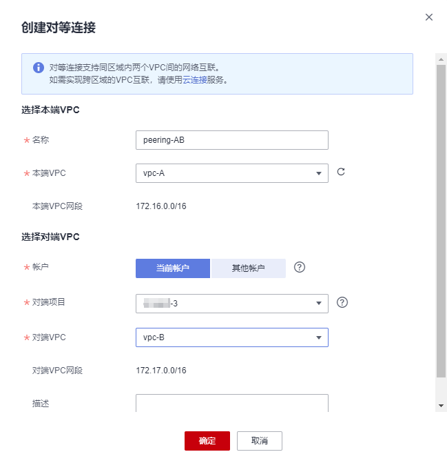
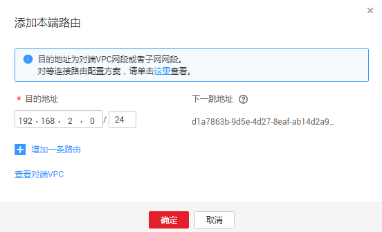

# 创建同一租户下的对等连接

## 操作场景

创建对等连接首先要向需要建立对等连接的VPC发送请求，您可以和自己租户内相同Region的其他VPC申请对等连接，同租户内同Region的VPC创建对等连接，默认自动接受。

## 前提条件

已创建相同Region内的两个VPC。

## 操作步骤

**创建VPC对等连接**

1.  登录管理控制台。
2.  在管理控制台左上角单击图标，选择区域和项目。
3.  在系统首页，单击“网络 \> 虚拟私有云”。
4.  在左侧导航栏选择“对等连接”。
5.  在界面右侧详情区域单击“创建对等连接”。
6.  根据界面提示配置参数，其中“租户”选择“当前租户”,相关参数如[表1](#tc7e5fc0051d945c1b49c341b41353839)所示。

    **图 1**  创建对等连接  
    

    **表 1**  参数说明

    
    <table><thead align="left"><tr id="rfff26265e27144ea8b923937d7f899f1"><th class="cellrowborder" valign="top" width="33.33333333333333%" id="mcps1.2.4.1.1">
参数

    </th>
    <th class="cellrowborder" valign="top" width="33.33333333333333%" id="mcps1.2.4.1.2">
说明

    </th>
    <th class="cellrowborder" valign="top" width="33.33333333333333%" id="mcps1.2.4.1.3">
取值样例

    </th>
    </tr>
    </thead>
    <tbody><tr id="r6c792b0c1cd1439a8347cf518cee9a63"><td class="cellrowborder" valign="top" width="33.33333333333333%" headers="mcps1.2.4.1.1 ">
名称

    </td>
    <td class="cellrowborder" valign="top" width="33.33333333333333%" headers="mcps1.2.4.1.2 ">
对等连接名称。

    
由汉字、英文字母、数字、中划线、下划线等构成，一般不超过64个字符。

    </td>
    <td class="cellrowborder" valign="top" width="33.33333333333333%" headers="mcps1.2.4.1.3 ">
peering-001

    </td>
    </tr>
    <tr id="r6e0db9f8c275413d8a6eca86dd3f3262"><td class="cellrowborder" valign="top" width="33.33333333333333%" headers="mcps1.2.4.1.1 ">
本端VPC

    </td>
    <td class="cellrowborder" valign="top" width="33.33333333333333%" headers="mcps1.2.4.1.2 ">
本端VPC。可在下拉框中选择。

    </td>
    <td class="cellrowborder" valign="top" width="33.33333333333333%" headers="mcps1.2.4.1.3 ">
vpc_002(0a396cff-8bc1-4509-98b9-267cae5ac460)

    </td>
    </tr>
    <tr id="r38027e47e28d406e9b603de6e119ca2c"><td class="cellrowborder" valign="top" width="33.33333333333333%" headers="mcps1.2.4.1.1 ">
本端VPC网段

    </td>
    <td class="cellrowborder" valign="top" width="33.33333333333333%" headers="mcps1.2.4.1.2 ">
本端VPC网段。

    </td>
    <td class="cellrowborder" valign="top" width="33.33333333333333%" headers="mcps1.2.4.1.3 ">
192.168.10.0/24

    </td>
    </tr>
    <tr id="re4eba0a8d8704647864e5603de6c80a4"><td class="cellrowborder" valign="top" width="33.33333333333333%" headers="mcps1.2.4.1.1 ">
租户

    </td>
    <td class="cellrowborder" valign="top" width="33.33333333333333%" headers="mcps1.2.4.1.2 ">
建立对等连接的帐号：

    <ul id="ul4166504516184"><li>当前租户：表示在同一个租户内、同一个Region下的不同VPC间建立对等连接。</li><li>其他租户：表示在同一个Region下的不同租户的VPC间建立对等连接。</li></ul>
    </td>
    <td class="cellrowborder" valign="top" width="33.33333333333333%" headers="mcps1.2.4.1.3 ">
当前租户

    </td>
    </tr>
    <tr id="row36820068181021"><td class="cellrowborder" valign="top" width="33.33333333333333%" headers="mcps1.2.4.1.1 ">
项目名称

    </td>
    <td class="cellrowborder" valign="top" width="33.33333333333333%" headers="mcps1.2.4.1.2 ">
项目名称，默认为当前项目的项目名称。

    </td>
    <td class="cellrowborder" valign="top" width="33.33333333333333%" headers="mcps1.2.4.1.3 ">
aaa

    </td>
    </tr>
    <tr id="rc3522d1027c14cedbbb303a1b60b7f1d"><td class="cellrowborder" valign="top" width="33.33333333333333%" headers="mcps1.2.4.1.1 ">
对端VPC

    </td>
    <td class="cellrowborder" valign="top" width="33.33333333333333%" headers="mcps1.2.4.1.2 ">
对端VPC。同租户Peer VPC可在下拉框中选择。

    </td>
    <td class="cellrowborder" valign="top" width="33.33333333333333%" headers="mcps1.2.4.1.3 ">
vpc_fab1(65d062b3-40fa-4204-8181-3538f527d2ab)

    </td>
    </tr>
    <tr id="r325dc900b6b24940a87f6a900d3cb89d"><td class="cellrowborder" valign="top" width="33.33333333333333%" headers="mcps1.2.4.1.1 ">
对端VPC网段

    </td>
    <td class="cellrowborder" valign="top" width="33.33333333333333%" headers="mcps1.2.4.1.2 ">
对端VPC网段。

    
对端VPC网段不能和本端VPC网段相同或有重叠网段，否则对等连接路由可能会失效。

    </td>
    <td class="cellrowborder" valign="top" width="33.33333333333333%" headers="mcps1.2.4.1.3 ">
192.168.2.0/24

    </td>
    </tr>
    </tbody>
    </table>

7.  单击“确定”。

**添加VPC对等连接路由**

相同租户创建VPC对等连接，默认接受请求，要使对等连接的VPC可以路由数据，还需要添加VPC对等连接路由信息。

1.  在系统首页，单击“网络 \> 虚拟私有云”。
2.  在左侧导航栏选择“对等连接”。

1.  在已创建对等连接列表，查找需要添加路由信息对等连接名。

    **图 2**  对等连接列表  
    

2.  单击对等连接名称链接，进入对等连接详情页面。
3.  在VPC对等连接详情页面，单击“本端路由”。
4.  在“本端路由”页签区域，单击“添加本端路由”添加本端路由信息，参数说明参考[表2](#t044d096c810a44ea9255a9c42bf548fc)。

    **图 3**  添加本端路由  
    

    **表 2**  路由参数说明

    
    <table><thead align="left"><tr id="r2808234364f54e6682fd9fd9d4223017"><th class="cellrowborder" valign="top" width="33.33333333333333%" id="mcps1.2.4.1.1">
参数

    </th>
    <th class="cellrowborder" valign="top" width="33.33333333333333%" id="mcps1.2.4.1.2">
说明

    </th>
    <th class="cellrowborder" valign="top" width="33.33333333333333%" id="mcps1.2.4.1.3">
取值样例

    </th>
    </tr>
    </thead>
    <tbody><tr id="ra6bd3f7a35584fd5b90e4963f0beb231"><td class="cellrowborder" valign="top" width="33.33333333333333%" headers="mcps1.2.4.1.1 ">
目的地址

    </td>
    <td class="cellrowborder" valign="top" width="33.33333333333333%" headers="mcps1.2.4.1.2 ">
目的地址，对端VPC或子网的网段。

    </td>
    <td class="cellrowborder" valign="top" width="33.33333333333333%" headers="mcps1.2.4.1.3 ">
192.168.10.0/24

    </td>
    </tr>
    <tr id="rc6095ad1c98d4a3e800f2c82386b73cf"><td class="cellrowborder" valign="top" width="33.33333333333333%" headers="mcps1.2.4.1.1 ">
下一跳地址

    </td>
    <td class="cellrowborder" valign="top" width="33.33333333333333%" headers="mcps1.2.4.1.2 ">
下一跳地址，即对等连接ID，默认不用配置。

    </td>
    <td class="cellrowborder" valign="top" width="33.33333333333333%" headers="mcps1.2.4.1.3 ">
65d062b3-40fa-4204-550a

    </td>
    </tr>
    </tbody>
    </table>

5.  单击“确定”，回到对等连接详情界面。
6.  在对等连接详情界面，单击“对端路由”。
7.  在“对端路由”页签区域，单击“添加对端路由”添加对端路由信息。
8.  单击“确定”，完成添加VPC对等连接路由信息。

    对等连接建立后，您可以使用私有IP地址在两个VPC之间进行通信。您可以使用“ping”命令可以检查网络两端网络是否连通。

    如果两个VPC不能互通，请参考[为什么对等连接创建完成后不能互通？](http://support.huaweicloud.com/vpc_faq/vpc_faq_0069.html)检查相关配置。

