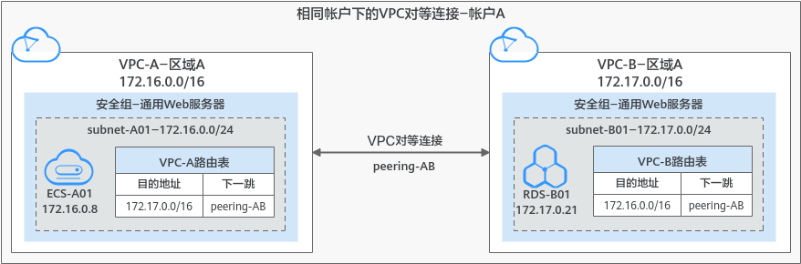
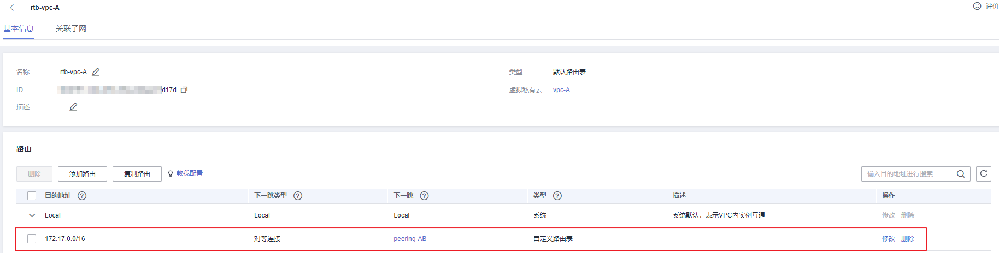
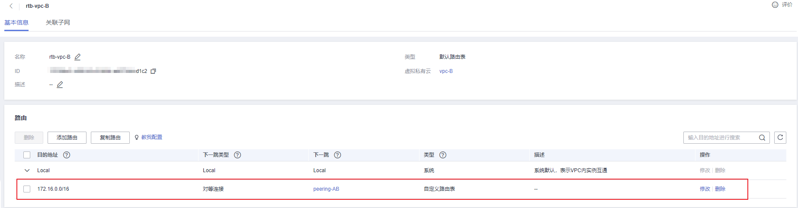

# 创建相同帐户下的对等连接<a name="zh-cn_topic_0046655037"></a>

## 操作场景<a name="s15a6c19babf0488eba98096754d78b91"></a>

不同VPC之间网络不通，您可以通过对等连接连通同一个区域下的VPC。本章节指导用户创建相同帐户下的VPC对等连接，即连通的两个VPC位于同一个帐户下。

本文档以在帐户A下，创建VPC-A和VPC-B之间的对等连接为例，实现业务服务器ECS-A01和数据库服务器RDS-B01之间的通信。

创建步骤如下：

1.  [步骤一：创建VPC对等连接](#section143383585438)
2.  [步骤二：添加VPC对等连接路由](#section19655123018712)
3.  [步骤三：验证网络互通情况](#section026312306414)

**图 1**  相同帐户下的对等连接组网示例<a name="fig4721642193711"></a>  


> **须知：** 
>当前VPC对等连接暂不收取您的任何费用。

## 约束与限制<a name="section644715161310"></a>

-   对等连接是建立在两个VPC之间的网络连接，两个VPC之间只能建立一个对等连接。
-   对等连接仅可以连通同区域的VPC，不同区域的VPC之间不能创建对等连接。
    -   若要实现不同区域VPC之间互通，您可以使用云连接，详细内容请参见[跨区域VPC互通](https://support.huaweicloud.com/qs-cc/cc_02_0201.html)。
    -   若您仅需要不同区域的几台ECS之间需要互通，您可以[为ECS申请和绑定弹性公网IP](https://support.huaweicloud.com/qs-eip/eip_qs_0001.html)，通过EIP实现ECS外网互通。此场景适用于ECS数量较少的情况。

-   配置对等连接时，当您的本端VPC和对端VPC存在网段重叠的情况时，那么您的对等连接可能会不生效。

    针对该情况，我们为您提供不同情况下的组网配置示例，请您参考[对等连接使用示例](对等连接使用示例.md)。


## 前提条件<a name="section2622867121261"></a>

已创建两个VPC，并且VPC位于同一个区域，具体方法请参见[创建虚拟私有云和子网](创建虚拟私有云和子网.md)。

## 步骤一：创建VPC对等连接<a name="section143383585438"></a>

1.  登录管理控制台。


1.  在管理控制台左上角单击，选择区域和项目。
2.  在系统首页，选择“网络\>虚拟私有云”。

    进入虚拟有云列表页面。

3.  在左侧导航栏，选择“虚拟私有云 \> 对等连接”。

    进入对等连接列表页面。

4.  在页面右上角区域，单击“创建对等连接”。

    弹出“创建对等连接”对话框。

5.  根据界面提示设置对等连接参数。

    参数详细说明请参见[表1](#table348414246354)。

    **图 2**  创建对等连接<a name="fig2048322419356"></a>  
    

    **表 1**  创建对等连接-参数说明

    <a name="table348414246354"></a>
    <table><thead align="left"><tr id="row11483122423517"><th class="cellrowborder" valign="top" width="22.36223622362236%" id="mcps1.2.4.1.1"><p id="p15483132414355"><a name="p15483132414355"></a><a name="p15483132414355"></a>参数</p>
    </th>
    <th class="cellrowborder" valign="top" width="43.90439043904391%" id="mcps1.2.4.1.2"><p id="p748382410356"><a name="p748382410356"></a><a name="p748382410356"></a>说明</p>
    </th>
    <th class="cellrowborder" valign="top" width="33.73337333733373%" id="mcps1.2.4.1.3"><p id="p848319249358"><a name="p848319249358"></a><a name="p848319249358"></a>取值样例</p>
    </th>
    </tr>
    </thead>
    <tbody><tr id="row8483182414357"><td class="cellrowborder" valign="top" width="22.36223622362236%" headers="mcps1.2.4.1.1 "><p id="p17483724103516"><a name="p17483724103516"></a><a name="p17483724103516"></a>名称</p>
    </td>
    <td class="cellrowborder" valign="top" width="43.90439043904391%" headers="mcps1.2.4.1.2 "><p id="p12511455184513"><a name="p12511455184513"></a><a name="p12511455184513"></a>必选参数。</p>
    <p id="p6483124203515"><a name="p6483124203515"></a><a name="p6483124203515"></a>此处填写对等连接的名称。</p>
    <p id="p04831624133516"><a name="p04831624133516"></a><a name="p04831624133516"></a>由中文字符、英文字母、数字、中划线、下划线等构成，一般不超过64个字符。</p>
    </td>
    <td class="cellrowborder" valign="top" width="33.73337333733373%" headers="mcps1.2.4.1.3 "><p id="p1948362414352"><a name="p1948362414352"></a><a name="p1948362414352"></a>peering-AB</p>
    </td>
    </tr>
    <tr id="row4483172411357"><td class="cellrowborder" valign="top" width="22.36223622362236%" headers="mcps1.2.4.1.1 "><p id="p164837248356"><a name="p164837248356"></a><a name="p164837248356"></a>本端VPC</p>
    </td>
    <td class="cellrowborder" valign="top" width="43.90439043904391%" headers="mcps1.2.4.1.2 "><p id="p2483102418354"><a name="p2483102418354"></a><a name="p2483102418354"></a>必选参数。</p>
    <p id="p172442324466"><a name="p172442324466"></a><a name="p172442324466"></a>此处为对等连接一端的VPC，可以在下拉框中选择已有VPC作为本端VPC。</p>
    </td>
    <td class="cellrowborder" valign="top" width="33.73337333733373%" headers="mcps1.2.4.1.3 "><p id="p312572911478"><a name="p312572911478"></a><a name="p312572911478"></a>VPC-A</p>
    </td>
    </tr>
    <tr id="row64833249353"><td class="cellrowborder" valign="top" width="22.36223622362236%" headers="mcps1.2.4.1.1 "><p id="p1048302413519"><a name="p1048302413519"></a><a name="p1048302413519"></a>本端VPC网段</p>
    </td>
    <td class="cellrowborder" valign="top" width="43.90439043904391%" headers="mcps1.2.4.1.2 "><p id="p1948311241357"><a name="p1948311241357"></a><a name="p1948311241357"></a>此处显示已选择的本端VPC的网段。</p>
    </td>
    <td class="cellrowborder" valign="top" width="33.73337333733373%" headers="mcps1.2.4.1.3 "><p id="p04838244352"><a name="p04838244352"></a><a name="p04838244352"></a>172.16.0.0/16</p>
    </td>
    </tr>
    <tr id="row104831624123510"><td class="cellrowborder" valign="top" width="22.36223622362236%" headers="mcps1.2.4.1.1 "><p id="p144831124163511"><a name="p144831124163511"></a><a name="p144831124163511"></a>帐户</p>
    </td>
    <td class="cellrowborder" valign="top" width="43.90439043904391%" headers="mcps1.2.4.1.2 "><p id="p195762383507"><a name="p195762383507"></a><a name="p195762383507"></a>必选参数。</p>
    <a name="ul14830246351"></a><a name="ul14830246351"></a><ul id="ul14830246351"><li>当前帐户：当对等连接中的对端VPC和本端VPC位于同一个帐户下时，选择该项。</li><li>其他帐户：当对等连接中的对端VPC和本端VPC位于不同帐户下时，选择该项。</li></ul>
    </td>
    <td class="cellrowborder" valign="top" width="33.73337333733373%" headers="mcps1.2.4.1.3 "><p id="p124835244358"><a name="p124835244358"></a><a name="p124835244358"></a>当前帐户</p>
    </td>
    </tr>
    <tr id="row2483152423519"><td class="cellrowborder" valign="top" width="22.36223622362236%" headers="mcps1.2.4.1.1 "><p id="p94831224103514"><a name="p94831224103514"></a><a name="p94831224103514"></a>对端项目</p>
    </td>
    <td class="cellrowborder" valign="top" width="43.90439043904391%" headers="mcps1.2.4.1.2 "><p id="p10919131135219"><a name="p10919131135219"></a><a name="p10919131135219"></a>当帐户选择“当前帐户”时，系统默认填充对应的项目，无需您额外操作。</p>
    <p id="p15472355567"><a name="p15472355567"></a><a name="p15472355567"></a>比如VPC-A和VPC-B均为帐户A下的资源，并且位于区域-A，那么此处系统默认显示帐户A下，区域A对应的项目。</p>
    <p id="p13504193755411"><a name="p13504193755411"></a><a name="p13504193755411"></a></p>
    </td>
    <td class="cellrowborder" valign="top" width="33.73337333733373%" headers="mcps1.2.4.1.3 "><p id="p4101650165716"><a name="p4101650165716"></a><a name="p4101650165716"></a>ab-cdef-1</p>
    </td>
    </tr>
    <tr id="row1748316247358"><td class="cellrowborder" valign="top" width="22.36223622362236%" headers="mcps1.2.4.1.1 "><p id="p148311245351"><a name="p148311245351"></a><a name="p148311245351"></a>对端VPC</p>
    </td>
    <td class="cellrowborder" valign="top" width="43.90439043904391%" headers="mcps1.2.4.1.2 "><p id="p1632319113590"><a name="p1632319113590"></a><a name="p1632319113590"></a>当帐户选择“当前帐户”时，该项为必选参数。</p>
    <p id="p133231411175911"><a name="p133231411175911"></a><a name="p133231411175911"></a>此处为对等连接另外一端的VPC，可以在下拉框中选择已有VPC作为对端VPC。</p>
    </td>
    <td class="cellrowborder" valign="top" width="33.73337333733373%" headers="mcps1.2.4.1.3 "><p id="p963622545917"><a name="p963622545917"></a><a name="p963622545917"></a>VPC-B</p>
    </td>
    </tr>
    <tr id="row12483122493518"><td class="cellrowborder" valign="top" width="22.36223622362236%" headers="mcps1.2.4.1.1 "><p id="p14483122413353"><a name="p14483122413353"></a><a name="p14483122413353"></a>对端VPC网段</p>
    </td>
    <td class="cellrowborder" valign="top" width="43.90439043904391%" headers="mcps1.2.4.1.2 "><p id="p1548322415359"><a name="p1548322415359"></a><a name="p1548322415359"></a>此处显示已选择的对端VPC的网段。</p>
    <p id="p11483424183510"><a name="p11483424183510"></a><a name="p11483424183510"></a>当您的本端VPC和对端VPC存在网段重叠的情况时，那么您的对等连接可能会不生效，具体请参见<a href="对等连接使用示例.md">对等连接使用示例</a>。</p>
    </td>
    <td class="cellrowborder" valign="top" width="33.73337333733373%" headers="mcps1.2.4.1.3 "><p id="p14831024173514"><a name="p14831024173514"></a><a name="p14831024173514"></a>172.17.0.0/16</p>
    </td>
    </tr>
    <tr id="row144841224133519"><td class="cellrowborder" valign="top" width="22.36223622362236%" headers="mcps1.2.4.1.1 "><p id="p8483152414359"><a name="p8483152414359"></a><a name="p8483152414359"></a>描述</p>
    </td>
    <td class="cellrowborder" valign="top" width="43.90439043904391%" headers="mcps1.2.4.1.2 "><p id="p1663904918593"><a name="p1663904918593"></a><a name="p1663904918593"></a>可选参数。</p>
    <p id="p2048418241358"><a name="p2048418241358"></a><a name="p2048418241358"></a>您可以根据需要在文本框中输入对该连接的描述信息。描述信息内容不能超过255个字符，且不能包含“&lt;”和“&gt;”。</p>
    </td>
    <td class="cellrowborder" valign="top" width="33.73337333733373%" headers="mcps1.2.4.1.3 "><p id="p134841624183519"><a name="p134841624183519"></a><a name="p134841624183519"></a>peering-AB连通VPC-A和VPC-B</p>
    </td>
    </tr>
    </tbody>
    </table>

6.  参数填写完成后，单击“确定”。

    弹出路由添加提示对话框。

7.  在路由添加提示对话框中，执行以下操作。

    1.  单击“查看路由”，跳转到“本端路由”页面，继续执行[步骤二：添加VPC对等连接路由](#section19655123018712)，添加路由。
    2.  单击“暂不添加”，返回对等连接列表页面。

    > **须知：** 
    >对等连接创建完成后，必须在本端VPC和对端VPC路由表中添加路由，否则对等连接不会生效。


## 步骤二：添加VPC对等连接路由<a name="section19655123018712"></a>

1.  执行以下操作，在本端VPC路由表中添加对等连接路由。
    1.  在对等连接的“本端路由”页签，根据左上方界面提示，单击路由表超链接。

        进入本端VPC的默认路由表基本信息页面。

        **图 3**  跳转VPC对等连接路由表-本端<a name="fig188841213181714"></a>  
        

    2.  单击“添加路由”，在默认路由表中添加路由。

        参数说明如[表2](#table97163496270)所示。

        **表 2**  参数说明

        <a name="table97163496270"></a>
        <table><thead align="left"><tr id="row671512499273"><th class="cellrowborder" valign="top" width="19.24%" id="mcps1.2.4.1.1"><p id="p147151949172714"><a name="p147151949172714"></a><a name="p147151949172714"></a>参数</p>
        </th>
        <th class="cellrowborder" valign="top" width="55.7%" id="mcps1.2.4.1.2"><p id="p971594962711"><a name="p971594962711"></a><a name="p971594962711"></a>说明</p>
        </th>
        <th class="cellrowborder" valign="top" width="25.06%" id="mcps1.2.4.1.3"><p id="p1771514952712"><a name="p1771514952712"></a><a name="p1771514952712"></a>取值样例</p>
        </th>
        </tr>
        </thead>
        <tbody><tr id="row127151049182714"><td class="cellrowborder" valign="top" width="19.24%" headers="mcps1.2.4.1.1 "><p id="p5715174912716"><a name="p5715174912716"></a><a name="p5715174912716"></a>目的地址</p>
        </td>
        <td class="cellrowborder" valign="top" width="55.7%" headers="mcps1.2.4.1.2 "><p id="p20715134922718"><a name="p20715134922718"></a><a name="p20715134922718"></a>对端VPC的地址，可以为VPC网段、子网网段、ECS IP地址等，具体请参见<a href="对等连接使用示例.md">对等连接使用示例</a>。</p>
        </td>
        <td class="cellrowborder" valign="top" width="25.06%" headers="mcps1.2.4.1.3 "><p id="p18759194352410"><a name="p18759194352410"></a><a name="p18759194352410"></a>此处为VPC-B的网段：172.17.0.0/16</p>
        </td>
        </tr>
        <tr id="row1716164972718"><td class="cellrowborder" valign="top" width="19.24%" headers="mcps1.2.4.1.1 "><p id="p10716949152714"><a name="p10716949152714"></a><a name="p10716949152714"></a>下一跳类型</p>
        </td>
        <td class="cellrowborder" valign="top" width="55.7%" headers="mcps1.2.4.1.2 "><p id="p27169498279"><a name="p27169498279"></a><a name="p27169498279"></a>选择“对等连接”。</p>
        </td>
        <td class="cellrowborder" valign="top" width="25.06%" headers="mcps1.2.4.1.3 "><p id="p27161349142717"><a name="p27161349142717"></a><a name="p27161349142717"></a>对等连接</p>
        </td>
        </tr>
        <tr id="row187164494273"><td class="cellrowborder" valign="top" width="19.24%" headers="mcps1.2.4.1.1 "><p id="p12716249192710"><a name="p12716249192710"></a><a name="p12716249192710"></a>下一跳</p>
        </td>
        <td class="cellrowborder" valign="top" width="55.7%" headers="mcps1.2.4.1.2 "><p id="p171614497279"><a name="p171614497279"></a><a name="p171614497279"></a>选择当前对等连接的名称。</p>
        </td>
        <td class="cellrowborder" valign="top" width="25.06%" headers="mcps1.2.4.1.3 "><p id="p1871694912275"><a name="p1871694912275"></a><a name="p1871694912275"></a>peering-AB</p>
        </td>
        </tr>
        <tr id="row11716164911279"><td class="cellrowborder" valign="top" width="19.24%" headers="mcps1.2.4.1.1 "><p id="p167161493278"><a name="p167161493278"></a><a name="p167161493278"></a>描述</p>
        </td>
        <td class="cellrowborder" valign="top" width="55.7%" headers="mcps1.2.4.1.2 "><p id="p1871604962713"><a name="p1871604962713"></a><a name="p1871604962713"></a>路由的描述信息，非必填项。</p>
        <p id="p97161949142719"><a name="p97161949142719"></a><a name="p97161949142719"></a>描述信息内容不能超过255个字符，且不能包含“&lt;”和“&gt;”。</p>
        </td>
        <td class="cellrowborder" valign="top" width="25.06%" headers="mcps1.2.4.1.3 "><p id="p137167494278"><a name="p137167494278"></a><a name="p137167494278"></a>-</p>
        </td>
        </tr>
        </tbody>
        </table>

    3.  路由信息设置完成后，单击“确定”。

        返回路由列表，可以看到刚添加的路由。

        **图 4**  添加VPC对等连接路由-本端<a name="fig169203092913"></a>  
        


1.  执行以下步骤，在对端VPC路由表中添加对等连接路由。
    1.  选择“对端路由”页签，根据左上方界面提示，单击路由表超链接。

        进入对端VPC默认路由表的基本信息页签。

        **图 5**  跳转VPC对等连接路由表-对端<a name="fig9737131963617"></a>  
        

    2.  单击“添加路由”，在默认路由表中添加路由。

        参数说明如[表3](#table13697163914393)所示。

        **表 3**  参数说明

        <a name="table13697163914393"></a>
        <table><thead align="left"><tr id="row2069718398393"><th class="cellrowborder" valign="top" width="19.24%" id="mcps1.2.4.1.1"><p id="p1569716399397"><a name="p1569716399397"></a><a name="p1569716399397"></a>参数</p>
        </th>
        <th class="cellrowborder" valign="top" width="55.7%" id="mcps1.2.4.1.2"><p id="p1169783914396"><a name="p1169783914396"></a><a name="p1169783914396"></a>说明</p>
        </th>
        <th class="cellrowborder" valign="top" width="25.06%" id="mcps1.2.4.1.3"><p id="p9697153918398"><a name="p9697153918398"></a><a name="p9697153918398"></a>取值样例</p>
        </th>
        </tr>
        </thead>
        <tbody><tr id="row15697139183912"><td class="cellrowborder" valign="top" width="19.24%" headers="mcps1.2.4.1.1 "><p id="p16697193913916"><a name="p16697193913916"></a><a name="p16697193913916"></a>目的地址</p>
        </td>
        <td class="cellrowborder" valign="top" width="55.7%" headers="mcps1.2.4.1.2 "><p id="p9809147434"><a name="p9809147434"></a><a name="p9809147434"></a>本端VPC的地址，可以为VPC网段、子网网段、ECS IP地址等，具体请参见<a href="对等连接使用示例.md">对等连接使用示例</a>。</p>
        </td>
        <td class="cellrowborder" valign="top" width="25.06%" headers="mcps1.2.4.1.3 "><p id="p8899143719370"><a name="p8899143719370"></a><a name="p8899143719370"></a>此处为VPC-A的网段：172.16.0.0/16</p>
        </td>
        </tr>
        <tr id="row7697173915399"><td class="cellrowborder" valign="top" width="19.24%" headers="mcps1.2.4.1.1 "><p id="p13697193918396"><a name="p13697193918396"></a><a name="p13697193918396"></a>下一跳类型</p>
        </td>
        <td class="cellrowborder" valign="top" width="55.7%" headers="mcps1.2.4.1.2 "><p id="p4697103910393"><a name="p4697103910393"></a><a name="p4697103910393"></a>选择“对等连接”。</p>
        </td>
        <td class="cellrowborder" valign="top" width="25.06%" headers="mcps1.2.4.1.3 "><p id="p0697739173916"><a name="p0697739173916"></a><a name="p0697739173916"></a>对等连接</p>
        </td>
        </tr>
        <tr id="row2697163963916"><td class="cellrowborder" valign="top" width="19.24%" headers="mcps1.2.4.1.1 "><p id="p769718397393"><a name="p769718397393"></a><a name="p769718397393"></a>下一跳</p>
        </td>
        <td class="cellrowborder" valign="top" width="55.7%" headers="mcps1.2.4.1.2 "><p id="p669773913393"><a name="p669773913393"></a><a name="p669773913393"></a>选择当前对等连接的名称。</p>
        </td>
        <td class="cellrowborder" valign="top" width="25.06%" headers="mcps1.2.4.1.3 "><p id="p16697739153910"><a name="p16697739153910"></a><a name="p16697739153910"></a>peering-AB</p>
        </td>
        </tr>
        <tr id="row669733963913"><td class="cellrowborder" valign="top" width="19.24%" headers="mcps1.2.4.1.1 "><p id="p9697123933915"><a name="p9697123933915"></a><a name="p9697123933915"></a>描述</p>
        </td>
        <td class="cellrowborder" valign="top" width="55.7%" headers="mcps1.2.4.1.2 "><p id="p10697939183913"><a name="p10697939183913"></a><a name="p10697939183913"></a>路由的描述信息，非必填项。</p>
        <p id="p1697143953919"><a name="p1697143953919"></a><a name="p1697143953919"></a>描述信息内容不能超过255个字符，且不能包含“&lt;”和“&gt;”。</p>
        </td>
        <td class="cellrowborder" valign="top" width="25.06%" headers="mcps1.2.4.1.3 "><p id="p86971139153912"><a name="p86971139153912"></a><a name="p86971139153912"></a>-</p>
        </td>
        </tr>
        </tbody>
        </table>

    3.  路由信息设置完成后，单击“确定”。

        返回路由列表，可以看到刚添加的路由。

        **图 6**  添加VPC对等连接路由-对端<a name="fig1797195563717"></a>  
        


## 步骤三：验证网络互通情况<a name="section026312306414"></a>

对等连接路由添加完成后，执行以下操作，验证本端VPC和对端VPC的通信情况。

1.  登录本端VPC内的弹性云服务器，本示例中为ECS-A01。

    弹性云服务器有多种登录方法，具体请参见[登录弹性云服务器](https://support.huaweicloud.com/qs-ecs/zh-cn_topic_0092494193.html)。

2.  执行以下命令，验证ECS-A01和的RDS-B01是否可以通信。

    **ping** _对端服务器的IP地址_

    命令示例：

    **ping 172.17.0.21**

    回显类似如下信息，表示ECS-A01与RDS-B01可以通过通信，VPC-A和VPC-B之间的对等连接创建成功。

    ```
    [root@ecs-A02 ~]# ping 172.17.0.21
    PING 172.17.0.21 (172.17.0.21) 56(84) bytes of data.
    64 bytes from 172.17.0.21: icmp_seq=1 ttl=64 time=0.849 ms
    64 bytes from 172.17.0.21: icmp_seq=2 ttl=64 time=0.455 ms
    64 bytes from 172.17.0.21: icmp_seq=3 ttl=64 time=0.385 ms
    64 bytes from 172.17.0.21: icmp_seq=4 ttl=64 time=0.372 ms
    ...
    --- 172.17.0.21 ping statistics ---
    ```

    > **须知：** 
    >-   本示例中ECS-A01和RDS-B01位于同一个安全组内，因此只要VPC-A和VPC-B之间的对等连接创建成功后，就可以实现网络互通。如果您需要连通的实例位于不同的安全组内，那么您需要在安全组的入方向规则中，添加放通对端安全组的规则，具体方法请参见[不同安全组内的弹性云服务器内网互通](安全组配置示例.md#section14197522283)。
    >-   对于更多对等连接网络不通的问题，处理方法请参见[为什么对等连接创建完成后不能互通？](https://support.huaweicloud.com/vpc_faq/vpc_faq_0069.html)。


