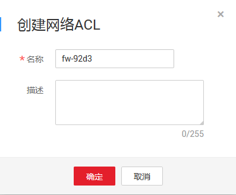

# 创建网络ACL

## 操作场景

您可以创建自定义网络ACL。默认情况下，创建的网络ACL没有关联子网和出入规则且处于停用状态。每个用户默认可以创建200个网络ACL。

## 操作步骤

1.  登录管理控制台。

1.  在管理控制台左上角单击，选择区域和项目。
2.  在系统首页，选择“网络 \> 虚拟私有云”。
3.  在左侧导航栏选择“访问控制 \> 网络ACL”。
4.  在页面右侧区域，单击“创建网络ACL”。
5.  在“创建网络ACL”页面，根据提示，填写网络ACL参数，如[图1](#fig76501936420)所示，参数参见[表1](#table145313414319)。

    **图 1**  创建网络ACL  
    

    **表 1**  参数说明

    
    <table><thead align="left"><tr id="row05304110314"><th class="cellrowborder" valign="top" width="14.85%" id="mcps1.2.4.1.1">
参数

    </th>
    <th class="cellrowborder" valign="top" width="51.32%" id="mcps1.2.4.1.2">
参数说明

    </th>
    <th class="cellrowborder" valign="top" width="33.83%" id="mcps1.2.4.1.3">
取值样例

    </th>
    </tr>
    </thead>
    <tbody><tr id="row2053541033"><td class="cellrowborder" valign="top" width="14.85%" headers="mcps1.2.4.1.1 ">
名称

    </td>
    <td class="cellrowborder" valign="top" width="51.32%" headers="mcps1.2.4.1.2 ">
网络ACL的名称，必填项。

    
网络ACL的名称只能由中文、英文字母、数字、下划线、中划线组成，且不能有空格，长度不能大于64个字符。

    </td>
    <td class="cellrowborder" valign="top" width="33.83%" headers="mcps1.2.4.1.3 ">
fw-92d3

    </td>
    </tr>
    <tr id="row1753541637"><td class="cellrowborder" valign="top" width="14.85%" headers="mcps1.2.4.1.1 ">
描述

    </td>
    <td class="cellrowborder" valign="top" width="51.32%" headers="mcps1.2.4.1.2 ">
网络ACL的描述信息，非必填项。

    
描述信息内容不能超过255个字符，且不能包含&lt;、&gt;符号。

    </td>
    <td class="cellrowborder" valign="top" width="33.83%" headers="mcps1.2.4.1.3 ">
-

    </td>
    </tr>
    </tbody>
    </table>

6.  单击“确定”，完成创建。

