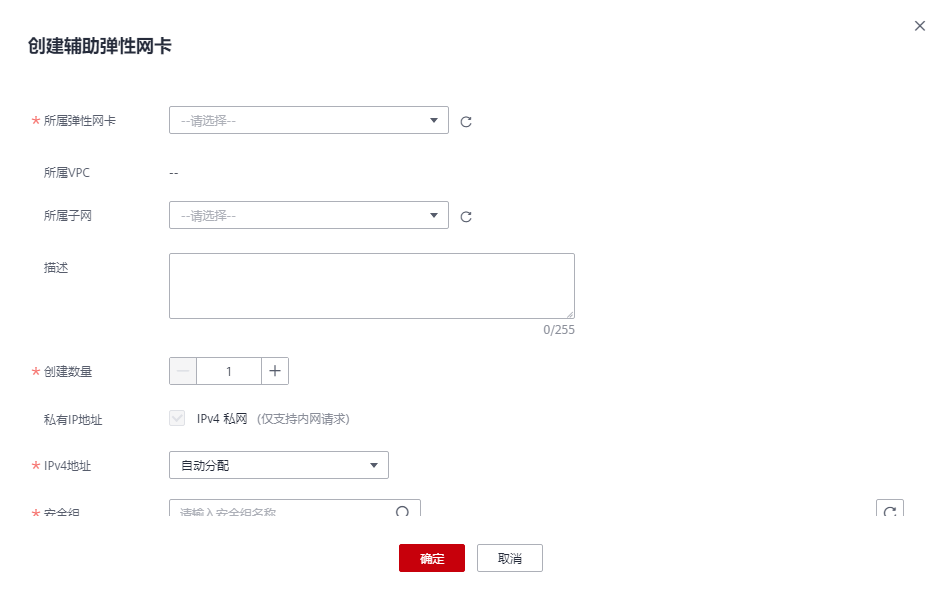
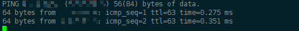
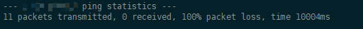

# 创建辅助弹性网卡

## 操作场景

当云服务器实例所需挂载的网卡超出弹性网卡的上限时，您可以参考本章节创建辅助弹性网卡，为云服务器实例挂载更多网卡，实现灵活、高可用的网络方案配置。

> **说明：** 
>辅助弹性网卡功能目前仅在“华北-北京四”、“华东-上海一”、“华南-广州”开放。

## 创建辅助弹性网卡

1.  登录管理控制台。
2.  在管理控制台左上角单击，选择区域和项目。
3.  在系统首页，选择“网络 \> 虚拟私有云”。
4.  在左侧导航栏选择“弹性网卡”。
5.  在页面右上角，单击“创建辅助弹性网卡”。

    **图 1**  创建辅助弹性网卡  
    

6.  配置辅助弹性网卡参数，如[表1](#table145313414319)所示。

    **表 1**  参数说明

    
    <table><thead align="left"><tr id="row05304110314"><th class="cellrowborder" valign="top" width="14.85%" id="mcps1.2.4.1.1">
参数

    </th>
    <th class="cellrowborder" valign="top" width="51.32%" id="mcps1.2.4.1.2">
参数说明

    </th>
    <th class="cellrowborder" valign="top" width="33.83%" id="mcps1.2.4.1.3">
取值样例

    </th>
    </tr>
    </thead>
    <tbody><tr id="row2053541033"><td class="cellrowborder" valign="top" width="14.85%" headers="mcps1.2.4.1.1 ">
所属弹性网卡

    </td>
    <td class="cellrowborder" valign="top" width="51.32%" headers="mcps1.2.4.1.2 ">
辅助弹性网卡所挂载的弹性网卡。

    
您可以通过下拉列表框选择支持挂载辅助弹性网卡的弹性网卡。

    </td>
    <td class="cellrowborder" valign="top" width="33.83%" headers="mcps1.2.4.1.3 ">
eni-891e

    </td>
    </tr>
    <tr id="row189916579720"><td class="cellrowborder" valign="top" width="14.85%" headers="mcps1.2.4.1.1 ">
所属VPC

    </td>
    <td class="cellrowborder" valign="top" width="51.32%" headers="mcps1.2.4.1.2 ">
辅助弹性网卡归属的VPC，无需填写。

    </td>
    <td class="cellrowborder" valign="top" width="33.83%" headers="mcps1.2.4.1.3 ">
vpc-001

    </td>
    </tr>
    <tr id="row1753541637"><td class="cellrowborder" valign="top" width="14.85%" headers="mcps1.2.4.1.1 ">
所属子网

    </td>
    <td class="cellrowborder" valign="top" width="51.32%" headers="mcps1.2.4.1.2 ">
选择辅助弹性网卡归属的子网。

    </td>
    <td class="cellrowborder" valign="top" width="33.83%" headers="mcps1.2.4.1.3 ">
subnet-001

    </td>
    </tr>
    <tr id="row548201618336"><td class="cellrowborder" valign="top" width="14.85%" headers="mcps1.2.4.1.1 ">
描述

    </td>
    <td class="cellrowborder" valign="top" width="51.32%" headers="mcps1.2.4.1.2 ">
辅助弹性网卡的描述信息，非必填项。

    
描述信息内容不能超过255个字符，且不能包含“&lt;”和“&gt;”。

    </td>
    <td class="cellrowborder" valign="top" width="33.83%" headers="mcps1.2.4.1.3 ">
-

    </td>
    </tr>
    <tr id="row214715191339"><td class="cellrowborder" valign="top" width="14.85%" headers="mcps1.2.4.1.1 ">
创建数量

    </td>
    <td class="cellrowborder" valign="top" width="51.32%" headers="mcps1.2.4.1.2 ">
待创建的辅助弹性网卡的数量，取值范围为1~20。

    </td>
    <td class="cellrowborder" valign="top" width="33.83%" headers="mcps1.2.4.1.3 ">
1

    </td>
    </tr>
    <tr id="row2970646101614"><td class="cellrowborder" valign="top" width="14.85%" headers="mcps1.2.4.1.1 ">
私有IP地址

    </td>
    <td class="cellrowborder" valign="top" width="51.32%" headers="mcps1.2.4.1.2 ">
选择是否为弹性辅助网卡分配私有IPv4地址，私有IP地址仅支持内网请求。

    
当前版本不支持去勾选。

    </td>
    <td class="cellrowborder" valign="top" width="33.83%" headers="mcps1.2.4.1.3 ">
-

    </td>
    </tr>
    <tr id="row15914454181610"><td class="cellrowborder" valign="top" width="14.85%" headers="mcps1.2.4.1.1 ">
IPv4地址

    </td>
    <td class="cellrowborder" valign="top" width="51.32%" headers="mcps1.2.4.1.2 ">
选择私有IP地址的分配方式：

    <ul id="ul188241147121118"><li>自动分配：系统自动分配IP地址。</li><li>手动分配：系统按指定的IP地址进行分配。
若选择“手动分配”，则填写IPv4的私有IP地址。

    </li></ul>
    </td>
    <td class="cellrowborder" valign="top" width="33.83%" headers="mcps1.2.4.1.3 ">
自动分配

    </td>
    </tr>
    <tr id="row157151552141619"><td class="cellrowborder" valign="top" width="14.85%" headers="mcps1.2.4.1.1 ">
安全组

    </td>
    <td class="cellrowborder" valign="top" width="51.32%" headers="mcps1.2.4.1.2 ">
选择辅助弹性网卡所属安全组。

    </td>
    <td class="cellrowborder" valign="top" width="33.83%" headers="mcps1.2.4.1.3 ">
sg-001

    </td>
    </tr>
    </tbody>
    </table>

7.  单击“确定”，完成创建。

## 配置辅助弹性网卡

当通过管理控制台创建辅助弹性网卡后，您还需要在云服务器实例的网卡中为该辅助弹性网卡创建VLAN子接口并配置私网IP地址、默认路由规则。

在配置之前，您需要获取辅助弹性网卡的信息，如[表2](#table19200441193910)所示。

**表 2**  辅助弹性网卡信息

<table><thead align="left"><tr id="row20201941133919"><th class="cellrowborder" valign="top" width="15.049999999999999%" id="mcps1.2.4.1.1">
信息

</th>
<th class="cellrowborder" valign="top" width="17.11%" id="mcps1.2.4.1.2">
获取方式

</th>
<th class="cellrowborder" valign="top" width="67.84%" id="mcps1.2.4.1.3">
说明

</th>
</tr>
</thead>
<tbody><tr id="row1420184153917"><td class="cellrowborder" valign="top" width="15.049999999999999%" headers="mcps1.2.4.1.1 ">
VLAN

</td>
<td class="cellrowborder" rowspan="4" valign="top" width="17.11%" headers="mcps1.2.4.1.2 ">
管理控制台

</td>
<td class="cellrowborder" rowspan="3" valign="top" width="67.84%" headers="mcps1.2.4.1.3 ">
在辅助弹性网卡列表中获取。

详细内容请参见<a href="查看辅助弹性网卡基本信息.md">查看辅助弹性网卡基本信息</a>。

</td>
</tr>
<tr id="row467712719582"><td class="cellrowborder" valign="top" headers="mcps1.2.4.1.1 ">
MAC地址

</td>
</tr>
<tr id="row126251081415"><td class="cellrowborder" valign="top" headers="mcps1.2.4.1.1 ">
私网IP地址

</td>
</tr>
<tr id="row116611318164115"><td class="cellrowborder" valign="top" headers="mcps1.2.4.1.1 ">
网关

</td>
<td class="cellrowborder" valign="top" headers="mcps1.2.4.1.2 ">
在辅助弹性网卡所在子网的详情页获取。

</td>
</tr>
</tbody>
</table>

本操作以在云服务器实例（以CentOS 8.2为例，其余规格请参考操作系统帮助文档）的eth0网卡上创建VLAN子接口为例介绍具体的配置步骤。

在本示例中：

-   VLAN：2110
-   私有IP地址：192.168.0.2/24
-   网关：192.168.0.1
-   MAC地址：a:16:3e:a1:b2:\*\*

**配置步骤**

1.  登录云服务器实例，登录方式请参见[Linux弹性云服务器登录方式概述](https://support.huaweicloud.com/usermanual-ecs/zh-cn_topic_0013771089.html)。
2.  为eth0创建VLAN子接口。

    **ip link add link **_eth0_** name **_eth0.2110_** type vlan id **_2110_

3.  创建命名空间“ns2110”。

    **ip netns add **_ns2110_

4.  将VLAN子接口“eth0.2110”加入命名空间“ns2110”。

    **ip link set **_eth0.2110_** netns **_ns__2110_

5.  修改VLAN子接口的MAC地址为“_a:16:3e:a1:b2:\*\*_”。

    **ip netns exec **_ns2110_** ifconfig **_eth0.2110_** hw ether **_fa:16:3e:a1:b2:\*\*_

6.  启动VLAN子接口。

    **ip netns exec **_ns2110_** ifconfig **_eth0.2110_** up**

7.  为VLAN子接口配置私网IP地址“_192.168.0.2/24_”。

    **ip netns exec **_ns2110_** ip addr add **_192.168.0.2/24_** dev **_eth0.__2110_

8.  为VLAN子接口配置默认路由，其中“_192.168.0.1_”为辅助弹性网卡所在子网的网关。

    **ip netns exec **_ns2110_** ip route add default via **_192.168.0.1_

**验证方法**

1.  通过在命名空间访问同一VPC下其他私网IP地址（例如_a.b.c.d_），验证配置辅助弹性网卡是否生效。

    **ip netns exec **_ns2110_** ping **_a.b.c.d_

    **图 2**  成功示例  
    

    **图 3**  失败示例  
    

