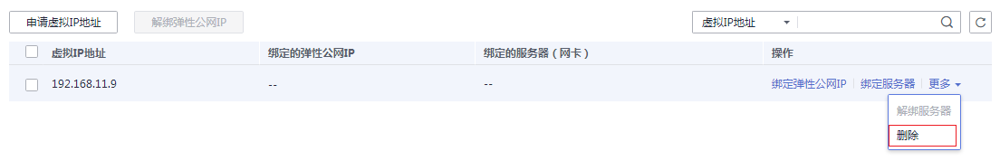

# 删除虚拟IP地址

## 操作场景

当无需使用子网的虚拟IP地址或预留虚拟IP地址、需要释放网络资源时，可删除子网的虚拟IP地址。

## 约束与限制

当虚拟IP被其他资源占用时，无法删除，请根据提示信息进行处理，具体请参见[表1](#table754115024120)。

**表 1**  虚拟IP无法删除原因说明

<table><thead align="left"><tr id="row1754250144120"><th class="cellrowborder" valign="top" width="36.83%" id="mcps1.2.3.1.1">
提示信息

</th>
<th class="cellrowborder" valign="top" width="63.17%" id="mcps1.2.3.1.2">
原因说明及处理方法

</th>
</tr>
</thead>
<tbody><tr id="row45455010410"><td class="cellrowborder" valign="top" width="36.83%" headers="mcps1.2.3.1.1 ">
已绑定实例或弹性公网ip地址，无法执行删除操作，请先执行对应解绑操作。如<a href="#fig11387181320304">图1</a>所示。

</td>
<td class="cellrowborder" valign="top" width="63.17%" headers="mcps1.2.3.1.2 ">
当前虚拟IP可能被弹性公网IP、弹性云服务或者二层连接占用，请先解绑占用资源，再删除虚拟IP。具体方法如下：

<ul id="ul193191251786"><li>弹性公网IP：请参见<a href="为虚拟IP解绑弹性公网IP.md">为虚拟IP解绑弹性公网IP</a>。</li><li>弹性云服务器或者二层连接：请参见<a href="为虚拟IP解绑实例.md">为虚拟IP解绑实例</a>。</li></ul>

解绑完成后，可以重新尝试删除虚拟IP。

</td>
</tr>
<tr id="row1154185024118"><td class="cellrowborder" valign="top" width="36.83%" headers="mcps1.2.3.1.1 ">
虚拟IP已被系统组件使用，无法执行操作。如<a href="#fig1498610219276">图2</a>所示。

</td>
<td class="cellrowborder" valign="top" width="63.17%" headers="mcps1.2.3.1.2 ">
当前虚拟IP被RDS实例使用，该IP不支持单独删除。如果您不需要使用该虚拟IP，请删除RDS实例，该虚拟IP会被同时删除。具体方法如下：

<ul id="ul78589573219"><li>对于包周期实例：请参见<a href="https://support.huaweicloud.com/usermanual-rds/rds_05_0056.html" target="_blank" rel="noopener noreferrer">退订包周期实例</a>。</li><li>对于按需实例：请参见<a href="https://support.huaweicloud.com/usermanual-rds/rds_08_0002.html" target="_blank" rel="noopener noreferrer">删除按需实例</a>。</li></ul>
</td>
</tr>
</tbody>
</table>

**图 1**  虚拟IP无法删除-场景一  

**图 2**  虚拟IP无法删除-场景二  

## 操作步骤

1.  登录管理控制台。
2.  在管理控制台左上角单击，选择区域和项目。
3.  在系统首页，选择“网络 \> 虚拟私有云”。

    进入虚拟私有云列表页面。

4.  在左侧导航栏，选择“虚拟私有云 \> 子网”。
5.  在子网列表中，单击虚拟IP地址所属子网名称。
6.  选择“IP地址管理”页签，在需要删除虚拟IP地址所在行的操作列下，单击“更多 \> 删除”。

    **图 3**  删除虚拟IP地址  
    

7.  单击“是”。

