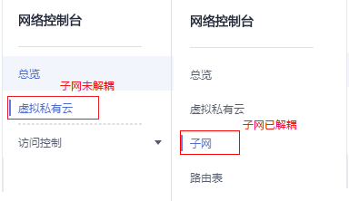

# 删除虚拟IP地址

## 操作场景

当无需使用子网的虚拟IP地址或预留虚拟IP地址、需要释放网络资源时，可删除子网的虚拟IP地址。

> **说明：** 
>当前在部分区域中，子网已从虚拟私有云中解耦，解耦后子网拥有独立入口，虚拟IP的相关操作入口也随之迁移。目前存在以下两种入口。
>-   未解耦：在虚拟私有云详情页的“子网”页签，可对子网进行操作。
>-   已解耦：在进入“网络 \> 虚拟私有云”后，在左侧导航栏直接选择“子网”，对子网进行操作。

## 前提条件

在删除虚拟IP前，请确保您已经将虚拟IP与以下资源解绑：

-   弹性云服务器
-   弹性公网IP
-   CCE集群

## 操作步骤

1.  登录管理控制台。

1.  在管理控制台左上角单击，选择区域和项目。
2.  在系统首页，选择“网络 \> 虚拟私有云”。

**在子网未解耦区域，虚拟IP入口请参考[4](申请虚拟IP地址.md#li51522361618)\~[7](申请虚拟IP地址.md#li18152143611112)；在子网已解耦区域，虚拟IP入口请参考[8](申请虚拟IP地址.md#li715211361516)\~[10](申请虚拟IP地址.md#li19153536815)。**

**图 1**  入口图示  

1.  在左侧导航栏选择“虚拟私有云”。
2.  在虚拟私有云列表中，单击需要删除虚拟IP地址的子网所在的虚拟私有云名称。
3.  在“子网”页签中，单击需要删除虚拟IP地址的子网名称。
4.  选择“虚拟IP”页签，在需要删除虚拟IP地址所在行的操作列下，单击“更多 \> 删除”。
5.  在左侧导航栏选择“子网”。
6.  在子网列表中，单击虚拟IP地址所属子网名称。
7.  选择“IP地址管理”页签，在需要删除虚拟IP地址所在行的操作列下，单击“更多 \> 删除”。

    **图 2**  删除虚拟IP地址  
    

8.  单击“是”。

