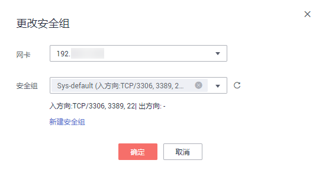

# 变更弹性云服务器的安全组

## 操作场景

变更弹性云服务器网卡所属的安全组。

## 操作步骤

1.  登录管理控制台。
2.  选择“计算 \> 弹性云服务器”。
3.  在弹性云服务器列表中，单击“操作”列下的“更多 \> 网络设置 \> 更改安全组”。

    系统弹窗显示“更改安全组”页面。

    **图 1**  更改安全组  
    

4.  根据界面提示，在下拉列表中选择待更改安全组的网卡，并重新选择安全组。

    您可以同时勾选多个安全组，此时，弹性云服务器的访问规则遵循几个安全组规则的并集。如需创建新的安全组，请单击“新建安全组”。

    > **说明：** 
    >使用多个安全组可能会影响弹性云服务器的网络性能，建议您选择安全组的数量不多于5个。

5.  单击“确定”。

