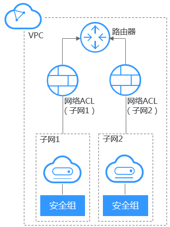

# 安全组与网络ACL区别

通过配置网络ACL和安全组策略，保障VPC内的弹性云服务器安全使用。

-   安全组对弹性云服务器进行防护。
-   网络ACL对子网进行防护。

如[图1](#fig151401249216)所示。

**图 1**  安全组与网络ACL  

网络ACL和安全组区别如[表1](#table53053071174845)所示。

**表 1**  安全组和网络ACL

<table><thead align="left"><tr id="row63488302174845"><th class="cellrowborder" valign="top" width="18.990000000000002%" id="mcps1.2.4.1.1">
对比项

</th>
<th class="cellrowborder" valign="top" width="35.8%" id="mcps1.2.4.1.2">
安全组

</th>
<th class="cellrowborder" valign="top" width="45.21%" id="mcps1.2.4.1.3">
网络ACL

</th>
</tr>
</thead>
<tbody><tr id="row30367752174845"><td class="cellrowborder" valign="top" width="18.990000000000002%" headers="mcps1.2.4.1.1 ">
防护对象

</td>
<td class="cellrowborder" valign="top" width="35.8%" headers="mcps1.2.4.1.2 ">
弹性云服务器级别操作。

</td>
<td class="cellrowborder" valign="top" width="45.21%" headers="mcps1.2.4.1.3 ">
子网级别操作。

</td>
</tr>
<tr id="row36596319174845"><td class="cellrowborder" valign="top" width="18.990000000000002%" headers="mcps1.2.4.1.1 ">
配置策略

</td>
<td class="cellrowborder" valign="top" width="35.8%" headers="mcps1.2.4.1.2 ">
仅支持允许策略（拒绝策略目前仅在“华东-上海一”、“华南-广州”、“西南-贵阳一”、“华北-北京四”、“中国-香港”、“亚太-新加坡”支持）。

</td>
<td class="cellrowborder" valign="top" width="45.21%" headers="mcps1.2.4.1.3 ">
支持允许、拒绝策略。

</td>
</tr>
<tr id="row3518463174845"><td class="cellrowborder" valign="top" width="18.990000000000002%" headers="mcps1.2.4.1.1 ">
优先级

</td>
<td class="cellrowborder" valign="top" width="35.8%" headers="mcps1.2.4.1.2 ">
多个规则冲突，先根据绑定安全组的顺序生效，再根据组内规则的优先级生效（安全组规则优先级目前仅在“华东-上海一”、“华南-广州”、“西南-贵阳一”、“华北-北京四”、“中国-香港”、“亚太-新加坡”支持）。

</td>
<td class="cellrowborder" valign="top" width="45.21%" headers="mcps1.2.4.1.3 ">
多个规则冲突，优先级高的规则生效，优先级低的不生效。

</td>
</tr>
<tr id="row59814478174845"><td class="cellrowborder" valign="top" width="18.990000000000002%" headers="mcps1.2.4.1.1 ">
应用操作

</td>
<td class="cellrowborder" valign="top" width="35.8%" headers="mcps1.2.4.1.2 ">
创建弹性云服务器默认必须选择安全组，默认安全组自动应用到弹性云服务器。

</td>
<td class="cellrowborder" valign="top" width="45.21%" headers="mcps1.2.4.1.3 ">
创建子网没有网络ACL选项，必须创建网络ACL、添加关联子网、添加出入规则，并启用网络ACL，才可应用到关联子网及子网下的弹性云服务器。

</td>
</tr>
<tr id="row3289418310534"><td class="cellrowborder" valign="top" width="18.990000000000002%" headers="mcps1.2.4.1.1 ">
报文组

</td>
<td class="cellrowborder" valign="top" width="35.8%" headers="mcps1.2.4.1.2 ">
仅支持报文三元组（即协议、端口和对端地址）过滤。

</td>
<td class="cellrowborder" valign="top" width="45.21%" headers="mcps1.2.4.1.3 ">
支持报文五元组（即协议、源端口、目的端口、源地址和目的地址）过滤。

</td>
</tr>
</tbody>
</table>

