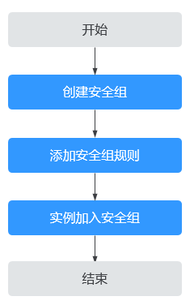

# 安全组和安全组规则
## 安全组
安全组是一个逻辑上的分组，为具有相同安全保护需求并相互信任的云服务器、云容器、云数据库等实例提供访问策略。安全组创建后，用户可以在安全组中定义各种访问规则，当实例加入该安全组后，即受到这些访问规则的保护。
您可以在安全组中添加入方向规则和出方向规则，用来控制安全组内实例入方向和出方向的网络流量。一个实例可以关联多个安全组，多个安全组按照优先级顺序依次匹配。安全组序号越小，表示优先级越高。
如果您未创建任何安全组，那么在首次创建需要使用安全组的实例时（比如弹性云服务器），系统会自动为您创建一个默认安全组并关联至该实例，关于默认安全组的更多信息，请参见[默认安全组](默认安全组.md)。
> **说明：** 
>默认安全组名称为default，默认安全组和您创建的自定义安全组均不收取费用

安全组是有状态的。如果您从实例发送一个出站请求，且该安全组的出方向规则是放通的话，那么无论其入方向规则如何，都将允许该出站请求的响应流量流入。同理，如果该安全组的入方向规则是放通的，那无论出方向规则如何，都将允许入站请求的响应流量可以流出。
安全组使用连接跟踪来标识进出实例的流量信息，根据流量的连接状态匹配安全组规则，以确定允许还是拒绝流量。
-   当您在安全组内增加、删除、更新规则，或者该安全组内添加、移出实例时，系统会自动清除该安全组内所有实例入方向的连接跟踪。此时，流入或流出实例的流量会被当作新的连接，需要重新匹配入方向或出方向的安全组规则，从而确保安全组规则或者实例变更可以立即生效，保障安全组内流入实例的流量安全。
-   流入或流出实例的流量如果长时间没有报文，超过连接跟踪老化时间后，该流量也会被当作新的连接，需要重新匹配入方向或出方向的安全组规则。不同协议的连接跟踪老化时间不同，已建立连接状态的TCP协议连接老化时间是600s，ICMP协议老化时间是30s。对于其他协议，如果两个方向都收到了报文，连接老化时间是180s，如果只是单方向收到报文，另一个方向没有收到报文时，老化时间是30s。对于除TCP、UDP或ICMP以外的协议，仅跟踪IP地址和协议编号。
## 安全组规则
安全组中包括入方向规则和出方向规则，用来控制安全组内实例的入方向和出方向的网络流量。安全组规则由协议端口、源地址/目的地址等组成，关键信息的说明如[表1](#table1919155115499)所示。
**表 1**  安全组规则详细信息

<table><thead align="left"><tr id="row1819216515491"><th class="cellrowborder" valign="top" width="18.75%" id="mcps1.2.3.1.1">
参数

</th>
<th class="cellrowborder" valign="top" width="81.25%" id="mcps1.2.3.1.2">
说明

</th>
</tr>
</thead>
<tbody><tr id="row15722172381311"><td class="cellrowborder" valign="top" width="18.75%" headers="mcps1.2.3.1.1 ">
协议类型

</td>
<td class="cellrowborder" valign="top" width="81.25%" headers="mcps1.2.3.1.2 ">
安全组规则中用来匹配流量的网络协议类型。目前支持“All”、“TCP”、“UDP”和“ICMP”等协议。

</td>
</tr>
<tr id="row1840163111319"><td class="cellrowborder" valign="top" width="18.75%" headers="mcps1.2.3.1.1 ">
端口范围

</td>
<td class="cellrowborder" valign="top" width="81.25%" headers="mcps1.2.3.1.2 ">
安全组规则中用来匹配流量的目的端口，取值范围为：1～65535。

<ul id="ul11461106134920"><li>在入方向规则中，表示外部访问安全组内实例的指定端口。</li><li>在出方向规则中，表示安全组内实例访问外部的指定端口。</li></ul>
</td>
</tr>
<tr id="row12735135161317"><td class="cellrowborder" valign="top" width="18.75%" headers="mcps1.2.3.1.1 ">
源地址（入方向）

</td>
<td class="cellrowborder" valign="top" width="81.25%" headers="mcps1.2.3.1.2 ">
源地址是入方向规则中，用来匹配外部访问请求的地址，支持多种格式：<ul id="ul14767152702818"><li>IP地址：<ul id="ul9709161982115"><li>单个IPv4地址：示例为192.168.10.10/32。</li><li>单个IPv6地址：示例为2002:50::44/128。</li><li>IPv4网段：示例为192.168.52.0/24。如果要匹配所有IPv4地址，设置为0.0.0.0/0。</li><li>IPv6网段：示例为2407:c080:802:469::/64。如果要匹配所有IPv6地址，设置为::/0。</li></ul>
</li><li>安全组：您可以选择当前帐号下，同一个区域内的其他安全组作为源地址。当安全组A内有实例a，安全组B内有实例b，在安全组A设置入方向规则时的“策略”为允许，源地址选择安全组B时，表示来自实例b的内网访问请求被允许进入实例a。</li><li>IP地址组：IP地址组是一个或者多个IP地址的集合，对于安全策略相同的IP网段和IP地址，此处建议您使用IP地址组作为源地址，简化管理。</li></ul>

</td>
</tr>
<tr id="row76189370131"><td class="cellrowborder" valign="top" width="18.75%" headers="mcps1.2.3.1.1 ">
目的地址（出方向）

</td>
<td class="cellrowborder" valign="top" width="81.25%" headers="mcps1.2.3.1.2 ">
目的地址是出方向规则中，用来匹配内部请求访问的地址，支持多种格式：

<ul id="ul145851618122615"><li>IP地址：<ul id="ul1658591816265"><li>单个IPv4地址：示例为192.168.10.10/32。</li><li>单个IPv6地址：示例为2002:50::44/128。</li><li>IPv4网段：示例为192.168.52.0/24。如果要匹配所有IPv4地址，设置为0.0.0.0/0。</li><li>IPv6网段：示例为2407:c080:802:469::/64。如果要匹配所有IPv6地址，设置为::/0。</li></ul>
</li></ul>
<ul id="ul16898144344515"><li>安全组：您可以选择当前帐号下，同一个区域内的其他安全组作为目的地址。当安全组A内有实例a，安全组B内有实例b，在安全组A设置出方向规则时的“策略”为允许，目的地址选择安全组B时，表示实例a内部的请求被允许出去访问实例b。</li><li>IP地址组：IP地址组是一个或者多个IP地址的集合，对于安全策略相同的IP网段和IP地址，此处建议您使用IP地址组作为目的地址，简化管理。</li></ul>
</td>
</tr>
<tr id="row919285113499"><td class="cellrowborder" valign="top" width="18.75%" headers="mcps1.2.3.1.1 ">
优先级

</td>
<td class="cellrowborder" valign="top" width="81.25%" headers="mcps1.2.3.1.2 ">
一个安全组可以包含多个安全组规则，此时流量根据优先级从高到低按顺序进行匹配规则。优先级的数字越小，优先级越高，比如1的优先级高于2。

</td>
</tr>
<tr id="row10192351124912"><td class="cellrowborder" valign="top" width="18.75%" headers="mcps1.2.3.1.1 ">
策略

</td>
<td class="cellrowborder" valign="top" width="81.25%" headers="mcps1.2.3.1.2 ">
安全组规则的策略，可以设置允许或者拒绝。安全组规则优先级相同的情况下，拒绝策略优先于允许策略。

对于入方向规则来说：<ul id="ul490721712116"><li>如果“策略”设置为允许，表示允许源地址访问安全组内实例的指定端口。</li><li>如果“策略”设置为拒绝，表示拒绝源地址访问安全组内实例的指定端口。</li></ul>

对于出方向规则来说：<ul id="ul1357316358171"><li>如果“策略”设置为允许，表示允许安全组内的实例访问目的地址的指定端口。</li><li>如果“策略”设置为拒绝，表示拒绝安全组内的实例访问目的地址的指定端口。</li></ul>

</td>
</tr>
</tbody>
</table>
安全组规则遵循白名单规则，具体说明如下：
-   入方向规则：入方向指外部访问安全组内实例的指定端口。当外部请求匹配上安全组中入方向规则的源地址，并且策略为“允许”时，允许该请求进入，其他请求一律拦截。
    因此，如果没有特殊需求，您一般不用在入方向配置策略为“拒绝”的规则，因为不匹配“允许”规则的请求均会被拦截。
-   出方向规则：出方向指安全组内实例访问外部的指定端口。在出方向中配置目的地址匹配所有IP地址的规则，并且策略为“允许”时，允许所有的内部请求出去。
    0.0.0.0/0表示匹配所有IPv4地址。
    ::/0表示匹配所有IPv6地址。
如[表2](#table102261597217)所示，以安全组sg-AB的入方向和出方向规则为例，为您详细解释安全组的规则。
**表 2**  安全组sg-AB的规则说明

<table><thead align="left"><tr id="row422689223"><th class="cellrowborder" valign="top" width="11.17%" id="mcps1.2.7.1.1">
规则方向

</th>
<th class="cellrowborder" valign="top" width="6.83%" id="mcps1.2.7.1.2">
策略

</th>
<th class="cellrowborder" valign="top" width="7.5200000000000005%" id="mcps1.2.7.1.3">
类型

</th>
<th class="cellrowborder" valign="top" width="9.959999999999999%" id="mcps1.2.7.1.4">
协议端口

</th>
<th class="cellrowborder" valign="top" width="20.9%" id="mcps1.2.7.1.5">
源地址/目的地址

</th>
<th class="cellrowborder" valign="top" width="43.62%" id="mcps1.2.7.1.6">
描述

</th>
</tr>
</thead>
<tbody><tr id="row17226899214"><td class="cellrowborder" valign="top" width="11.17%" headers="mcps1.2.7.1.1 ">
入方向规则

</td>
<td class="cellrowborder" valign="top" width="6.83%" headers="mcps1.2.7.1.2 ">
允许

</td>
<td class="cellrowborder" valign="top" width="7.5200000000000005%" headers="mcps1.2.7.1.3 ">
IPv4

</td>
<td class="cellrowborder" valign="top" width="9.959999999999999%" headers="mcps1.2.7.1.4 ">
全部

</td>
<td class="cellrowborder" valign="top" width="20.9%" headers="mcps1.2.7.1.5 ">
源地址：sg-AB

</td>
<td class="cellrowborder" valign="top" width="43.62%" headers="mcps1.2.7.1.6 ">
针对全部IPv4协议，允许本安全组内云服务器的请求进入，即该条规则确保安全组内的云服务器网络互通。

</td>
</tr>
<tr id="row152581149173415"><td class="cellrowborder" valign="top" width="11.17%" headers="mcps1.2.7.1.1 ">
入方向规则

</td>
<td class="cellrowborder" valign="top" width="6.83%" headers="mcps1.2.7.1.2 ">
允许

</td>
<td class="cellrowborder" valign="top" width="7.5200000000000005%" headers="mcps1.2.7.1.3 ">
IPv4

</td>
<td class="cellrowborder" valign="top" width="9.959999999999999%" headers="mcps1.2.7.1.4 ">
TCP: 22

</td>
<td class="cellrowborder" valign="top" width="20.9%" headers="mcps1.2.7.1.5 ">
源地址：0.0.0.0/0

</td>
<td class="cellrowborder" valign="top" width="43.62%" headers="mcps1.2.7.1.6 ">
针对TCP(IPv4)协议，允许外部所有IP访问安全组内云服务器的SSH(22)端口，用于远程登录Linux云服务器。

</td>
</tr>
<tr id="row1815528134114"><td class="cellrowborder" valign="top" width="11.17%" headers="mcps1.2.7.1.1 ">
入方向规则

</td>
<td class="cellrowborder" valign="top" width="6.83%" headers="mcps1.2.7.1.2 ">
允许

</td>
<td class="cellrowborder" valign="top" width="7.5200000000000005%" headers="mcps1.2.7.1.3 ">
IPv4

</td>
<td class="cellrowborder" valign="top" width="9.959999999999999%" headers="mcps1.2.7.1.4 ">
TCP: 3389

</td>
<td class="cellrowborder" valign="top" width="20.9%" headers="mcps1.2.7.1.5 ">
源地址：0.0.0.0/0

</td>
<td class="cellrowborder" valign="top" width="43.62%" headers="mcps1.2.7.1.6 ">
针对TCP(IPv4)协议，允许外部所有IP访问安全组内云服务器的RDP(3389)端口，用于远程登录Windows云服务器。

</td>
</tr>
<tr id="row1237831174516"><td class="cellrowborder" valign="top" width="11.17%" headers="mcps1.2.7.1.1 ">
入方向规则

</td>
<td class="cellrowborder" valign="top" width="6.83%" headers="mcps1.2.7.1.2 ">
允许

</td>
<td class="cellrowborder" valign="top" width="7.5200000000000005%" headers="mcps1.2.7.1.3 ">
IPv4

</td>
<td class="cellrowborder" valign="top" width="9.959999999999999%" headers="mcps1.2.7.1.4 ">
TCP: 80

</td>
<td class="cellrowborder" valign="top" width="20.9%" headers="mcps1.2.7.1.5 ">
源地址：10.5.6.30/32

</td>
<td class="cellrowborder" valign="top" width="43.62%" headers="mcps1.2.7.1.6 ">
针对TCP(IPv4)协议，允许外部IP(10.5.6.30)访问安全组内云服务器的80端口。

</td>
</tr>
<tr id="row122457011313"><td class="cellrowborder" valign="top" width="11.17%" headers="mcps1.2.7.1.1 ">
出方向规则

</td>
<td class="cellrowborder" valign="top" width="6.83%" headers="mcps1.2.7.1.2 ">
允许

</td>
<td class="cellrowborder" valign="top" width="7.5200000000000005%" headers="mcps1.2.7.1.3 ">
IPv4

</td>
<td class="cellrowborder" valign="top" width="9.959999999999999%" headers="mcps1.2.7.1.4 ">
全部

</td>
<td class="cellrowborder" valign="top" width="20.9%" headers="mcps1.2.7.1.5 ">
目的地址：0.0.0.0/0

</td>
<td class="cellrowborder" valign="top" width="43.62%" headers="mcps1.2.7.1.6 ">
针对全部IPv4协议，允许安全组内的云服务器可访问外部IP的所有端口。

</td>
</tr>
<tr id="row1974265394319"><td class="cellrowborder" valign="top" width="11.17%" headers="mcps1.2.7.1.1 ">
出方向规则

</td>
<td class="cellrowborder" valign="top" width="6.83%" headers="mcps1.2.7.1.2 ">
允许

</td>
<td class="cellrowborder" valign="top" width="7.5200000000000005%" headers="mcps1.2.7.1.3 ">
IPv6

</td>
<td class="cellrowborder" valign="top" width="9.959999999999999%" headers="mcps1.2.7.1.4 ">
全部

</td>
<td class="cellrowborder" valign="top" width="20.9%" headers="mcps1.2.7.1.5 ">
目的地址：::/0

</td>
<td class="cellrowborder" valign="top" width="43.62%" headers="mcps1.2.7.1.6 ">
针对全部IPv6协议，允许安全组内的云服务器可访问外部IP的所有端口。

</td>
</tr>
</tbody>
</table>
> **须知：** 
>-   在安全组规则中放开某个端口后，为了确保网络正常通信，您还需要确保实例内对应的端口也已经放通。
>-   通常情况下，同一个安全组内的实例默认网络互通。当同一个安全组内实例网络不通时，可能情况如下：
>    -   在入方向规则中，删除了同一个安全组内实例互通对应的规则。
>    -   不同VPC的网络不通，所以当实例属于同一个安全组，但属于不同VPC时，网络不通。
>        您可以通过[VPC对等连接](对等连接简介.md)连通不同区域的VPC。

## 安全组和安全组规则匹配排序原则
一个实例可以关联多个安全组，并且一个安全组内可以包含多个安全组规则。以入方向的流量为例，实例的网络流量将按照以下原则匹配安全组规则：
1.  首先，流量按照安全组的优先级进行匹配。安全组序号越小，表示优先级越高。
    比如，安全组A的序号为1，安全组B的序号为2，安全组A的优先级高于安全组B，流量优先匹配安全组A内的入方向规则。
2.  其次，流量按照安全组规则的优先级和策略进行匹配。
    1.  先按照安全组规则优先级匹配，优先级的数字越小，优先级越高。
        比如安全组规则A的优先级为1，安全组规则B的优先级为2，安全组规则A的优先级高于安全组规则B，流量优先匹配安全组规则A。
    2.  安全组规则优先级相同的情况下，再按照策略匹配，拒绝策略高于允许策略。
3.  流量按照协议端口和源地址，遍历了所有安全组内的入方向规则
    -   如果成功匹配某个规则，则执行以下操作：
        -   如果规则的策略是允许，则允许该流量访问安全组内实例。
        -   如果规则的策略是拒绝，则拒绝该流量访问安全组内实例。
    -   如果未匹配上任何规则，则拒绝该流量访问安全组内的实例。
## 安全组配置流程
**图 1**  安全组配置流程  

**表 3**  安全组配置流程说明

<table><thead align="left"><tr id="row176607263119"><th class="cellrowborder" valign="top" width="5.87%" id="mcps1.2.5.1.1">
序号

</th>
<th class="cellrowborder" valign="top" width="18.91%" id="mcps1.2.5.1.2">
步骤

</th>
<th class="cellrowborder" valign="top" width="56.14%" id="mcps1.2.5.1.3">
说明

</th>
<th class="cellrowborder" valign="top" width="19.08%" id="mcps1.2.5.1.4">
操作指导

</th>
</tr>
</thead>
<tbody><tr id="row186601926181116"><td class="cellrowborder" valign="top" width="5.87%" headers="mcps1.2.5.1.1 ">
1

</td>
<td class="cellrowborder" valign="top" width="18.91%" headers="mcps1.2.5.1.2 ">
创建安全组

</td>
<td class="cellrowborder" valign="top" width="56.14%" headers="mcps1.2.5.1.3 ">
创建安全组规则时候，您可以使用系统提供的模板，支持“通用Web服务器”和“开放全部端口”等模板。模板中会预置部分安全组规则，详细信息请参见<a href="创建安全组.md#table117828131111">安全组模板说明</a><strong id="b17135926962">。</strong>

</td>
<td class="cellrowborder" valign="top" width="19.08%" headers="mcps1.2.5.1.4 ">
<a href="创建安全组.md">创建安全组</a>

</td>
</tr>
<tr id="row96601626191113"><td class="cellrowborder" valign="top" width="5.87%" headers="mcps1.2.5.1.1 ">
2

</td>
<td class="cellrowborder" valign="top" width="18.91%" headers="mcps1.2.5.1.2 ">
配置安全组规则

</td>
<td class="cellrowborder" valign="top" width="56.14%" headers="mcps1.2.5.1.3 ">
安全组创建完成后，如果模板里面的规则不能满足业务要求，您还可以在安全组中添加新的安全组规则，或者修改已有的安全组规则。

</td>
<td class="cellrowborder" valign="top" width="19.08%" headers="mcps1.2.5.1.4 ">
<a href="添加安全组规则.md">添加安全组规则</a>

<a href="快速添加多条安全组规则.md">快速添加多条安全组规则</a>

</td>
</tr>
<tr id="row106601826131116"><td class="cellrowborder" valign="top" width="5.87%" headers="mcps1.2.5.1.1 ">
3

</td>
<td class="cellrowborder" valign="top" width="18.91%" headers="mcps1.2.5.1.2 ">
在安全组中添加实例

</td>
<td class="cellrowborder" valign="top" width="56.14%" headers="mcps1.2.5.1.3 ">
创建实例的时候，会自动将实例加入一个安全组内，实例将会受到安全组的保护。

如果一个安全组无法满足您的要求，您可以将实例加入多个安全组。

</td>
<td class="cellrowborder" valign="top" width="19.08%" headers="mcps1.2.5.1.4 ">
<a href="在安全组中添加或移出实例.md">在安全组中添加或移出实例</a>

</td>
</tr>
</tbody>
</table>
## 安全组的限制
-   为了确保良好的网络性能体验，建议一个实例最多关联5个安全组。
-   建议一个安全组关联的实例数量不应超过6000个，否则会引起安全组性能下降。
-   如果您添加安全组规则时，使用IP地址组或者不连续端口，那么该安全组规则对不同规格云服务器的生效情况存在差异，为了避免您的安全组规则不生效，请您查看[表4](#table9182817155011)了解详情。
    **表 4**  安全组规则限制
    
    <table><thead align="left"><tr id="row171811217135019"><th class="cellrowborder" valign="top" width="36.58%" id="mcps1.2.3.1.1">
安全组规则

    </th>
    <th class="cellrowborder" valign="top" width="63.42%" id="mcps1.2.3.1.2">
云服务器类型

    </th>
    </tr>
    </thead>
    <tbody><tr id="row1118120178509"><td class="cellrowborder" valign="top" width="36.58%" headers="mcps1.2.3.1.1 ">
添加安全组规则时，“源地址”和“目的地址”可选择“IP地址组”

    </td>
    <td class="cellrowborder" valign="top" width="63.42%" headers="mcps1.2.3.1.2 ">
不支持的X86云服务器规格如下：<ul id="ul18181101765015"><li>通用计算型（S1型、C1型、C2型 ）</li><li>内存优化型（M1型）</li><li>高性能计算型（H1型）</li><li>磁盘增强型（ D1型）</li><li>GPU加速型（G1型、G2型）</li><li>超大内存型（E1型、E2型、ET2型）</li></ul>
    

    </td>
    </tr>
    <tr id="row171821417125011"><td class="cellrowborder" rowspan="2" valign="top" width="36.58%" headers="mcps1.2.3.1.1 ">
添加安全组规则时，“协议端口”可配置为不连续端口号

    </td>
    <td class="cellrowborder" valign="top" width="63.42%" headers="mcps1.2.3.1.2 ">
不支持的X86云服务器规格如下：

    <ul id="ul21827177508"><li>通用计算型（S1型、C1型、C2型 ）</li><li>内存优化型（M1型）</li><li>高性能计算型（H1型）</li><li>磁盘增强型（ D1型）</li><li>GPU加速型（G1型、G2型）</li><li>超大内存型（E1型、E2型、ET2型）</li></ul>
    </td>
    </tr>
    <tr id="row101825172505"><td class="cellrowborder" valign="top" headers="mcps1.2.3.1.1 ">
所有鲲鹏云服务器规格不支持配置不连续端口。

    
如果您在鲲鹏云服务器中添加安全组规则时，使用了不连续端口号，那么除了该条规则不会生效，该规则后的其他规则也不会生效。比如：

    
您先配置了安全组规则A（不连续端口号22,24），再配置了下一条安全规则B（独立端口号9096），则安全组规则A和B均不会生效。

    </td>
    </tr>
    </tbody>
    </table>
    > **说明：** 
    >-   X86云服务器规格详情，请参见[规格清单（X86）](https://support.huaweicloud.com/productdesc-ecs/zh-cn_topic_0159822360.html)。
    >-   鲲鹏云服务器规格详情，请参见[规格清单（鲲鹏）](https://support.huaweicloud.com/productdesc-ecs/ecs_01_0066.html)。

## 实践建议
-   请您遵循白名单原则配置安全组规则，即安全组内实例默认拒绝所有外部的访问请求，通过添加允许规则放通指定的网络流量。
-   添加安全组规则时，请遵循最小授权原则。例如，放通22端口用于远程登录云服务器时，建议仅允许指定的IP地址登录，谨慎使用0.0.0.0/0（所有IP地址）。
-   请您尽量保持单个安全组内规则的简洁，通过不同的安全组来管理不同用途的实例。如果您使用一个安全组管理您的所有业务实例，可能会导致单个安全组内的规则过于冗余复杂，增加维护管理成本。
-   您可以将实例按照用途加入到不同的安全组内。例如，当您具有面向公网提供网站访问的业务时，建议您将运行公网业务的Web服务器加入到同一个安全组，此时仅需要放通对外部提供服务的特定端口，例如80、443等，默认拒绝外部其他的访问请求。同时，请避免在运行公网业务的Web服务器上运行内部业务，例如MySQL、Redis等，建议您将内部业务部署在不需要连通公网的服务器上，并将这些服务器关联至其他安全组内。
-   请您尽量避免直接修改已运行业务的安全组规则。如果您需要修改使用中的安全组规则，建议您先克隆一个测试安全组，然后在测试安全组上进行调试，确保测试安全组内实例网络正常后，再修改使用中的安全组规则，减少对业务的影响。具体方法，请参见[克隆安全组](https://support.huaweicloud.com/usermanual-vpc/vpc_SecurityGroup_0009.html)。
-   您在安全组内新添加实例，或者修改安全组的规则后，此时不需要重启实例，安全组规则会立即生效。如果您的安全组规则配置完未生效，请参考[为什么配置的安全组规则不生效？](https://support.huaweicloud.com/vpc_faq/faq_security_0006.html)。
