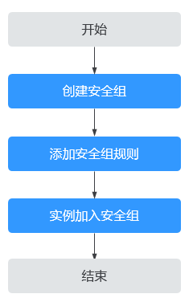

# 安全组简介

## 安全组

安全组是一个逻辑上的分组，为具有相同安全保护需求并相互信任的云服务器提供访问策略。安全组创建后，用户可以在安全组中定义各种访问规则，当云服务器加入该安全组后，即受到这些访问规则的保护。

系统会为每个用户默认创建一个默认安全组，默认安全组的规则是在出方向上的数据报文全部放行，入方向访问受限，安全组内的云服务器无需添加规则即可互相访问。默认安全组您可以直接使用，详情请参见[默认安全组和规则](默认安全组和规则.md)。

您也可以根据需要创建自定义的安全组，请参见[创建安全组](创建安全组.md)。

## 安全组基本信息

-   服务器及扩展网卡等实例可以关联一个或多个安全组。

    您可以更改与服务器、扩展网卡等实例关联的安全组。默认情况下创建实例时，除非您指定了其他安全组，否则实例与VPC的默认安全组关联。

-   如果您创建了放通同安全组的安全组规则，则允许安全组内实例互相访问。

    对于IPv4类型的地址，安全组只支持加入32位前缀的地址，对于IPv6类型的地址，安全组只支持加入128位前缀的地址。具体如何更改实例安全组，请参见[2.1.12 实例加入/移出安全组](实例加入-移出安全组.md)。

-   安全组是有状态的。如果您从实例发送一个出站请求，且该安全组的出站规则是放通的话，那么无论其入站规则如何，都将允许该出站请求的响应流量流入。同理，如果该安全组的入站规则是放通的，那无论出站规则如何，都将允许入站请求的响应流量可以出站。

    安全组使用连接跟踪来跟踪有关进出实例的流量信息，将基于流量的连接状态应用规则以确定允许还是拒绝流量。在安全组规则增加、删除、更新时，或者该安全组下实例创建、删除时，会自动清除该安全组下所有实例入方向的连接跟踪，此时，流入或流出实例的流量会被当做新的连接，需要重新匹配相应入方向或出方向的安全组规则，以保证规则能立即生效，从而保障流入实例的流量的安全。

    除此以外，流入或流出实例的流量如果长时间没有报文，超过连接跟踪老化时间以后也会被当做新的连接需要重新匹配出、入方向规则。不同协议的连接跟踪老化时间不同，已建立连接状态的TCP协议连接老化时间是600s，ICMP协议老化时间是30s。对于其他协议，如果两个方向都收到了报文，连接老化时间是180s，如果只是单方向收到了一个或多个包，另一个方向没有收到包时，老化时间是30s。对于除 TCP、UDP 或 ICMP 以外的协议，仅跟踪 IP 地址和协议编号。

> **说明：** 
>安全组需在网络互通的情况下生效。若实例属于不同VPC，但同属于一个安全组，此时实例不能互通。您可以使用对等连接等产品建立VPC连接互通，安全组才能对不同VPC内实例的流量进行访问控制。VPC连接请参见[应用场景](https://support.huaweicloud.com/productdesc-vpc/overview_0002.html)。

## 安全组规则

安全组创建后，您可以在安全组中设置出方向、入方向规则，这些规则会对安全组内部的云服务器出入方向网络流量进行访问控制，当云服务器加入该安全组后，即受到这些访问规则的保护。

安全组规则包括如下组成部分：

-   来源：源数据（入方向）或目标数据（出方向）的 IP。
-   协议类型和协议端口：包括协议类型和协议端口，协议类型如 TCP、UDP、HTTP 等。
-   源地址：可以是IP地址、安全组、IP地址组。
-   类型：IP地址类型。开通IPv6功能后可见。
-   描述：安全组规则的描述信息。

每个安全组都自带默认安全组规则，详情请参见[默认安全组Sys-default规则](默认安全组和规则.md#table1580115155277)。您也可以自定义添加安全组规则，请参见[添加安全组规则](添加安全组规则.md)。

## 安全组模板

新建安全组时，您可以选择系统为您提供的三种安全组模版，方便您快速创建安全组。

-   通用Web服务器：默认放通22、3389、80、443端口和ICMP协议。
-   开放全部端口：开放全部端口有一定安全风险，请谨慎选择。
-   自定义：入方向不放通任何端口，您可在安全组创建后根据实际访问需求添加或修改安全组规则。

## 安全组配置流程

**图 1**  安全组配置流程  

## 安全组的限制

-   默认情况下，一个用户可以创建100个安全组。
-   默认情况下，一个安全组最多只允许拥有50条安全组规则。
-   默认情况下，一个云服务器或扩展网卡最多只能被添加到5个安全组中。
-   安全组添加实例时，一次最多可添加20个实例。
-   一个安全组最多允许关联1000个实例。

## 实践建议

使用安全组时：

-   不建议使用一个安全组管理所有应用，不同业务场景有不同的隔离需求。推荐您针对不同的业务规划不同的安全组，并设置不同的安全组规则。
-   不建议为每个实例单独设置一个安全组，您只需将具有相同安全保护需求的实例加入同一安全组。

添加安全组规则时：

-   建议您设置简洁的安全组规则。如果您给一个实例关联了多个安全组，该实例很可能会同时遵循数百条安全组规则，任何规则变更都可能引起网络不通。
-   如果您想要修改线上的安全组和规则，建议您先克隆一个安全组，再在克隆的安全组上进行调试，避免直接影响线上应用。详情请参见[克隆安全组](https://support.huaweicloud.com/usermanual-vpc/vpc_SecurityGroup_0009.html)。
-   为应用添加安全组规则时遵循最小授权原则。例如，您可以：
    -   选择开放具体的端口，如22。不建议设置为端口范围，如22-30。
    -   添加安全组规则时，谨慎放通0.0.0.0/0（全网段）的流量。

