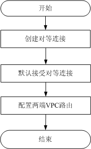

# 对等连接创建流程

对等连接是指两个VPC之间的网络连接。您可以使用私有IP地址在两个VPC之间进行通信，就像两个VPC在同一个网络中一样。同一区域内，您可以在自己的VPC之间创建对等连接，也可以在自己的VPC与其他租户的VPC之间创建对等连接。不同区域间的VPC之间不能创建对等连接。

-   同租户的VPC创建对等连接流程。

    **图 1**  同租户的VPC创建对等连接流程  
    

    在同一个租户下，创建对等连接后，状态是已接受。您需要在两端VPC内添加对等连接路由信息，才能使两个VPC互通。

-   跨租户的VPC创建对等连接流程。

    **图 2**  跨租户的VPC创建对等连接流程  
    

    跨租户创建VPC对等连接时，一端VPC发起创建对等连接请求，对等连接状态为待接受。待对方接受该创建请求后，对等连接状态变为已接受，请求方和接受方须分别配置对等连接路由信息，才能使两个VPC互通。

    添加对等连接路由信息时，如果两个VPC网段有重叠，这个对等连接添加的路由将可能会失效。如果要在具有重叠CIDR的VPC间建立对等连接，确保两个VPC下的所有子网CIDR都不重叠，此时，您可以通过VPC对等连接建立子网之间的对等关系。

    对等连接创建完成后，可以使用“ping”命令可以检查网络两端网络是否连通。

