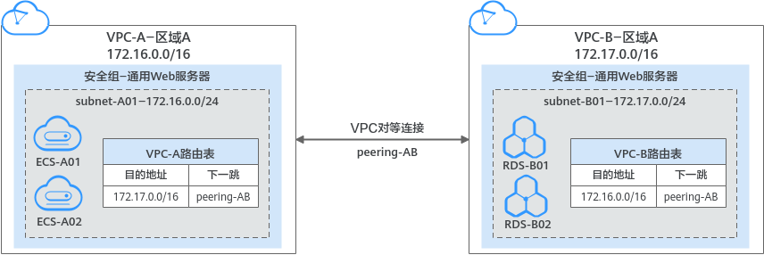
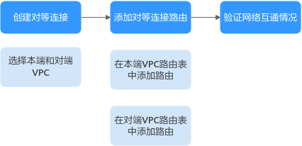
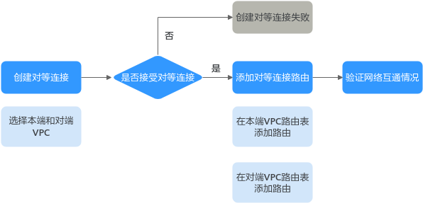

# 对等连接简介

## 什么是对等连接

对等连接是建立在两个VPC之间的网络连接，不同VPC之间网络不通，通过对等连接可以实现不同VPC之间的云上内网通信。对等连接用于连通同一个区域内的VPC，您可以在相同帐户下或者不同帐户下的VPC之间创建对等连接。

-   对等连接用于连通同一个区域的VPC，如果您要连通不同区域的VPC，请使用[云连接](https://support.huaweicloud.com/productdesc-cc/cc_01_0001.html)。
-   您可以通过对等连接构建不同的组网，常见的使用示例请参见[对等连接使用示例](对等连接使用示例.md)。

接下来，我们通过[图1](#fig4721642193711)中简单的组网示例，为您介绍对等连接的使用场景。

-   在区域A内，您的两个VPC分别为VPC-A和VPC-B，VPC-A和VPC-B之间网络不通。
-   您的业务服务器ECS-A01和ECS-A02位于VPC-A内，数据库服务器RDS-B01和RDS-B02位于VPC-B内，此时业务服务器和数据库服务器网络不通。

-   您需要在VPC-A和VPC-B之间建立对等连接Peering-AB，连通VPC-A和VPC-B之间的网络，业务服务器就可以访问数据库服务器。

**图 1**  对等连接组网示意图  

> **须知：** 
>当前VPC对等连接暂不收取您的任何费用。

## 对等连接创建流程

对等连接可以连通相同帐户和不同帐户下的VPC，连通的VPC位于同一个区域即可，创建流程如下：

-   相同帐户下的VPC对等连接创建流程如[图2](#zh-cn_topic_0000001154868962_fig10285152624918)所示。

    创建对等连接的具体操作，请参见[创建相同帐户下的对等连接](创建相同帐户下的对等连接.md)。

    **图 2**  相同帐户下的VPC对等连接创建流程  
    

-   不同帐户下的VPC对等连接创建流程如[图3](#fig16137161191713)所示。

    创建对等连接的具体操作，请参见[创建不同帐户下的对等连接](创建不同帐户下的对等连接.md)。

    创建不同帐户下的VPC对等连接时，如果在账号A下发起创建对等连接请求，需要账号B接受该请求才可以，如果帐号B拒绝，则该对等连接创建失败。

    **图 3**  不同帐户下的VPC对等连接创建流程  
    

## 约束与限制

-   对等连接仅可以连通同区域的VPC，不同区域的VPC之间不能创建对等连接。
    -   若要实现不同区域VPC之间互通，您可以使用云连接，详细内容请参见[跨区域VPC互通](https://support.huaweicloud.com/qs-cc/cc_02_0201.html)。
    -   若您仅需要不同区域的几台ECS之间需要互通，您可以[为ECS申请和绑定弹性公网IP](https://support.huaweicloud.com/qs-eip/eip_qs_0001.html)，通过EIP实现ECS外网互通。此场景适用于ECS数量较少的情况。

-   配置对等连接时，当您的本端VPC和对端VPC存在网段重叠的情况时，那么您的对等连接可能会不生效。

    针对该情况，我们为您提供不同情况下的组网配置示例，请您参考[对等连接使用示例](对等连接使用示例.md)。

-   您可以通过对等连接连通位于华为云中国站和国际站相同区域的VPC，比如VPC-A位于中国站的“中国-香港”区域，VPC-B位于国际站的“中国-香港”区域，可以通过对等连接连通VPC-A和VPC-B。
-   位于两个边缘小站的不同VPC，无法通过对等连接实现通信。
-   VPC-A和VPC-B之间创建对等连接，默认情况下，VPC-B不能通过VPC-A的EIP访问公网。您可以通过使用NAT网关服务或配置SNAT服务器，使得VPC-B下的弹性云服务器可以通过VPC-A下绑定了EIP的弹性云服务器访问Internet。具体实现方式请参见[无公网IP的弹性云服务器访问Internet](https://support.huaweicloud.com/usermanual-ecs/ecs_03_0705.html)。

