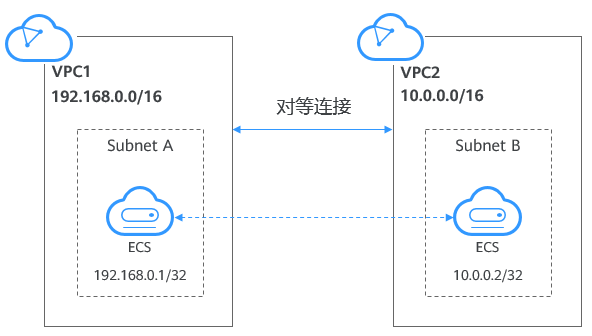

# 对等连接简介

对等连接是指两个VPC之间的网络连接。您可以使用私有IP地址在两个VPC之间进行通信，就像两个VPC在同一个网络中一样。同一区域内，您可以在自己的VPC之间创建对等连接，也可以在自己的VPC与其他帐户的VPC之间创建对等连接。不同区域间的VPC之间不能创建对等连接。

**图 1**  对等连接  

## 约束与限制

-   有重叠子网网段的VPC建立的对等连接，可能不生效。

    对等连接创建完成后，可以使用“ping”命令检查本端网络是否连通，不支持通过“ping”命令检查对端子网网关是否连通，更多信息请参考[为什么对等连接创建完成后不能互通？](https://support.huaweicloud.com/vpc_faq/vpc_faq_0069.html)。

-   两个VPC之间不能同时建立多个VPC对等连接。
-   不同区域的VPC不能创建对等连接，若要实现不同区域VPC之间互通，您可以使用云连接，详细内容请参见[跨区域VPC互通](https://support.huaweicloud.com/qs-cc/cc_02_0201.html)。
-   VPC1与VPC2创建对等连接，默认情况下VPC2不能通过VPC1的EIP访问公网。您可以通过使用NAT网关服务或[配置SNAT服务器](https://support.huaweicloud.com/usermanual-vpc/vpc_route_0004.html)，使得VPC2下的弹性云服务器可以通过VPC1下绑定了EIP的弹性云服务器访问Internet。具体实现方式请参见[无公网IP的弹性云服务器访问Internet](https://support.huaweicloud.com/usermanual-ecs/ecs_03_0705.html)。
-   跨租户申请VPC对等连接，需要对端租户接受后，才能生效。同租户申请对等连接默认已接受。
-   对等连接建立后，需要在本端VPC、对端VPC分别添加对方子网的路由才能通信。
-   VPC A与B、C分别建立对等连接，如果B、C两个VPC的网段有重叠，A中无法添加具有相同目的网段的路由。
-   为了安全起见，请不要接受来自未知帐号的对等连接申请。
-   对等连接双方帐号都有权限删除对等连接，一方删除对等连接后，对等连接的所有信息会被立刻删除，包括对等连接关联的路由信息。
-   如果两个VPC的CIDR有重叠，建立对等连接时，只能针对子网建立对等关系。如果两个VPC下的子网网段有重叠，那么该对等关系可能不生效。建立对等连接时，请确保两个VPC之间没有重叠的子网。
-   VPC对等连接路由存在时，VPC无法被删除。
-   支持在华为云中国站和国际站同一区域创建对等连接。

