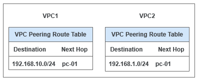
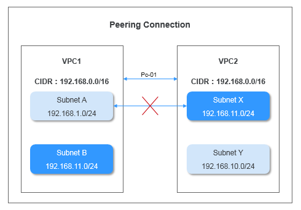

# 对等连接路由配置方案

当您需要两个VPC互相通信时，可以通过在VPC间建立对等连接的方式实现。拥有不同CIDR的VPC可创建指向整个VPC的对等连接路由，具有重叠CIDR的VPC只能针对子网创建对等连接路由。

-   指向整个VPC的对等连接路由配置。
    -   指向整个VPC的对等连接包含以下几种情况：两个VPC之间建立对等连接，多个VPC之间建立对等连接。
    -   不论是哪种情况，只要是指向整个VPC的对等连接路由配置，建立对等连接的所有VPC的CIDR都不能重叠，否则连接失效、路由不通。
    -   指向整个VPC的对等连接的路由配置，目的地址为对端VPC的CIDR，下一跳地址为对等连接ID。

-   指向子网的对等连接路由配置。

    如果VPC间的CIDR有重叠，建立对等连接时，只能针对子网建立对等关系。如果VPC下的子网网段有重叠，那么该对等关系不生效。建立对等连接时，请确保VPC之间没有重叠的子网。

    假设VPC1和VPC2的CIDR相同且相互之间子网没有重叠，那么，可以在两个不同的子网间建立对等连接，具体是哪些子网具有对等关系，是在路由表里体现的。对等关系如[图1](#fig3667915794311)。图中VPC1的子网A和VPC2的子网X需要通过添加路由来建立对等关系。

    **图 1**  子网A和子网X的建立对等连接  
    

    子网A和子网X的对等连接路由配置如[图2](#fig2977759394311)所示，配置完成后，子网A与子网X就建立了对等关系，可以相互通信。

    **图 2**  子网A和子网X的对等连接路由表  
    

    如果两个VPC之间的子网网段有重叠，那么建立的对等连接将无效，无法相互通信。

    如[图3](#fig2590564294311)所示，由于子网B与子网Y的网段相同，因此子网A和子网Y无法建立对等关系。

    **图 3**  无效的对等连接  
    

    当VPC1与多个VPC （比如：VPC2、VPC3、VPC4）建立对等连接时，VPC1与这些VPC下的子网CIDR都不能重叠。如果VPC2、VPC3、VPC4具有重叠子网，重叠子网不能同时作为对等子网与VPC1的子网建立对等关系。1个子网与其他N个子网建立对等关系时，所有子网的网段彼此都不能重叠。

