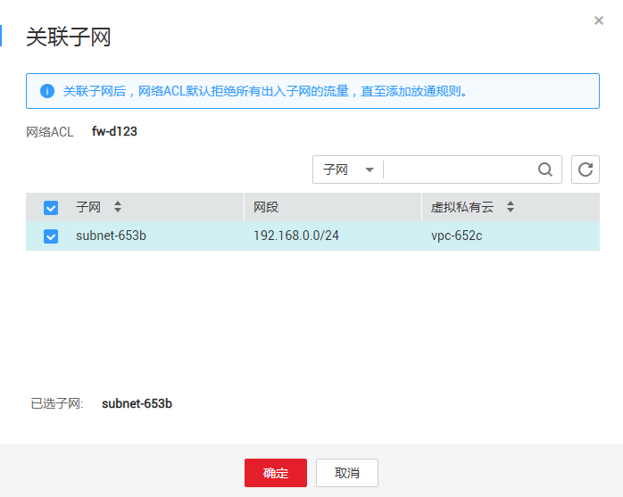

# 将子网和网络ACL关联

## 操作场景

当用户需进行子网关联时，可进入该网络ACL详情页面的添加关联子网。关联子网后，网络ACL默认拒绝弹性云服务器所有出入子网的流量，直至添加放通规则。

## 操作步骤

1.  登录管理控制台。
2.  在管理控制台左上角单击图标，选择区域和项目。
3.  在系统首页，单击“网络 \> 虚拟私有云”。
4.  在左侧导航栏单击“网络ACL”。
5.  在右侧在“网络ACL”列表区域，选择网络ACL的名称列，单击您需要关联的“网络ACL名称”进入网络ACL详情页面。
6.  在详情页面，单击“关联子网”页签。
7.  在“关联子网”页签区域，单击“关联”按钮，弹出添加关联子网页面。如[图1](#fig12845939203210)所示。

    **图 1**  关联子网  
    

8.  在弹出的关联子网页面，勾选需要进行关联的子网，单击“确定”，完成子网关联。

> **说明：**   
>已关联网络ACL的子网将不会展示在添加关联子网页面中，即暂不支持一键式解绑子网与关联子网操作，若用户需要关联已绑定网络ACL的子网，需要先解除绑定再进行关联。  

