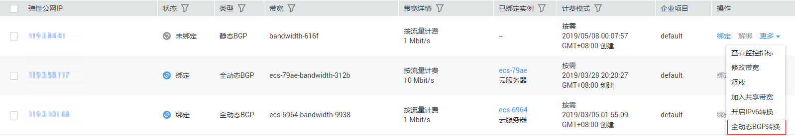
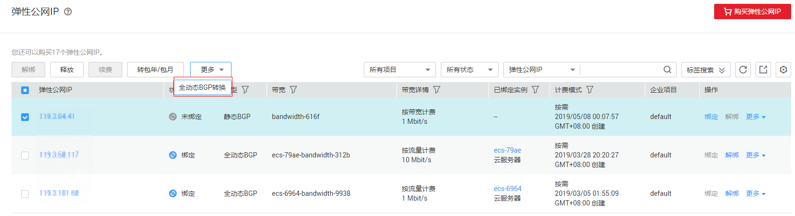

# 将弹性公网IP线路由静态BGP转换为全动态BGP

## 操作场景

您可以将静态BGP的EIP转换为全动态BGP的EIP，全动态BGP可根据设定的寻路协议第一时间自动优化网络结构，以保持客户使用的网络持续稳定、高效。

转换BGP类型不改变原有计费方式，不会中断业务，对用户业务不会造成影响。

对于按需的EIP，支持单个转换和批量转换两种方式，转换立即生效。对于包年包月的EIP，您只能单个转换，且需要补交差额费用成功后才能生效。

## 约束与限制

-   目前仅限“华东-上海二”、“华南-广州”区域使用。
-   仅支持在2019-06-05 22:00:00（UTC+8）之前创建的静态BGP EIP转换成全动态BGP。
-   静态BGP切换为全动态BGP后，不能再转换为静态BGP。

## 单个转换

1.  登录管理控制台。
2.  在管理控制台左上角单击，选择区域和项目。
3.  在系统首页，选择“网络 \> 弹性公网IP”。
4.  选择静态BGP的EIP，在“操作”列，选择“全动态BGP转换”。

    **图 1**  单个转换为全动态BGP  
    

5.  单击“下一步”。
6.  对于按需的EIP，单击“提交”。
7.  对于包年包月的EIP，单击“去支付”补交差额费用。

## 批量转换

对于按需的EIP，支持批量转换为全动态BGP。

1.  登录管理控制台。
2.  在管理控制台左上角单击，选择区域和项目。
3.  在系统首页，选择“网络 \> ”。
4.  单击列表左上方的“全动态BGP转换”，默认自动勾选当前页中全部静态BGP的按需EIP。

    您也可以先勾选需要切换的EIP，然后单击“全动态BGP转换”。

    **图 2**  批量转换为全动态BGP  
    

5.  单击“提交”。

## 相关操作

[静态BGP与全动态BGP有何区别？](https://support.huaweicloud.com/eip_faq/faq_bandwidth_0013.html)

