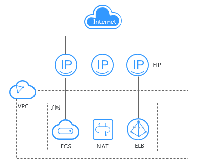

# 弹性公网IP简介

## 弹性公网IP

弹性公网IP（Elastic IP，简称EIP）提供独立的公网IP资源，包括公网IP地址与公网出口带宽服务。可以与弹性云服务器、裸金属服务器、虚拟IP、弹性负载均衡、NAT网关等资源灵活地绑定及解绑。拥有多种灵活的计费方式，可以满足各种业务场景的需要。

一个弹性公网IP只能绑定一个云资源使用。

**图 1**  通过EIP访问公网  

## 优势

-   弹性灵活

    EIP支持与ECS、BMS、NAT网关、ELB、虚拟IP灵活的绑定与解绑，带宽支持灵活调整，应对各种业务变化。

-   多种计费模式

    多种计费策略，支持按需、按带宽、按流量计费，包年包月价格更优惠 。

-   共享带宽

    EIP可以加入共享带宽，降低带宽使用成本。

-   即开即用

    即开即用，绑定解绑、带宽调整实时生效。

## 使用限制

-   一个弹性公网IP只能绑定一个云资源使用，且弹性公网IP和云资源必须在同一个区域。
-   每个用户最多申请20个EIP，如果您需要更多的EIP，请提交工单申请。
-   只有未绑定状态的EIP才能进行绑定操作。
-   按带宽计费的带宽上限为2000Mbit/s，如果您需要更大的带宽，请提交工单申请或联系您的客户经理。
-   按流量计费的带宽上限为300Mbit/s。
-   因安全等原因被冻结的EIP无法进行绑定、解绑等操作。
-   申请提升配额，要求该账户下存在有效订单和持续使用的云服务资源，如您的账户之前存在多次订购资源后即时释放的情况，拒绝提升配额。
-   对于长期闲置的EIP资源配额，华为云将降低配额至默认值，如需提升配额，您可通过工单提交申请。
-   如您违反适用法律法规的要求使用华为云EIP资源，华为云有权收回EIP资源，并暂停向您提供服务。

> **说明：** 
>工单提交请参见[提交工单](https://support.huaweicloud.com/usermanual-ticket/zh-cn_topic_0127038618.html)。

