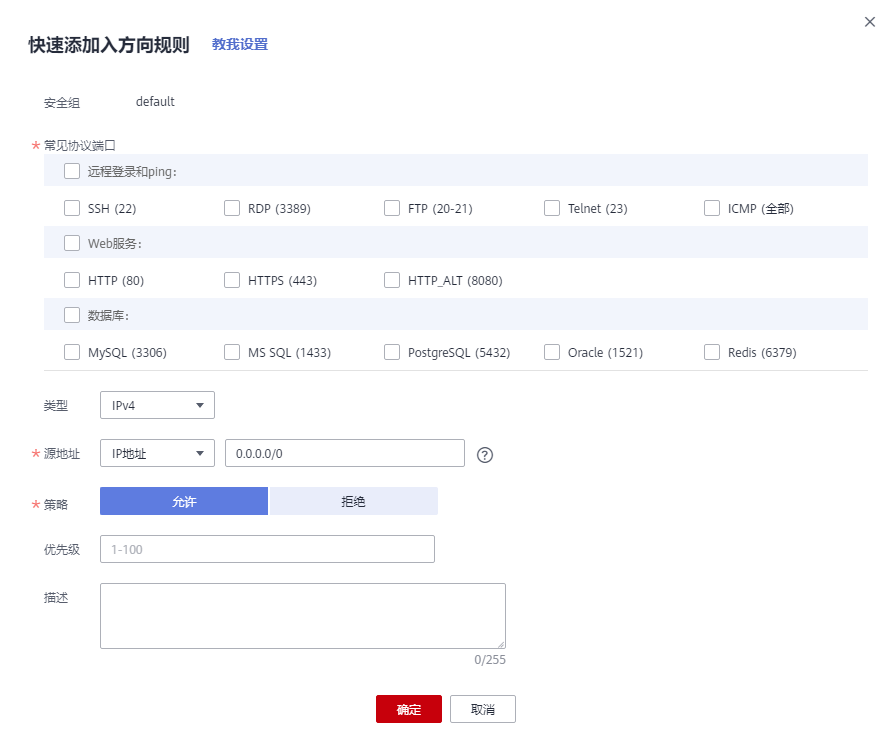
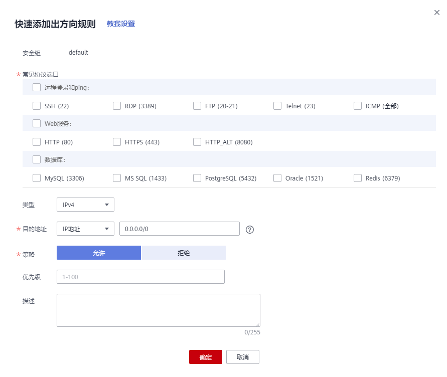

# 快速添加多条安全组规则

## 操作场景

系统提供了部分常用的协议端口，您可以一次性添加多条不同协议端口的安全组规则，满足您快速添加安全组规则的需求。

## 操作步骤

1.  登录管理控制台。

1.  在管理控制台左上角单击，选择区域和项目。
2.  在系统首页，选择“网络 \> 虚拟私有云”。
3.  在左侧导航树选择“访问控制 \> 安全组”。
4.  在安全组界面，单击操作列的“配置规则”，进入安全组详情界面。
5.  在入方向规则页签，单击“快速添加规则”，同时添加多条不同协议端口的安全组入方向规则。

    **图 1**  快速添加入方向规则  
    

6.  在出方向规则页签，单击“快速添加规则”，同时添加多条不同协议端口的安全组出方向规则。

    **图 2**  快速添加出方向规则  
    

7.  单击“确定”。

