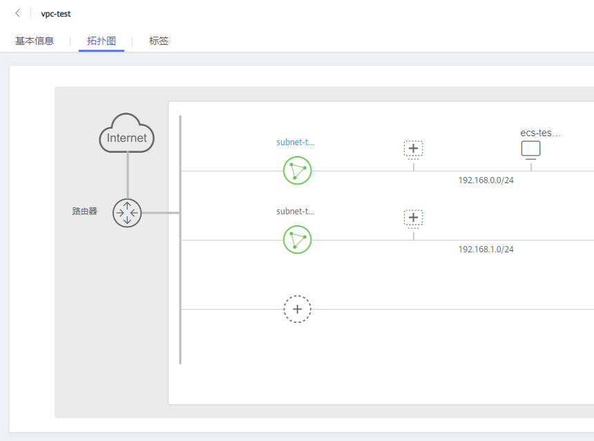

# 查看虚拟私有云拓扑图

## 操作场景

本章节指导用户查看VPC的拓扑图，拓扑图直观的为您展示VPC内的子网，以及子网内的弹性云服务器。

## 操作步骤

1.  登录管理控制台。

1.  在管理控制台左上角单击，选择区域和项目。
2.  在服务列表中，选择“网络 \> 虚拟私有云”。

    进入“虚拟私有云“页面。

3.  在虚拟私有云列表中，单击需要查看拓扑图的VPC名称。

    进入虚拟私有云详情页。

4.  选择“拓扑图“页签，查看VPC拓扑图。

    拓扑图直观的为您展示当前VPC内的子网，以及子网内的ECS。

    您还可以通过拓扑图提供的功能，对子网和ECS执行部分常见操作，具体说明如下：

    -   修改子网、删除子网
    -   在子网内添加新的ECS、为ECS绑定弹性公网IP、更改ECS的安全组。

    **图 1**  VPC拓扑图  
    

