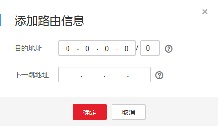

# 添加自定义路由

## 操作场景

当VPC内的弹性云服务器需要访问Internet，用户可以添加自定义路由，通过绑定弹性公网IP的服务器访问Internet网络。

## 操作步骤

1.  登录管理控制台。

1.  在管理控制台左上角单击，选择区域和项目。
2.  在系统首页，选择“网络 \> 虚拟私有云”。
3.  在左侧导航栏选择“虚拟私有云”。
4.  在虚拟私有云列表中，单击需要添加路由的虚拟私有云名称。
5.  在“路由表”页签，单击“添加路由信息”。
6.  根据弹出框中提示，填写路由信息。

    **图 1**  添加路由信息  
    

    -   “目的地址”是目的网段，默认是0.0.0.0/0，如果是VPC内部发起的流量，则"目的地址"可以为该VPC下的子网地址。如果是VPC外部发起的流量，则"目的地址"不能与该VPC下子网网段冲突。但是，每条路由信息的目的地址不能重复。
    -   “下一跳地址”是VPC内的私有IP地址或虚拟IP。

    > **说明：** 
    >如果下一跳地址是虚拟IP，这个虚拟IP必须绑定EIP，否则无法通过自定义路由到虚拟IP访问Internet。

7.  单击“确定”，完成创建。

