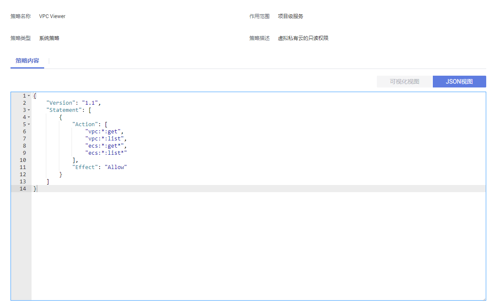

# 细粒度策略<a name="permission_0005"></a>

## 策略结构<a name="section20984256114816"></a>

策略结构包括：Version（策略版本号）和Statement（策略权限语句），其中Statement可以有多个，表示不同的授权项。

**图 1**  策略结构<a name="fig32964578481"></a>  


## 策略语法<a name="section181195744819"></a>

在IAM左侧导航窗格中，单击“策略”，单击策略名称，可以查看策略的详细内容，以“VPC Viewer”为例，说明细粒度策略的语法。

**图 2**  细粒度策略语法<a name="fig135967292717"></a>  


```
{
    "Version": "1.1",
    "Statement": [
        {
            "Action": [
                "vpc:*:get",
                "vpc:*:list",
                "ecs:*:get*",
                "ecs:*:list*"
            ],
            "Effect": "Allow"
        }
    ]
}
```

-   作用范围：策略的生效范围，该策略需要在除全局区域外的其他区域中授权。
-   Version：Version：策略的版本号，RBAC策略版本为“1.0”，细粒度策略版本为“1.1”。
-   Statement：策略的授权语句，包含Action（授权项）和Effect（作用），Action和Effect结合构成用户具备的权限。
    -   Action（授权项）：操作权限，格式为：服务名:资源类型:操作，支持单个或多个操作权限，支持通配符号\*，通配符号\*表示所有。

        示例："vpc:\*:get\*"：表示对vpc所有资源类型的查询权限，其中vpc为服务名，\*为资源类型，get\*为操作。

    -   Effect（作用）：定义Action中的操作权限是否允许执行。Allow：允许；Deny：拒绝。

        系统预置策略仅包含允许的授权语句，自定义策略中可以同时包含允许和拒绝的授权语句，同一个Action的Effect如果既有Allow又有Deny时，遵循Deny优先的原则。


## 多个授权项策略<a name="section1691457194818"></a>

一个自定义策略中可以包含多个授权项，且除了可以包含本服务的授权项外，还可以包含其他服务的授权项，可以包含的其他服务必须跟本服务同属性，即都是项目级服务。多个授权语句策略描述如下：

```
{ 
    "Version": "1.1", 
    "Statement": [ 
        { 
            "Effect": "Allow", 
            "Action": [ 
                "vpc:vpcs:create", 
                "vpc:vpcs:delete", 
                "vpc:vpcs:list" ,
                "vpc:vpcs:get"
            ] 
        }, 
        { 
            "Effect": "Allow", 
            "Action": [ 
                "ecs:*:list*", 
                "ecs:*:get*" 
            ] 
        } 
    ] 
}
```

## 拒绝策略<a name="section693185754810"></a>

拒绝策略需要同时配合其他策略使用，否则没有实际作用。用户被授予的策略中，一个授权项的作用如果同时存在Alow和Deny，则遵循Deny优先。

如果您给用户授予VPC Admin的系统策略，但不希望用户拥有VPC Admin中定义的删除VPC权限（vpc:vpcs:delete），您可以创建一条相同Action的自定义策略，并将自定义策略的Effect设置为Deny，然后同时将VPC Admin和拒绝策略授予用户，根据Deny优先原则用户可以对VPC执行除了删除VPC外的所有操作。以下策略样例表示：拒绝用户删除VPC。

```
{ 
      "Version": "1.1", 
      "Statement": [ 
            { 
		  "Effect": "Deny", 
                  "Action": [ 
                        "vpc:vpcs:delete" 
                  ] 
            } 
      ] 
}
```

## 检查规则<a name="section110612578482"></a>

当用户被授予多个策略，或者一个策略中包含多个授权语句，这些策略中既有Allow又有Deny的授权语句时，遵循Deny优先的原则。在用户访问资源时，权限检查逻辑如下：

**图 3**  系统鉴权逻辑图<a name="fig52981057154820"></a>  


> **说明：**   
>每条策略做评估时， Action之间是或\(or\)的关系。  

1.  用户访问系统，发起操作请求。
2.  系统评估用户被授予的访问策略，鉴权开始。
3.  在用户被授予的访问策略中，系统将优先寻找显式拒绝指令。如找到一个适用的显式拒绝，系统将返回Deny决定。
4.  如果没有找到显式拒绝指令，系统将寻找适用于请求的任何Allow指令。如果找到一个显式允许指令，系统将返回Allow决定。

如果找不到显式允许，最终决定为Deny，鉴权结束。

