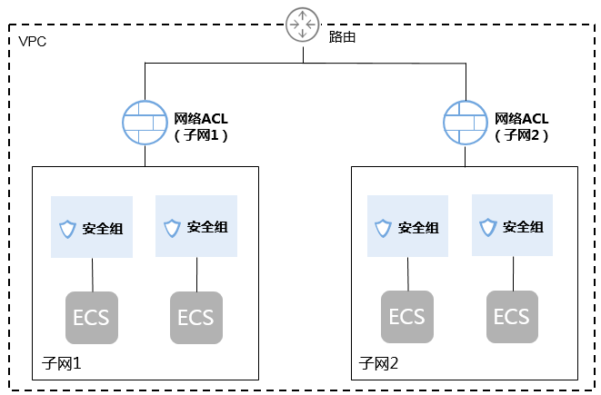
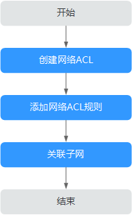

# 网络ACL简介

网络ACL是一个子网级别的可选安全层，通过与子网关联的出方向/入方向规则控制出入子网的数据流。

如[图1](#fig10469151512467)所示。

**图 1**  安全组与网络ACL  

网络ACL与安全组类似，都是安全防护策略，当您想增加额外的安全防护层时，就可以启用网络ACL。安全组只有“允许”策略，但网络ACL可以“拒绝”和“允许”，两者结合起来，可以实现更精细、更复杂的安全访问控制。

网络ACL与安全组的详细区别请参见[安全组与网络ACL区别](安全组与网络ACL区别.md)。

## 网络ACL基本信息

-   您的VPC默认没有网络ACL。当您需要时，可以创建自定义的网络ACL并将其与子网关联。关联子网后，网络ACL默认拒绝所有出入子网的流量，直至添加放通规则。
-   网络ACL可以关联多个子网，但一个子网同一时间只能关联一个网络ACL。
-   每个新创建的网络ACL最初都为未激活状态，直至您关联子网为止。
-   网络ACL是有状态的。如果您发送一个出站请求，且该网络ACL的出站规则是放通的话，那么无论其入站规则如何，都将允许该出站请求的响应流量流入。同理，如果您发送一个入站请求，且该网络ACL的入站规则是放通的，那无论出站规则如何，都将允许该入站请求的响应流量可以出站。

    不同协议的连接跟踪老化时间不同，已建立连接状态的TCP协议连接老化时间是600s，ICMP协议老化时间是30s。对于其他协议，如果两个方向都收到了报文，连接老化时间是180s，如果只是单方向收到了一个或多个包，另一个方向没有收到包时，老化时间是30s。对于除 TCP、UDP 或 ICMP 以外的协议，仅跟踪 IP 地址和协议编号。

## 网络ACL默认规则

每个网络ACL都包含一组默认规则，如下所示：

-   默认放通同一子网内的流量。
-   默认放通目的IP地址为255.255.255.255/32的广播报文。用于配置主机的启动信息。
-   默认放通目的网段为224.0.0.0/24的组播报文。供路由协议使用。
-   默认放通目的IP地址为169.254.169.254/32，TCP端口为80的metadata报文。用于获取元数据。
-   默认放通公共服务预留网段资源的报文，例如目的网段为100.125.0.0/16的报文。
-   除上述默认放通的流量外，其余出入子网的流量全部拒绝，如[表1](#table1034601475112)所示。该规则不能修改和删除。

    **表 1**  网络ACL默认规则

    
    <table><thead align="left"><tr id="row1267171445118"><th class="cellrowborder" valign="top" width="11.918808119188078%" id="mcps1.2.8.1.1">
方向

    </th>
    <th class="cellrowborder" valign="top" width="6.05939406059394%" id="mcps1.2.8.1.2">
优先级

    </th>
    <th class="cellrowborder" valign="top" width="7.0892910708929096%" id="mcps1.2.8.1.3">
动作

    </th>
    <th class="cellrowborder" valign="top" width="8.25917408259174%" id="mcps1.2.8.1.4">
协议

    </th>
    <th class="cellrowborder" valign="top" width="14.198580141985797%" id="mcps1.2.8.1.5">
源地址

    </th>
    <th class="cellrowborder" valign="top" width="12.568743125687428%" id="mcps1.2.8.1.6">
目的地址

    </th>
    <th class="cellrowborder" valign="top" width="39.90600939906009%" id="mcps1.2.8.1.7">
说明

    </th>
    </tr>
    </thead>
    <tbody><tr id="row167117147516"><td class="cellrowborder" valign="top" width="11.918808119188078%" headers="mcps1.2.8.1.1 ">
入方向

    </td>
    <td class="cellrowborder" valign="top" width="6.05939406059394%" headers="mcps1.2.8.1.2 ">
*

    </td>
    <td class="cellrowborder" valign="top" width="7.0892910708929096%" headers="mcps1.2.8.1.3 ">
拒绝

    </td>
    <td class="cellrowborder" valign="top" width="8.25917408259174%" headers="mcps1.2.8.1.4 ">
全部

    </td>
    <td class="cellrowborder" valign="top" width="14.198580141985797%" headers="mcps1.2.8.1.5 ">
0.0.0.0/0

    </td>
    <td class="cellrowborder" valign="top" width="12.568743125687428%" headers="mcps1.2.8.1.6 ">
0.0.0.0/0

    </td>
    <td class="cellrowborder" valign="top" width="39.90600939906009%" headers="mcps1.2.8.1.7 ">
拒绝所有入站流量

    </td>
    </tr>
    <tr id="row11671414155113"><td class="cellrowborder" valign="top" width="11.918808119188078%" headers="mcps1.2.8.1.1 ">
出方向

    </td>
    <td class="cellrowborder" valign="top" width="6.05939406059394%" headers="mcps1.2.8.1.2 ">
*

    </td>
    <td class="cellrowborder" valign="top" width="7.0892910708929096%" headers="mcps1.2.8.1.3 ">
拒绝

    </td>
    <td class="cellrowborder" valign="top" width="8.25917408259174%" headers="mcps1.2.8.1.4 ">
全部

    </td>
    <td class="cellrowborder" valign="top" width="14.198580141985797%" headers="mcps1.2.8.1.5 ">
0.0.0.0/0

    </td>
    <td class="cellrowborder" valign="top" width="12.568743125687428%" headers="mcps1.2.8.1.6 ">
0.0.0.0/0

    </td>
    <td class="cellrowborder" valign="top" width="39.90600939906009%" headers="mcps1.2.8.1.7 ">
拒绝所有出站流量

    </td>
    </tr>
    </tbody>
    </table>

## 规则优先级

-   网络ACL规则的优先级使用“优先级”值来表示，优先级的值越小，优先级越高，最先应用。优先级的值为“\*”的是默认规则，优先级最低。
-   多个网络ACL规则冲突，优先级高的规则生效，优先级低的不生效。若某个规则需要优先或落后生效，可在对应规则（需要优先或落后于某个规则生效的规则）前面或后面插入此规则。

## 应用场景

-   由于应用层需要对外提供服务，因此入方向规则必须放通所有地址，如何防止恶意用户的非正常访问呢？

    解决方案：通过网络ACL添加拒绝规则，拒绝恶意IP的访问。

-   隔离具有漏洞的应用端口，比如Wanna Cry，关闭445端口

    解决方案：通过网络ACL添加拒绝规则，拒绝恶意协议和端口，比如TCP：445端口。

-   子网内的通信无防护诉求，仅有子网间的访问限制。

    解决方案：通过网络ACL设置子网间的访问规则

-   对访问频繁的应用，调整安全规则顺序，提高性能。

    解决方案：网络ACL支持规则编排，可以把访问频繁的规则置顶。

## 网络ACL配置流程

子网配置网络ACL的流程，如[图2](#fig91216511166)所示。

**图 2**  网络ACL配置流程  

1.  参考[创建网络ACL](创建网络ACL.md)创建网络ACL。
2.  参考[添加网络ACL规则](添加网络ACL规则.md)添加网络ACL规则。
3.  参考[将子网和网络ACL关联](将子网和网络ACL关联.md)将子网与网络ACL关联。子网关联后，网络ACL将自动开启并生效。

