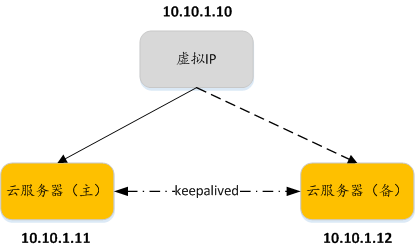
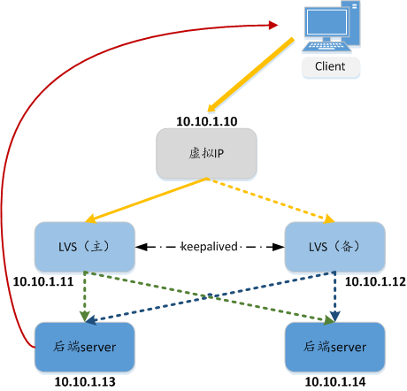

# 虚拟IP简介

## 什么是虚拟IP

虚拟IP（Virtual IP Address，简称VIP）是一个未分配给真实弹性云服务器网卡的IP地址。弹性云服务器除了拥有私有IP地址外，还可以拥有虚拟IP地址，用户可以通过其中任意一个IP（私有IP/虚拟IP）访问此弹性云服务器。同时，虚拟IP地址拥有私有IP地址同样的网络接入能力，包括VPC内二三层通信、VPC之间对等连接访问，以及弹性公网IP、VPN、云专线等网络接入。

多个主备部署的弹性云服务器可以在绑定虚拟IP地址时选择同一个虚拟IP地址。用户可以为该虚拟IP地址绑定一个弹性公网IP地址，从互联网可以访问后端绑定了同一个虚拟IP地址的多个主备部署的弹性云服务器，增强容灾性能。

## 典型组网

虚拟IP主要用在弹性云服务器的主备切换，达到高可用性HA（High Availability）的目的。当主服务器发生故障无法对外提供服务时，动态将虚拟IP切换到备服务器，继续对外提供服务。本节介绍两种典型的组网模式。

-   **典型组网1：**HA高可用性模式

    场景举例：如果您想要提高服务的高可用性，避免单点故障，可以用“一主一备”或“一主多备”的方法组合使用弹性云服务器，这些弹性云服务器对外表现为一个虚拟IP。当主服务器故障时，备服务器可以转为主服务器，继续对外提供服务。

    **图 1**  HA高可用性模式组网图  
    

    -   将2台同子网的弹性云服务器绑定同一个虚拟IP。
    -   将这2台弹性云服务器配置Keepalived，实现一台为主服务器，一台为备份服务器。Keepalived可参考业内通用的配置方法，此处不做详细介绍。

-   **典型组网2：**高可用负载均衡集群

    场景举例：如果您想搭建高可用负载均衡集群服务，您可以采用Keepalived + LVS\(DR\)来实现。

    **图 2**  高可用负载均衡集群  
    

    -   将2台弹性云服务器绑定同一个虚拟IP。
    -   将绑定了虚拟IP的这2台弹性云服务器配置Keepalived+LVS（DR模式），组成LVS主备服务器。这2台服务器作为分发器将请求均衡地转发到不同的后端服务器上执行。
    -   配置另外2台弹性云服务器作为后端RealServer服务器。
    -   关闭2台后端RealServer弹性云服务器的源/目的检查。
    -   检查LVS主备服务器的源/目的检查是否关闭，请参见[关闭源/目的检查（适用于高可用负载均衡集群场景）](关闭源-目的检查（适用于高可用负载均衡集群场景）.md)。

        若采用控制台方式将弹性云服务器与虚拟IP绑定，则源/目的检查自动关闭；若采用调用接口方式将弹性云服务器与虚拟IP绑定，则需要手动关闭源/目的检查）

    Keepalived + LVS调度服务端安装配置以及后端RealServer服务器配置可以参考业内通用的配置方法，此处不做详细介绍。

## 应用场景

-   场景一：通过弹性公网IP访问虚拟IP。

    您的应用需要具备高可用性并通过Internet对外提供服务，推荐使用弹性公网IP绑定虚拟IP功能。

-   场景二：通过VPN/云专线/对等连接访问虚拟IP。

    您的应用需要具备高可用性并且需要通过Internet访问，同时需要具备安全性（VPN），保证稳定的网络性能（云专线），或者需要通过其他VPC访问（对等连接）。

## 约束与限制

-   不推荐在弹性云服务器配置多个同子网网卡的场景下，使用虚拟IP功能。若在该场景下使用虚拟IP功能，弹性云服务器内部会存在路由冲突，导致虚拟IP通信异常。
-   虚拟IP仅能绑定到同一个子网下的云服务器。
-   备弹性云服务器需要关闭IP转发功能。请参见[关闭备弹性云服务器IP转发功能](关闭备弹性云服务器IP转发功能.md)。
-   虚拟IP只能使用默认安全组，不能更新为自定义安全组。
-   建议一个ECS绑定的虚拟IP不要超过8个。
-   建议一个虚拟IP绑定的ECS不要超过10个。
-   IPv6的虚拟IP仅支持绑定一个网卡（双栈网卡），如需进行服务器的主备切换，请通过调用API方式。具体请参考[配置云服务器高可用的IPv6虚拟IP功能](https://support.huaweicloud.com/api-vpc/vpc_apieg_0006.html)。

