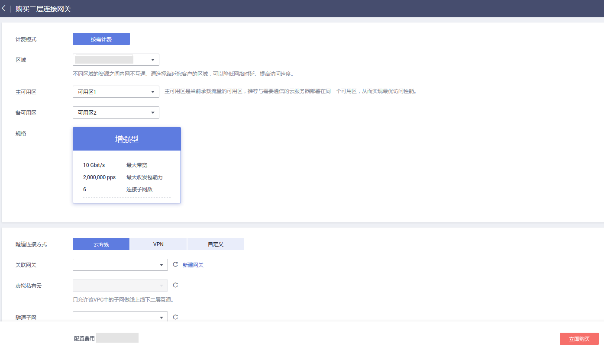

# 购买二层连接网关

## 操作场景

如果您需要将VPC中的弹性云服务器和您的数据中心子网做二层互通，则需要先购买二层连接网关。

> **说明：** 
>二层连接网关功能目前仅在“华东-上海一”、“ 华南-广州”开放，且还在公测期间，请申请公测权限后使用。

## 前提条件

-   已提前规划创建二层连接网关所在VPC、子网。
-   确认VPC已绑定了专线虚拟网关或VPN网关（连接方式为自定义时，此项为非必须条件）。

## 操作步骤

1.  登录管理控制台。
2.  在管理控制台左上角单击，选择区域和项目。
3.  在系统首页，选择“网络 \> 虚拟私有云”。
4.  在左侧导航栏选择“二层连接网关”。
5.  在右侧详情区域单击“购买”，进入二层连接网关购买页面。

    **图 1**  购买二层连接网关  
    

6.  根据界面提示，配置二层连接网关基本信息，配置参数请参见[表1](#zh-cn_topic_0228866528_table14521511)。

    **表 1**  参数说明

    
    <table><thead align="left"><tr id="zh-cn_topic_0228866528_row20335970"><th class="cellrowborder" valign="top" width="18.68%" id="mcps1.2.4.1.1">
<strong id="zh-cn_topic_0228866528_b60972199">参数</strong>

    </th>
    <th class="cellrowborder" valign="top" width="62.629999999999995%" id="mcps1.2.4.1.2">
<strong id="zh-cn_topic_0228866528_b22665468">参数说明</strong>

    </th>
    <th class="cellrowborder" valign="top" width="18.69%" id="mcps1.2.4.1.3">
取值样例

    </th>
    </tr>
    </thead>
    <tbody><tr id="zh-cn_topic_0228866528_row41283123"><td class="cellrowborder" valign="top" width="18.68%" headers="mcps1.2.4.1.1 ">
计费模式

    </td>
    <td class="cellrowborder" valign="top" width="62.629999999999995%" headers="mcps1.2.4.1.2 ">
支持按需计费。

    </td>
    <td class="cellrowborder" valign="top" width="18.69%" headers="mcps1.2.4.1.3 ">
按需计费

    </td>
    </tr>
    <tr id="row853412920107"><td class="cellrowborder" valign="top" width="18.68%" headers="mcps1.2.4.1.1 ">
区域

    </td>
    <td class="cellrowborder" valign="top" width="62.629999999999995%" headers="mcps1.2.4.1.2 ">
所在的区域。

    </td>
    <td class="cellrowborder" valign="top" width="18.69%" headers="mcps1.2.4.1.3 ">
华北-北京一

    </td>
    </tr>
    <tr id="zh-cn_topic_0228866528_row47790568"><td class="cellrowborder" valign="top" width="18.68%" headers="mcps1.2.4.1.1 ">
主可用区

    </td>
    <td class="cellrowborder" valign="top" width="62.629999999999995%" headers="mcps1.2.4.1.2 ">
L2CG主节点所在可用区。

    
主可用区是当前承载流量的可用区，推荐与需要通信的云服务器部署在同一个可用区，从而实现最优访问性能。

    </td>
    <td class="cellrowborder" valign="top" width="18.69%" headers="mcps1.2.4.1.3 ">
可用区1

    </td>
    </tr>
    <tr id="zh-cn_topic_0228866528_row58598692"><td class="cellrowborder" valign="top" width="18.68%" headers="mcps1.2.4.1.1 ">
备可用区

    </td>
    <td class="cellrowborder" valign="top" width="62.629999999999995%" headers="mcps1.2.4.1.2 ">
L2CG备节点所在可用区。

    
备可用区用于容灾备份，建议不要与主可用区相同。

    </td>
    <td class="cellrowborder" valign="top" width="18.69%" headers="mcps1.2.4.1.3 ">
可用区2

    </td>
    </tr>
    <tr id="zh-cn_topic_0228866528_row38259177"><td class="cellrowborder" valign="top" width="18.68%" headers="mcps1.2.4.1.1 ">
规格

    </td>
    <td class="cellrowborder" valign="top" width="62.629999999999995%" headers="mcps1.2.4.1.2 ">
L2CG的规格。

    
共有基础型、标准型、增强型三种规格类型（公测期间暂只开放增强型）。

    </td>
    <td class="cellrowborder" valign="top" width="18.69%" headers="mcps1.2.4.1.3 ">
增强型

    </td>
    </tr>
    <tr id="zh-cn_topic_0228866528_row11911733"><td class="cellrowborder" valign="top" width="18.68%" headers="mcps1.2.4.1.1 ">
隧道连接方式

    </td>
    <td class="cellrowborder" valign="top" width="62.629999999999995%" headers="mcps1.2.4.1.2 ">
L2CG与线下数据中心互通的网络连接方式，一般为云专线或VPN。

    </td>
    <td class="cellrowborder" valign="top" width="18.69%" headers="mcps1.2.4.1.3 ">
VPN

    </td>
    </tr>
    <tr id="zh-cn_topic_0228866528_row64007000"><td class="cellrowborder" valign="top" width="18.68%" headers="mcps1.2.4.1.1 ">
关联网关

    </td>
    <td class="cellrowborder" valign="top" width="62.629999999999995%" headers="mcps1.2.4.1.2 ">
根据不同的隧道连接方式，可选择需要的云专线虚拟网关或VPN网关。

    </td>
    <td class="cellrowborder" valign="top" width="18.69%" headers="mcps1.2.4.1.3 ">
vpngw-01

    </td>
    </tr>
    <tr id="zh-cn_topic_0228866528_row54293220"><td class="cellrowborder" valign="top" width="18.68%" headers="mcps1.2.4.1.1 ">
虚拟私有云

    </td>
    <td class="cellrowborder" valign="top" width="62.629999999999995%" headers="mcps1.2.4.1.2 ">
L2CG所属的VPC。

    </td>
    <td class="cellrowborder" valign="top" width="18.69%" headers="mcps1.2.4.1.3 ">
vpc-01

    </td>
    </tr>
    <tr id="zh-cn_topic_0228866528_row41752314"><td class="cellrowborder" valign="top" width="18.68%" headers="mcps1.2.4.1.1 ">
隧道子网

    </td>
    <td class="cellrowborder" valign="top" width="62.629999999999995%" headers="mcps1.2.4.1.2 ">
L2CG所属VPC中的子网。

    
该子网通过专线或VPN与线下数据中心网络互通。

    </td>
    <td class="cellrowborder" valign="top" width="18.69%" headers="mcps1.2.4.1.3 ">
subnet-01

    </td>
    </tr>
    <tr id="zh-cn_topic_0228866528_row54920213"><td class="cellrowborder" valign="top" width="18.68%" headers="mcps1.2.4.1.1 ">
隧道IP

    </td>
    <td class="cellrowborder" valign="top" width="62.629999999999995%" headers="mcps1.2.4.1.2 ">
L2CG本端隧道IP，可选择自动分配和手动分配。

    </td>
    <td class="cellrowborder" valign="top" width="18.69%" headers="mcps1.2.4.1.3 ">
自动分配

    </td>
    </tr>
    <tr id="zh-cn_topic_0228866528_row22678235"><td class="cellrowborder" valign="top" width="18.68%" headers="mcps1.2.4.1.1 ">
名称

    </td>
    <td class="cellrowborder" valign="top" width="62.629999999999995%" headers="mcps1.2.4.1.2 ">
L2CG名称。

    
最大支持64个字符，仅支持数据、字母、_（下划线）、-（中划线）。

    </td>
    <td class="cellrowborder" valign="top" width="18.69%" headers="mcps1.2.4.1.3 ">
l2cg-01

    </td>
    </tr>
    <tr id="zh-cn_topic_0228866528_row38968871"><td class="cellrowborder" valign="top" width="18.68%" headers="mcps1.2.4.1.1 ">
描述

    </td>
    <td class="cellrowborder" valign="top" width="62.629999999999995%" headers="mcps1.2.4.1.2 ">
L2CG信息描述。

    
最大支持255个字符。

    </td>
    <td class="cellrowborder" valign="top" width="18.69%" headers="mcps1.2.4.1.3 ">
-

    </td>
    </tr>
    </tbody>
    </table>

    配置完成上述信息，会显示L2CG配置费用，可通过“了解计费详情”查看计费信息。

7.  单击“立即购买”后，在规格确认页面，您可以再次核对二层连接网关信息。
8.  单击“提交”，开始创建二层连接网关。

    二层连接网关的创建过程一般需要3\~6分钟。

9.  在二层连接网关页面查询状态。

    若状态为“运行中”，表示二层连接网关已创建成功。

