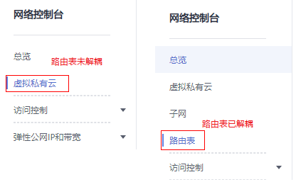

# 路由表简介

路由表中包含一系列被称为路由的规则，可用于判断网络流量的导向目的地。

用户可以在虚拟私有云内添加自定义的路由规则，通过该路由规则使得虚拟私有云内没有绑定弹性公网IP的弹性云服务器能够访问Internet。

## 相关背景

当前在部分区域中，路由表已从虚拟私有云中解耦，解耦后路由表拥有独立入口，支持路由表与子网关联功能，请以实际界面为准。

-   未解耦：在虚拟私有云详情页的“路由表”页签，可对路由表进行操作。
-   已解耦：在进入“网络 \> 虚拟私有云”后，在左侧导航栏直接选择“路由表”，可对路由表进行操作。

    **图 1**  路由表入口  
    

本章节适用于路由表未解耦区域，已解耦的区域用户请参考[路由表（已解耦）](路由表（已解耦）.md)。

路由表未解耦区域目前仅包括“华北-北京一”、“拉美-墨西哥城一”、“拉美-圣地亚哥”。

