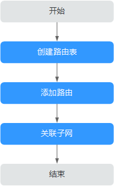

# 路由表简介

当前在部分区域中，路由表与虚拟私有云已解耦，解耦后路由表入口迁移，支持路由表与子网关联功能，具体请以实际界面为准。

本章节适用于路由表已解耦区域，未解耦的区域用户请参考[路由表](路由表-UG.md)。

## 路由表

路由表由一系列路由规则组成，用于控制虚拟私有云内子网的出流量走向。VPC中的每个子网都必须关联一个路由表，一个子网一次只能关联一个路由表，但一个路由表可以关联多个子网。

## 默认路由表和自定义路由表

用户创建虚拟私有云时，系统会自动为其生成一个默认路由表，创建子网后，子网会自动关联默认路由表。您可以在默认路由表中添加、删除和修改路由规则，但不能删除默认路由表。创建VPN、云专线、云连接服务时，默认路由表会自动下发路由，该路由不能删除和修改，您可以将子网关联到自定义路由表或者复制该条路由到自定义路由表中，在自定义路由表中添加、修改和删除路由。

您可以直接使用默认路由表，也可以为具有相同路由规则的子网创建一个自定义路由表，并将自定义路由表与子网关联。自定义路由表可以删除。

> **说明：** 
>-   子网关联自定义路由表仅影响子网的出流量走向，入流量仍然匹配默认路由表。
>-   当前自定义路由表需提交工单申请，如需使用自定义路由表，请在创建路由表页面单击“申请扩大配额”或在页面右上角单击“更多 \> 工单 \> 新建工单”申请扩大路由表配额。更多提交工单信息请参考[提交工单](https://support.huaweicloud.com/usermanual-ticket/zh-cn_topic_0127038618.html)。

创建自定义路由表的方法请参见[创建自定义路由表](创建自定义路由表.md)。

## 路由

路由即路由规则，在路由中通过配置目的地址、下一跳类型、下一跳地址等信息，来决定网络流量的走向。路由分为系统路由和自定义路由。

-   系统路由：系统自动添加且无法修改或删除的路由。

    创建路由表后，系统会自动在路由表中添加如下的系统路由，表示VPC内实例互通。

    -   目的地址是100.64.0.0/10、198.19.128.0/20的路由。
    -   目的地址是子网网段的路由。

        > **说明：** 
        >除以上系统路由外，系统还会自动添加目的地址是127.0.0.0/8的路由，表示本地回环地址。

-   自定义路由：可以修改和删除的路由。自定义路由的目地地址不能与系统路由的目地地址重叠。

    您可以通过添加自定义路由来自定义网络流量的走向，您需要指定目的地址、下一跳类型、下一跳地址。支持的下一跳类型如[表1](#zh-cn_topic_0212076956_table1727714140542)所示。

    **表 1**  下一跳类型

    
    <table><thead align="left"><tr id="zh-cn_topic_0212076956_row13277814115411"><th class="cellrowborder" valign="top" width="15.129999999999999%" id="mcps1.2.3.1.1">
下一跳类型

    </th>
    <th class="cellrowborder" valign="top" width="84.87%" id="mcps1.2.3.1.2">
说明

    </th>
    </tr>
    </thead>
    <tbody><tr id="zh-cn_topic_0212076956_row112771014105411"><td class="cellrowborder" valign="top" width="15.129999999999999%" headers="mcps1.2.3.1.1 ">
ECS实例

    </td>
    <td class="cellrowborder" valign="top" width="84.87%" headers="mcps1.2.3.1.2 ">
将指向目的地址的流量转发到虚拟私有云内的一台ECS实例。

    </td>
    </tr>
    <tr id="zh-cn_topic_0212076956_row327761465419"><td class="cellrowborder" valign="top" width="15.129999999999999%" headers="mcps1.2.3.1.1 ">
扩展网卡

    </td>
    <td class="cellrowborder" valign="top" width="84.87%" headers="mcps1.2.3.1.2 ">
将指向目的地址的流量转发到虚拟私有云内的一台ECS实例的扩展网卡。

    </td>
    </tr>
    <tr id="zh-cn_topic_0212076956_row427719141546"><td class="cellrowborder" valign="top" width="15.129999999999999%" headers="mcps1.2.3.1.1 ">
VPN网关

    </td>
    <td class="cellrowborder" valign="top" width="84.87%" headers="mcps1.2.3.1.2 ">
将指向目的地址的流量转发到一个VPN网关。

    </td>
    </tr>
    <tr id="zh-cn_topic_0212076956_row112771314145417"><td class="cellrowborder" valign="top" width="15.129999999999999%" headers="mcps1.2.3.1.1 ">
云连接

    </td>
    <td class="cellrowborder" valign="top" width="84.87%" headers="mcps1.2.3.1.2 ">
将指向目的地址的流量转发到云连接。

    </td>
    </tr>
    <tr id="zh-cn_topic_0212076956_row62774144548"><td class="cellrowborder" valign="top" width="15.129999999999999%" headers="mcps1.2.3.1.1 ">
云专线网关

    </td>
    <td class="cellrowborder" valign="top" width="84.87%" headers="mcps1.2.3.1.2 ">
将指向目的地址的流量转发到一个云专线网关。

    </td>
    </tr>
    <tr id="zh-cn_topic_0212076956_row112776144548"><td class="cellrowborder" valign="top" width="15.129999999999999%" headers="mcps1.2.3.1.1 ">
NAT网关

    </td>
    <td class="cellrowborder" valign="top" width="84.87%" headers="mcps1.2.3.1.2 ">
将指向目的地址的流量转发到一个NAT网关。

    </td>
    </tr>
    <tr id="zh-cn_topic_0212076956_row10277171416546"><td class="cellrowborder" valign="top" width="15.129999999999999%" headers="mcps1.2.3.1.1 ">
对等连接

    </td>
    <td class="cellrowborder" valign="top" width="84.87%" headers="mcps1.2.3.1.2 ">
将指向目的地址的流量转发到一个对等连接。

    </td>
    </tr>
    <tr id="zh-cn_topic_0212076956_row1781535195512"><td class="cellrowborder" valign="top" width="15.129999999999999%" headers="mcps1.2.3.1.1 ">
虚拟IP

    </td>
    <td class="cellrowborder" valign="top" width="84.87%" headers="mcps1.2.3.1.2 ">
将指向目的地址的流量转发到一个虚拟IP地址，可以通过该虚拟IP地址将流量转发到主备ECS。

    </td>
    </tr>
    <tr id="zh-cn_topic_0212076956_row1653212151559"><td class="cellrowborder" valign="top" width="15.129999999999999%" headers="mcps1.2.3.1.1 ">
VPC终端节点

    </td>
    <td class="cellrowborder" valign="top" width="84.87%" headers="mcps1.2.3.1.2 ">
将指向目的地址的流量转发到一个VPC终端节点。

    </td>
    </tr>
    <tr id="row877892215469"><td class="cellrowborder" valign="top" width="15.129999999999999%" headers="mcps1.2.3.1.1 ">
云容器引擎

    </td>
    <td class="cellrowborder" valign="top" width="84.87%" headers="mcps1.2.3.1.2 ">
将指向目的地址的流量转发到一个云容器引擎的节点。

    </td>
    </tr>
    </tbody>
    </table>

    > **说明：** 
    >-   当为默认路由表添加自定义路由时，下一跳类型不支持选择VPN网关与云专线网关。
    >-   个别由系统下发的路由可供用户修改和删除，这取决于创建对端服务时是否已设置目的地址。
    >    例如，创建NAT GateWay时，没有指定目的地址，系统会自动下发一条自定义类型的路由，可供用户自行调整。而创建VPN网关时，可以指定远端子网，也就是路由表的目的地址，系统将下发系统类型的路由。如果在路由表页面更改将会导致与对端数据不一致，您可以前往对端服务页面修改远端子网来调整路由表中的路由规则。

## 自定义路由表配置流程

创建并配置自定义路由表的流程如[图1](#zh-cn_topic_0212076956_fig16862186152219)所示。

**图 1**  路由表配置流程  

1.  参考[创建自定义路由表](创建自定义路由表.md)创建自定义路由表。
2.  参考[添加自定义路由](添加自定义路由-1.md)添加自定义路由规则。
3.  参考[关联子网与路由表](关联子网与路由表.md)关联子网，关联成功后，路由规则对该子网生效。

## 使用限制

-   每个路由表最多添加200个路由。
-   默认路由表不能删除。
-   系统路由不能修改和删除。
-   由VPN、云专线、云连接服务下发到默认路由表中的路由不能修改和删除。
-   云容器引擎类型的路由不支持修改、复制和删除。
-   由VPC终端节点服务下发到默认路由表的网关类型终端节点的路由不能修改、复制和删除，并且自定义路由表中的网关类型终端节点的路由也不能修改和删除。
-   当为默认路由表添加自定义路由时，下一跳类型不支持选择VPN网关与云专线网关。

